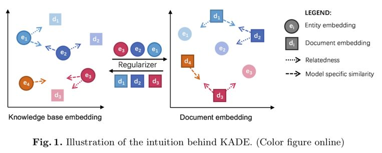
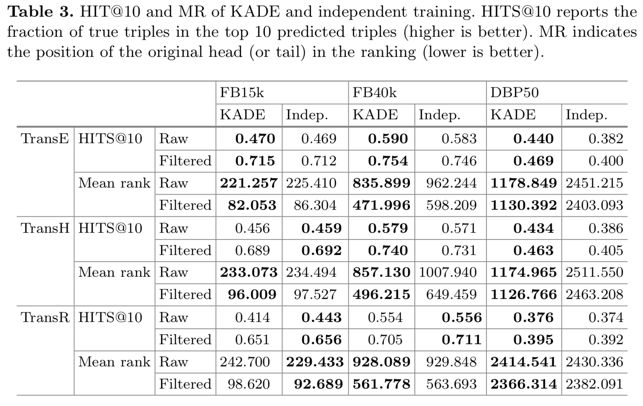
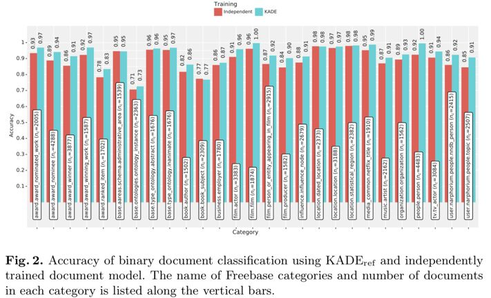

## 基于embedding模型的知识库和文档对齐

> 笔记整理：张文，浙江大学在读博士，研究方向为知识图谱的表示学习，推理和可解释。

本文是我们于苏黎世大学合作的关注与知识图谱和文本对齐的论文，发表于ISWC2018.

 

文本和知识图谱都包含了丰富的信息, 其中知识图谱用结构化的三元组表示信息，文本用自由文本形式表示信息，信息表示的差异给知识图谱和文本融合对齐造成了困难，本文关注于如何将知识图谱于文本进行对齐，并提出了基于正则的多任务学习的对齐模型KADE。

 

文本选择了将知识图谱的实体和描述实体的文本进行对齐，首先将文本和知识图谱都通过表示学习映射到向量空间，学习到文本和实体的向量表示，在学习过程中加入正则约束使表示同一实体的实体向量和描述文本在向量空间中尽可能接近，知识图谱和文本的表示学习模型交替进行训练，从而在不影响文本和知识图谱各自的表示学习效果的情况下实现对齐。KADE的核心想法如下：

本文的实验主要采用了三个数据集，FB15k, FB40K和DBP50。实验中知识图谱表示学习采用了TransE,TransH 和TransD，并在链接预测任务上进行了测试，实验结果如下并表明了KADE对知识图谱表示学习模型本身的效果没有影响且稍有提升。

实验中文本表示学习模型采用了PV-DM, 并在文本分类任务上进行了测试，实验结果如下并标明了KADE对文本表示学习模型的效果没有影响且有明显提升。

本文还验证了KADE的对齐效果，提出了一个评价对齐效果的指标normalizedalignment score, 这是一个介于0到1之间的值且值越大说明对齐效果越好。我们构造了一个对齐的baseline通过非线性函数实现文本表示学习向量空间和知识图谱表示学习向量空间的互相转换，实验结果如下：

从上图的实验结果能够看出，简单了非线性空间映射几乎无法完成对齐任务，同时KADE实现了知识图谱实体和实体描述文本的对齐。

