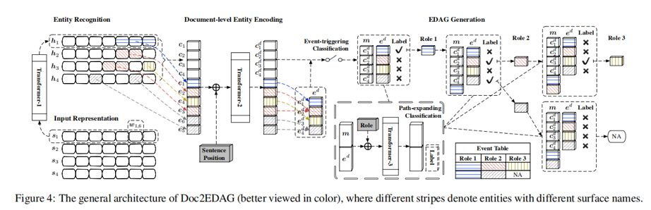
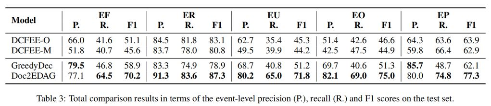
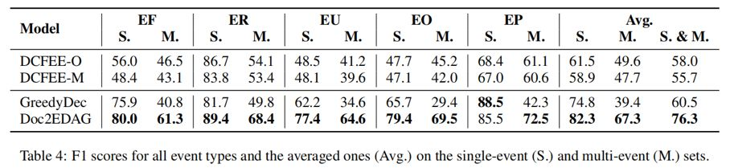

## Doc2EDAG：一种针对中文金融事件抽取的端到端文档级框架

> 论文笔记整理：叶宏彬，浙江大学博士生，研究方向为知识图谱、自然语言处理。

> 链接：https://arxiv.org/pdf/1904.07535.pdf

## **背景**

大多数现有的事件提取（EE）方法仅提取句子范围内的事件参数。但是，此类句子级的EE方法难以处理来自新兴应用领域（例如金融，法律，健康等）的大量文档，其中事件论元分散在不同的句子中，甚至多个事件实例在同一文档中同时存在。为了应对这些挑战，本文提出了一种新颖的端到端解决方案 Doc2EDAG，该解决方案可以有效地生成基于实体的有向无环图，以实现文档级事件抽取。

## **动机**

本文的附录部分展示了中文金融事件抽取的几个难点，并用之前的 DCFEE模型作了对比分析：1）在多事件任务下，尽管 DCFEE-O 可以正确地识别关键语句，但它无法决定此语句表示多少事件，DCFEE-M 会产生多个部分正确的事件，但是 DCFEE-M 的论元补全阶段是上下文无关的；2）对于不同的句子多次提及同一事件的环境下，DCFEE 模型的关键句子检测模块无法有效地区分重复的事件实例，造成抽取事件冗余；3）当一个文档由多个简单的句子片段构成时，事件的论元散落在各个句子中，DCFEE 模型无法有效地将这些零碎的信息整合起来识别完整的事件论元及事件角色。

## **模型**

模型分为四个阶段的处理流程：

1）**预处理模块**：通过词嵌入矩阵将文档中的句子序列 [s1; s2; · · · ; sNs ] 转化为词向量表示的嵌入矩阵 si ∈ Rdw×Nw,并采用 Transformer 作为上下文编码器对实体单位进行编码训练，hi = Transformer-1(si)。在训练过程中，使用事件论元的角色信息作为实体标签，使用经典的BIO(Begin,Inside, Other)方案，并用 crf 层将其封装起来，以获得实体识别 Loss 函数。

2）**文档级信息融合模块**：为了有效地解决论元分散的挑战，必须利用全局上下文来更好地识别一个实体是否扮演特定的事件角色。因此，该文档级别实体编码阶段的目标是用这样的上下文对提取的实体提及进行编码，并为每个实体提到的内容生成大小为dw的嵌入。由于涉及的实体通常包含多个可变长度的令牌，因此采用注意力加权平均(AWA)模块，为每个实例获得一个固定大小的嵌入ei∈ Rdw，对于每一个句子，也用另一个AWA模块来获得每个句子的固定大小的嵌入ci∈ Rdw。为了提高对文档级上下文的认识，作者使用了第二个 transformer 模块，以方便所有实例和句子之间的信息交换。模型中还增加了句子的嵌入位置来指示句子的顺序。在转换器编码之后，作者还使用一个AWA模块将相同实例的嵌入聚合到单个嵌入中。在这个阶段之后，获得了文档级上下文有关的实例和句子表示，并对每种事件类型进行事件触发分类。

3）**文档级信息记忆模块**:在依次生成基于实体的有向无环图(EDAG)时，必须同时考虑文档级上下文和路径中已经存在的实体。因此，作者设计了一种内存机制，初始化为句子的嵌入向量。更新 EDAG 时需要追加已经识别的实体嵌入或零矩阵向量（假如识别的是NA argument）。

4）**路径扩展模块**：当扩展事件路径时，对每个实体进行二进制分类，展开(1)或不展开(0)，结合当前路径状态、历史上下文和当前角色信息。首先连接记忆张量m和实体张量 ed，然后用event-role-indicator 嵌入它们，并将它们送入第三个 transformer 模块。然后，从 transformer-3 的输出中提取出丰富的实体张量 er，并在此基础上进行路径扩展分类。

## **实验**

ChFinAnn 数据集（本文使用的）与 DCFEE 使用的数据集相比，ChFinAnn 要大十倍，其中约 30％ 的文档包含多个事件记录。文中实验表明，当面对DEE（文档级事件抽取）任务时，Doc2EDAG 获得当前最好的结果。

## **总结** 

本文的贡献包括：

1）提出了一种新颖的解决方案 Doc2EDAG，该解决方案可以在给定文档的情况下直接生成事件表，以有效应对 DEE 的独特挑战。

2）重新设计了无需触发词的 DEE 任务，以简化基于 DS 的文档级事件标记。

3）为 DEE 建立了一个大规模的现实世界数据集，它面临着事件论元分散和多事件的挑战，并进行广泛的实验证明了 Doc2EDAG 的优越性。

