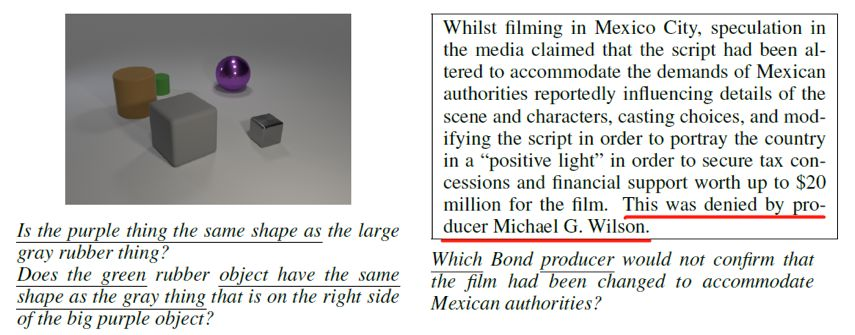
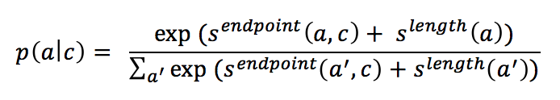
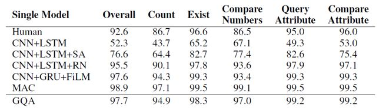
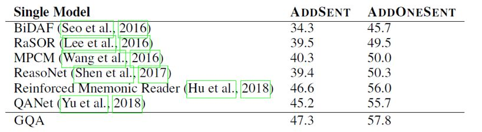

## 基于生成的问答系统

> 论文笔记整理：王梁，浙江大学硕士，研究方向为知识图谱，自然语言处理。

链接: https://openreview.net/forum?id=Bkx0RjA9tX

传统的机器阅读理解的模型都是给定 context 和 question, 找出最有可能回答该 question 的 answer，用概率表示为 p(a|q,c)，这其实是一个判别模型。判别模型在大多数任务上可以取得比生成模型更好的准确率，但问题在于判别模型会利用一切能提升准确率的数据特征来做预测，这在机器阅读中会造成模型并未完全理解question和context，而是利用训练集中的一些数据漏洞来预测。如下图所示，模型只需要question中有下划线的词即可预测出正确答案，无须完全理解问题。在 SQuAD 中另一个典型的情况是：问题的疑问词是when或者who，而context中只有一个日期或者人名，这时模型只需要根据question的疑问词，context中的日期或人名即可回答问题，不用完全理解 question和context。

因此，本文的作者提出基于生成模型架构的机器阅读模型，其优化的目标是：给定context，最大化question和answer的联合概率，用概率表示为p(a,q|c)。该概率可以分解为p(a|c)p(q|a,c)。对于这两部分，分别训练两个模型，最后在预测时，遍历所有候选的answer选出最大化联合概率p(a,q|c)的answer作为预测结果。

首先训练p(a|c)部分，即给定context，选出最有可能出现的候选的answer。根据context的不同，采用不同的方式。

（1）  如果context是文档，例如SQuAD数据集，那么用ELMo得到context的表示后，该表示经过全连接层映射得到一个score（记为），该score在和候选answer的长度指标()，这两个score按如下公式得到每个候选answer的概率

（2）  如果context是图片，例如CLEVR数据集，那么在预训练的RESNet上fine tuning得到图片的表示，对所有候选answer分类得到每个answer出现的概率。

其次是p(q|a,c)部分，本文将其看做是文本生成问题，即采用Encoder-Decoder架构，根据answer, context的encoding结果，采用decoder生成question。模型采用的Decoder的架构为：

其主要包含一个循环N词的decoder block，每个block内部t时刻生成的词的embedding会先经过self-attention和attention计算，得到的结果再经过一个LSTM单元，如此重复N次并最终依存t+1时刻的词。为了解决稀疏词的问题，在预测每个词被生成的概率时采用了character级别的embedding和pointer-generator机制。

到这里模型已经介绍完毕。但是论文中提到了按照上述目标函数和模型结构训练完后，还有一个fine-tuning的步骤，这一步的目标是通过人为构造question和answer的负组合，来强化模型生成question时和answer的关联。Fine-tuning的目标函数是最小化如下式子：

其中A是由p(a|c)选出的在当前context下最有可能的top k个候选answer。

模型的实验结果如下所示，在SQuAD和CLEVR上都取得了仅次于当前state-of-the-art的判别式机器阅读模型的效果：

可以看到生成模型的效果要比效果最好的判别模型略差，但是本文的论点在于生成模型对question和context有更全面的理解，从而让模型有更好的泛化能力和应对对抗样本的能力。为了验证模型的泛化能力，本文作者构建了一个SQuAD的子集，该子集中训练样本中的context都只包含一个日期，数字或者人名类实体，但是在测试样本中有多个。如果模型在训练时仅依赖context中特殊类型的实体作为答案的数据特征，那么在测试集上就会表现很差。

可以看到在该数据集上生成模型有很大的优势。

在包含对抗样本的数据集Adversarial SQuAD上的表现也好过判别模型。

