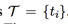
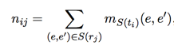
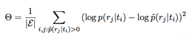
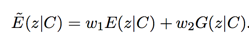
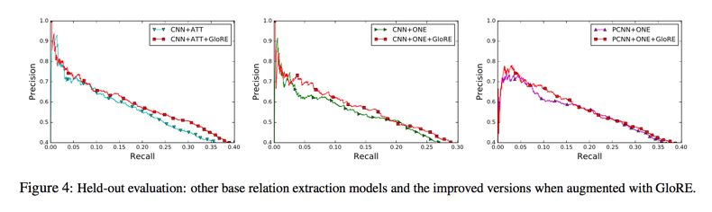
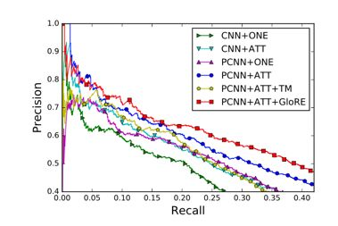
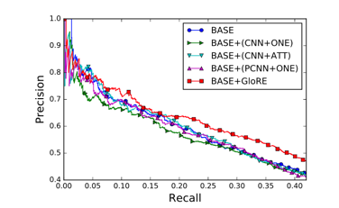

## 全局关系嵌入表示在关系抽取中的应用

> 笔记整理：王冠颖，浙江大学硕士，研究方向关系抽取、知识图谱

> **链接**：https://arxiv.org/abs/1704.05958

## **Introduction**

在关系抽取任务中，通常采用远程监督的方式自动生成数据集。由于实体对间可能存在多关系，生成的数据集往往存在大量噪音。本文对文本中的关系表述（textual relation）和知识库中的关系（kb relation）进行了共现统计，利用全局统计的信息训练 embedding，使模型能更加鲁棒地应对训练噪音的问题。

 

## **Idea**

本文的核心思想是：全局的统计信息比局部的统计信息更加鲁棒。在传统的关系抽取训练中，句子与句子之间是独立的，基于单句的局部特征训练模型，受到错误标签的影响比较大。本文提出了一种全局统计的思路，对每个句子，提取它文本中的关系表述（textual relation），并统计该 textual relation 在训练集中共现的 kb relation 的分布，这个分布可以用来作为 textual relation 的embedding 表示。

比如，对于上述两个textual relation，分别统计训练集中包含该textual relation的句子对应的label，可以得到texual relation在kbrelation上的分布如下：

可以看出，表述为born的句子可以被映射到place_of_birth上，虽然训练集中存在错误标签（place_of_death）的问题，但在全局统计的角度看，错误标签占比比较小。因此，全局共现信息可以有效地突出正确标签。

本文的思路可以类比 GloVE 对 word2vec 的改进。

 

## **Methods**

**1****、统计**

首先，在语料集上，本文用short dependency path来提取每个关系的texual relation，得到文本的relational fact，以及对应的texualrelation set：。

其次，对于每个texual relation，得到共现的实体对：

每个实体对出现的次数记为。

在知识库上，relational fact 即为三元组。对于每个三元组，统计出共现的实体对，记做S(rj)。根据关系标签的映射，我们可以得到textual relation和kb relation的共现信息：

**2****、****Global relation embedding****（****GloRE****）**

本文用GRU处理texual relation的路径，并将输出结果映射到上一节统计出的共现分布上：

这里用『-』来代表依赖路径中的方向。目标函数如下：

最终得到 textual relation 的embedding。

 

**3****、关系抽取增强**

本文用GloRE计算关系score，加到原有关系抽取模型的score中。

在实体对的 set level 上，关系抽取模型的score记作E(z|C)。

用GloRE对单句进行预测得到score，再做set内的聚合，和关系抽取的set level对齐：

最终关系抽取的score表示为两个score加权的和：

## **Experiments**

本文首先在多种关系抽取模型上进行了GloRE的加成测试，效果均有一定提升：

其次，作者用PCNN+ATT+GloRE和一些经典关系抽取数据集进行最终对比：

最后，本文用同样的PCNN+ATT作为BASE模型，用不同模型作为叠加，证明了GloRE的加成效果最好。

作者还进行了 case study，来分析GloRE的具体效果：

