## GraphIE:基于图的信息抽取框架

> 笔记整理：吕欣泽，南京大学计算机科学与技术系，硕士研究生。

> 论文连接：https://arxiv.org/pdf/1810.13083.pdf
>
> 发表会议：NAACL 2019

## **摘要**

大多数现代信息提取（IE）系统都是作为顺序标记器实现的，并且只模拟本地依赖项。然而，非顺序的上下文是改进预测效果的有价值的信息来源。本文介绍GraphIE，一个在图上运行的信息抽取框架。该算法通过图形卷积网络在连接的节点之间传播信息，利用来改进单词级别的预测从，而生成更丰富的表示。本文评估了三个不同的任务：文本，社交媒体和视觉信息提取，结果一致地显示GraphIE 优于最先进的信息抽取模型。

## **模型介绍**

**1. 概览**

最现代的信息提取（IE）系统通常被实现为顺序标记器。这样的模型有效地捕捉了在上下文中的本地关系，它们利用非本地和非顺序依赖的能力有限。然而，在许多应用程序中，这种依赖性可以大大减少标记的模糊性，从而提高整体提取性能。例如，从文档中提取实体时，各种类型的非本地情境信息，如共同引用和相同的提及可能提供有价值的线索。参见下图，其中非本地关系对于区分第二次提及的实体类型至关重要：华盛顿（即人，组织或地点）。

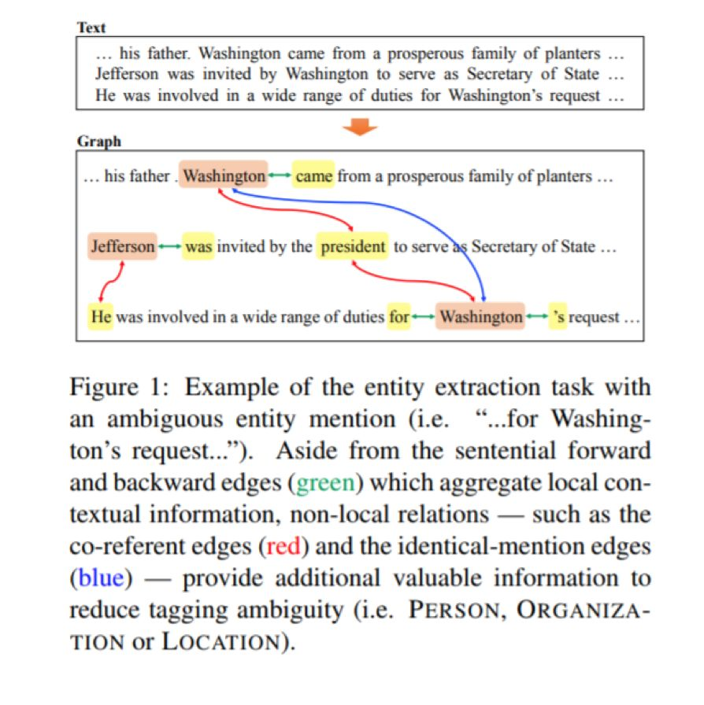

本文提出了GraphIE，这是一个通过自动学习输入空间中本地和非本地依赖关系之间的交互来改进预测的框架。它将图网络和编码器-解码器集成在一起，构建了序列标记的体系结构。模型如下。

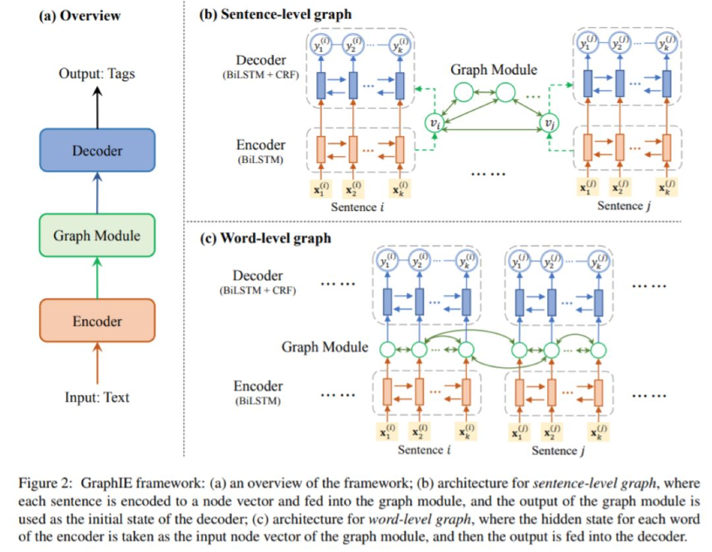

**2. 编码**

一个句子表示为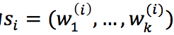，每一个词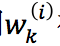被表示为一个向量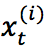，编码公式为如下，其中代表隐态，0 代表初始隐态为 0 向量，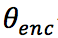代表编码器的参数。

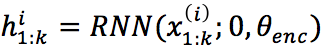

图卷积网络过程为如下，其中 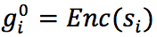，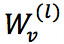是要学习的权重，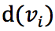是节点 **v_i **的度，和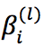组合得到第l层的表示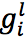。

**3. 解码**

解码时，隐态的获得如下，其中是图卷积网络的输出。

标记时使用CRF:

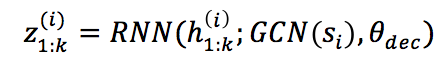

标记时使用CRF:

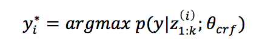

## **实验结果分析**

**1. ****文本信息抽取******

使用CoNLL-2003 和CHEMDNER 数据集，实验结果如下。

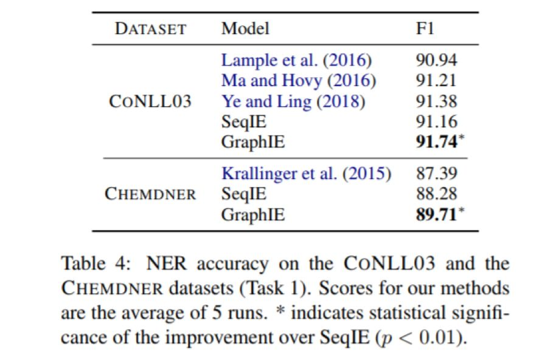

**2. ****社交媒体信息抽取******

从Twitter语料库里构造了两个数据集EDUCATION和JOB。实验结果如下。

**3. ****视觉信息抽取******

数据集来自病人病历，由于隐私原因无法公开。实验结果如下：

 

