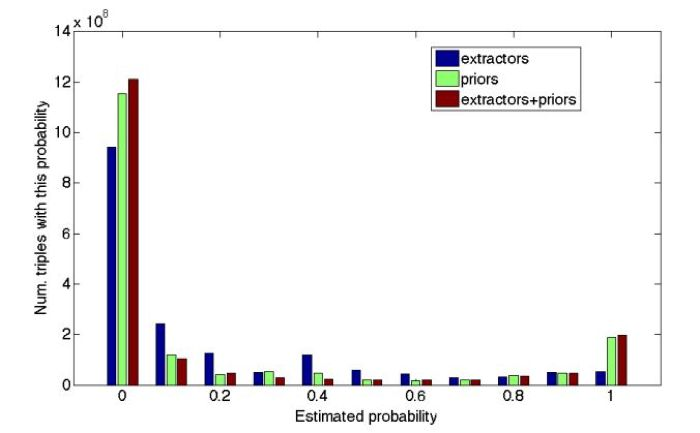

## Knowledge Vault: 全网规模的知识概率融合方法

&gt; 笔记整理: 

论文笔记整理：吴桐桐，东南大学博士生，研究方向为自然语言处理。

链接：https://www.cs.ubc.ca/~murphyk/Papers/kv-kdd14.pdf

 

基于机器学习，Knowledge Vault不仅能够从多个来源（文本，表格数据，页面结构，人工注释）中提取数据，而且还可以根据所有可用数据推断事实和关系。网络当然包含大量的错误数据，因此框架依赖于现有的知识库（例如Freebase），以便在评估过程的其中一个步骤中验证事实。研究人员将该过程描述为“图中的链接预测”，并试图通过采用两种不同的方法来解决它：a）路径排序算法（PRA）和b）神经网络模型（MLP）[1]

 

# **结构**

Knowledge Vault主要由以下三个主要构件组成：

1.    **提取器** - 从大型数据集中提取三元组（主语，谓语，对象）并分配置信度分数。

2.    **基于****图****形的先****验** - 从现有知识库中学习

3.    **知****识****融合** - 事实概率的最终得分

通过结合现有知识库和自身提取过程中的数据，研究人员已设法减少事实不确定性的数量，如下图所示：

# **Knowledge Vault 相比于知识图谱的优势**

Knowledge Vault 对当前知识图的关键优势在于其设计允许其扩展。到目前为止，Knowledge Vault设法推断了大约 271,000,000 个“可信的事实”，这些事实被认为是真实的，至少有90％的可能性。为了提炼这些事实，Knowledge Vault 提取了 1,600,000,000 三元组，4469种关系类型和1100种实体。

# **关于知识图谱的思考**

本文作为知识图谱领域的核心论文之一，文中所提出的几点思考放在论文发表5年之后的今天仍具有借鉴意义。

 

1.如何建模事实之间的互斥性：目前，我们将每个事实视为独立的二进制随机变量，无论是真是假。然而在现实中许多三元组之间是互斥的。

2.建模事实之间的软相关性：对于某些关系，它们的价值将受到软约束。如某个人物的出生时间一定在其父母出生时间的至少10年之后。

3.值可以在多个抽象层次上表示：我们可以用不同的粒度来表示世界。

4.如何处理相关的数据源：当数据源数目较多且相互重叠时，则需要考虑更复杂的数据拷贝机制。

5.有些事实只是暂时的事实。在某些情况下，事实的“真相”可能会改变。例如，谷歌目前的首席执行官是拉里·佩奇，但从2001年到2011年，他就是埃里克·施密特。这两个事实都是正确的，但只是在指定的时间间隔内。

6.如何发现并添加新实体和关系。除了遗漏的事实之外，还有许多实体在网络上被提及，但不在Freebase中，因此也不在 knowledge vault 中。

 

**OpenKG**

开放知识图谱（简称 OpenKG）旨在促进中文知识图谱数据的开放与互联，促进知识图谱和语义技术的普及和广泛应用。

点击**阅读原文**，进入 OpenKG 博客。
