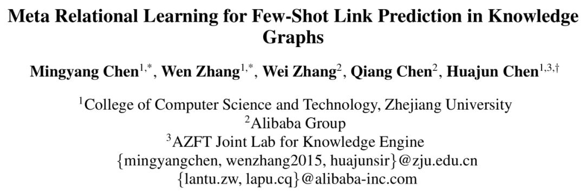
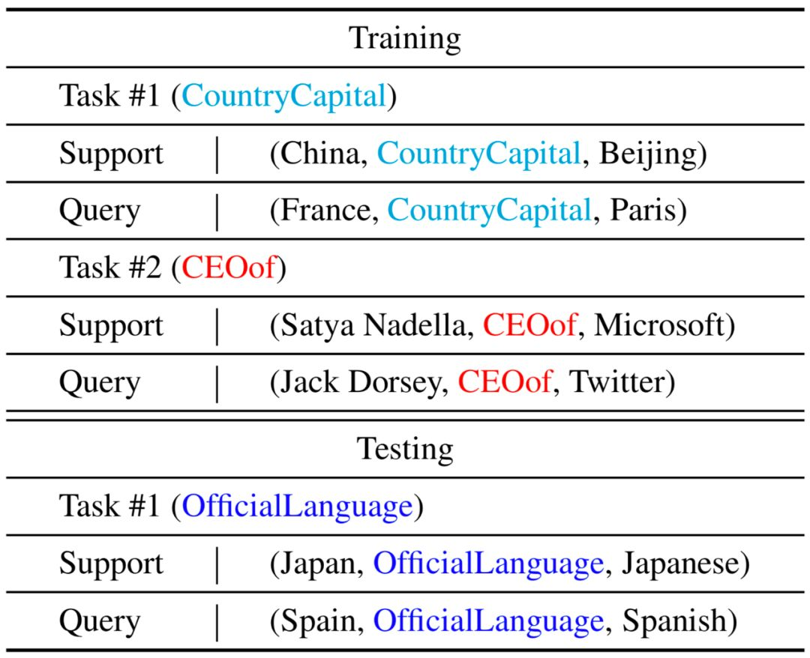
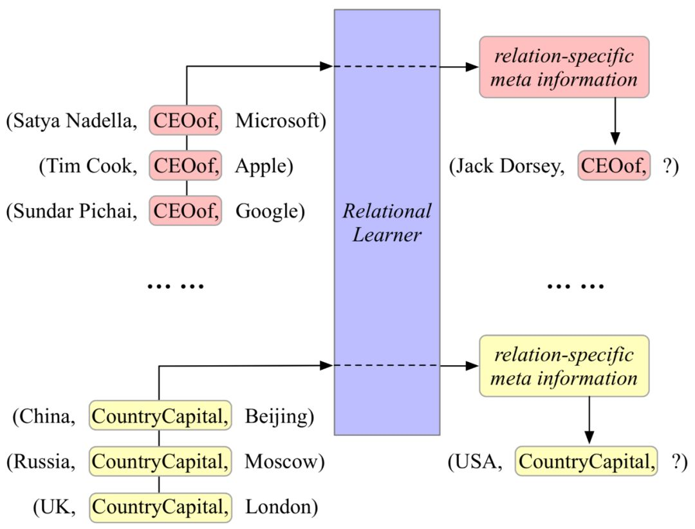
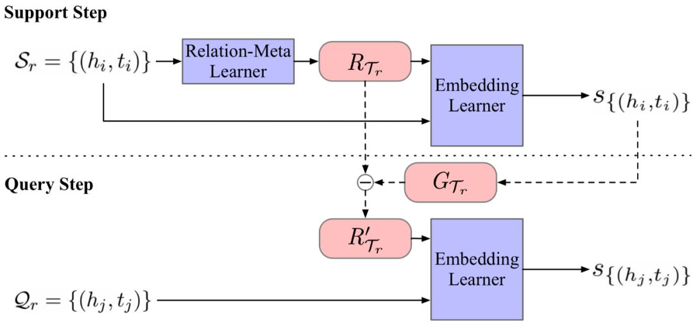
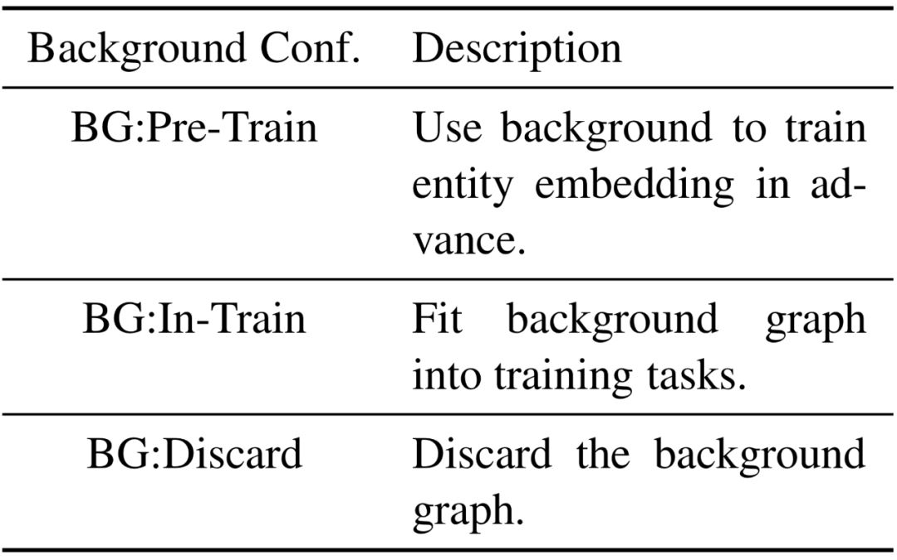
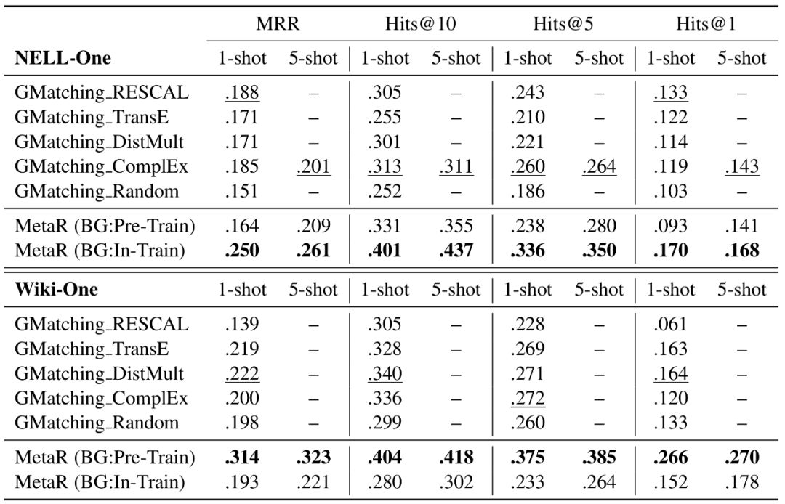
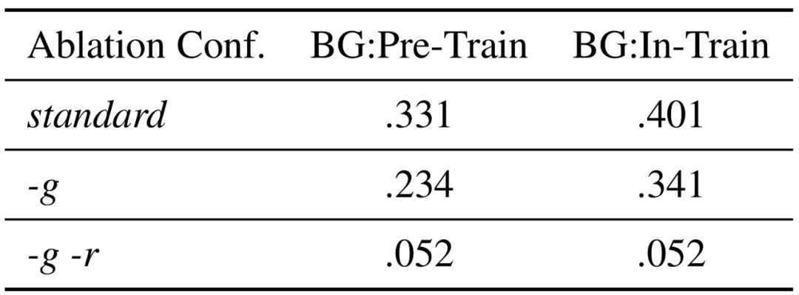

## 论文浅尝 | Meta Relational Learning: 基于元关系学习的少样本知识图谱推理

> 作者：陈名杨，浙江大学在读博士

> 来源：EMNLP 2019

本文主要解决知识图谱中少样本链接预测的问题，具体来说，就是在仅观测到某个关系的少量三元组后，预测该关系的其他三元组，也就是对该关系进行链接预测。针对该问题，我们提出了一个元关系学习框架MetaR（Meta Relational Learning）融合元学习和知识图谱嵌入的方法，通过转移关系特定元信息（relation-specific meta information）从而解决知识图谱少样本链接预测的问题。本篇工作已经被EMNLP-2019接收。

知识图谱（KG）中包含了大量形如(head, relation, tail)的三元组，尽管如此，知识图谱仍然存在不完整性的问题，因此需要进行知识图谱的补全，其中一个很重要的方法就是链接预测。知识图谱嵌入（Knowledge Graph Embedding）是完成链接预测的一种有效方法，但其有效性依赖于足够的训练样本，因此在知识图谱中对于某一个关系的训练样本较少时，对于该关系的嵌入并不能得到充分的学习，所以完成链接预测的效果也会很差。但是在真实的情况中，少样本的问题广泛存在于知识图谱中。例如在Wikidata中，大约有10%的关系的三元组数量少于10个。我们在这里把仅有少量三元组的关系称为少样本关系（few-shot relations），本篇文章主要关注少样本链接预测，也就是在仅知道K个关于关系r的三元组的情况下，给定头实体h和关系r，预测尾实体t，通常K非常小，例如1、3、5。

下表为知识图谱的单样本链接预测任务的训练和测试任务举例：

单样本链接预测的问题可以解释成，根据支持集（support）中的关于该关系的一个样本，从而对查询集（query）中的关于该关系的缺失了尾实体的三元组进行链接预测。

 

下图描述了一个三样本链接预测（3-shot link prediction）。也可以看出MetaR解决少样本链接预测的思路，其中最重要的思想在于使用在不同任务（across tasks）之间共享的relational learner，在一个具体的任务（within one task）中，从少量的关于某个关系的三元组中抽取出关系特定元信息，用于该关系的链接预测。其中，关系特定元信息包含两个部分，关系元（relation meta）和梯度元（gradient meta），其中关系元是连接头实体和尾实体的关系的高阶表示，梯度元则为关系元的梯度。

具体的模型分为两个部分，关系元学习器（Relation-Meta Learner）和嵌入学习器（Embedding Leaner）。关系元学习器是根据支持集的头实体和尾实体的向量表示得到两个实体间的关联，也就是关系元；嵌入学习器计算在支持集和查询集中，送入的头尾实体二元组和计算出的关系元的真值，类似于在做知识图谱嵌入时的得分函数，同时在支持集的阶段通过该真值而计算出的关系元的梯度作梯度元从而更新关系元。整个流程如下：

其中R为关系元，G为梯度元。

在实验阶段我们使用了NELL-One和Wiki-One，这两个数据集是在发表于MENLP-2018的One-Shot Relational Learning for Knowledge Graphs中提出，其中该文章提出的GMatching方法中需要使用一个不包含训练/验证/测试任务的关系的背景知识图谱（Background KG），但是我们提出的方法并不依赖于类似的背景知识图谱，所以我们对数据集进行了多种的不同处理，具体解释如下:

在不同的数据集设定下进行实验，和GMatching对比都是公平的，因为这并没有改变少样本的设定，也没有更改数据集的总量，仅仅是不同的背景知识图谱使用方法。

实验中我们验证了：MetaR在少样本链接预测的任务上是否优于之前的模型；关系特定元信息在整个模型中的贡献；MetaR在做少样本链接预测时是否有什么要求。首先我们先把我们的模型和GMatching在NELL-One和Wiki-One上进行对比，从下表中可以看出，我们的方法在NELL-One、Wiki-One上和1-shot、5-shot的结果都要好于GMatching。

并且我们进行了模型简化测试（ablation study），分别去掉梯度元（-g），去掉关系元和梯度元（-g-r），以下是在NELL-One进行单样本链接预测的Hit@10的结果，去掉相关部分后实验结果都大幅降度，说明了关系特定元信息的重要性。

最后我们发现在实验结果上，NELL-One在BG:In-Train的数据集设定下实验结果更好， Wiki-One在BG:Pre-Train设定下的结果更好，我们对两个数据集进行分析后，认为是数据集的实体稀疏性和训练任务的数量会对实验结果产生影响。

