## NumNet: 一种带有数学推理的机器阅读理解模型

&gt; 笔记整理: 

论文笔记整理：吴林娟。

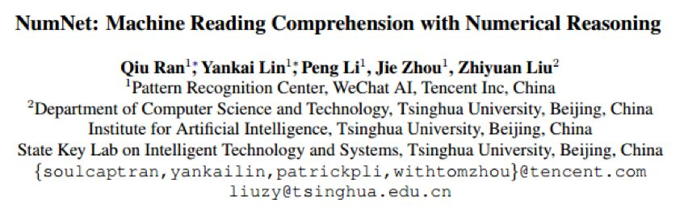来源：EMNLP2019

论文链接：https://arxiv.org/pdf/1910.06701.pdf

开放源码：https://github.com/ranqiu92/NumNet

## **概述**

本文提出了一个将数学推理融入机器阅读理解的模型——NumNet，其中利用数字感知的图神经模型(NumGNN)实现了数字比较和数学推理，旨在解决目前机器阅读理解模型在数值推理上的不足。模型以NumGNN为核心，结合NAQANet的基础模块以及改进的预处理方法实现了问题和问题提出的段落的编码，编码中融入了问题和段落的数字感知表示用于实现数值推理。在公开的考察数学运算能力的机器阅读理解数据集DROP上获得了64.56%的EM分数，超过了所有现有的考虑了数字之间关系的机器阅读理解模型。

文章的创新点主要在于提出了机器阅读理解中数学推理的关键是进行数值比较，且对于两类问题最重要：

（1）数值比较问题：通过数值比较后可以直接得到答案；

（2）数值条件问题：通过数值比较之后可以更好地理解文本。

## 

## **模型和方法**

模型NumNet是在数字感知QANet(NAQANet)的基础上进行的增强。模型架构如下图所示，主要包括了编码模块、推理模块、和预测模块。数字之间的数字关系通过图的拓扑进行编码。例如，从“6”指向“ 5”的边缘表示“ 6”大于“ 5”。推理模块利用数字感知图神经网络对图进行数字推理。由于在我们的模型中对数值比较进行了明确的建模，因此它对于回答需要数值推理（例如加法，计数或按数字排序）的问题更为有效。

### 1. 编码模型

首先使用QANet和NAQANet的编码组件对问题Q和段落P进行编码，包括卷积层、自注意力层和前馈层：

并传递到向量空间表示中，然后分别加入了问题-段落的注意力表示增强阅读理解能力：

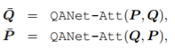

其中QANet-Emb-Enc(·)和QANet-Att(·)分别表示QANet的“堆叠式嵌入编码器层”和“上下文查询关注层”。和传递到下一个模块。

### 

### 2. 推理模型

#### 2.1 数字感知表示

将问题和段落中的数字建立了一个有向图 G = (V ; E)，结点由问题和段落中的数字组成 V = V^Q∪V^P，其中数字用 n(v),v∈V，边 (G) 用于编码数字之间的数值关系。

在这项工作中考虑了两组边：
- 大于的关系边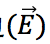：例如两个点 v_i,v_j∈V，它们的边为 e ⃗_ij=(v_i,v_j)，表示 n(v_i )&lt;n(v_j)。- 小于或等于的关系边 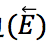：例如两个点 v_i,v_j∈V，它们的边为 e ⃖_ij=(v_i,v_j)，表示 n(v_i )&gt;n(v_j。
由于数字可能多次出现并代表文档中的不同事实，因此作者为图形中的每次出现添加一个不同的节点以防止潜在的歧义。因此，为了在节点之间编码“相等”的信息，同时使用了 和 。

      然后，基于图神经网络对图进行推理，可以将编码正式表示为：

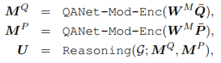

其中是共享的权重矩阵，U 是对应于数字的节点的表示形式，QANet-Mod-Enc(·)是QANet中定义的“模型编码器层”，类似于QANet-Emb-Enc(·)。

      由于 U 中只包含数字的表示，但是数字之间在段落中是有跨度的，所以采取了以下的表示方式来记录出数字所在的位置：

就是最终的数字感知段落表示。

#### 2.2 数字推理

            （1）初始化表示数字：，其中段落和问题中的数字节点 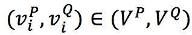，, 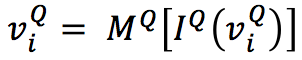， 和 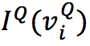表示对应于 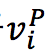和 的单词索引。

            （2）One-Step推理：根据给定图 G 和节点** v** 表示，使用GNN分三步执行推理：
- ****节点关联性度量****：由于通常只有少数的数字与回答问题相关，因此计算权重时每个节点在推理过程中都要绕过无关的数字。权重计算：
**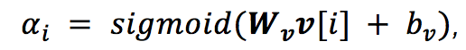**
- ****信息传递****：由于数字在推理中的作用不仅由其本身决定，而且与上下文有关，因此数字信息要从每个节点传播到相邻节点来帮助推理。传播函数用于计算节点的前向更新：
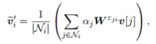

其中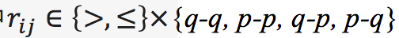, p和q分别表示节点的类型。
- ****节点表示更新****：由于在上一步中获得的消息表示仅包含来自相邻节点的信息，因此需要将其与节点表示融合，以与节点本身携带的信息进行组合：

            整个单步推理过程可以表示为：

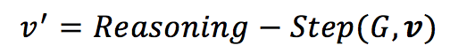

（3）多步推理：通过单步推理，只能推断相邻节点之间的关系。但是，对于某些任务，例如排序，可能需要多个节点之间的关系。因此，执行多步骤推理至关重要。多步推理表示为：

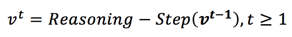

### 3. 预测模型

根据NAQANet，作者将答案分为四种类型，并使用特殊的输出层来计算每种类型的条件答案概率 Pr(answer | type)，四种类型分别是：答案在段落中，答案在问题中，计数问题和算术表达式类问题。

同时，额外的输出层也用于预测每种答案类型的概率 Pr(type)。在训练时，最终答案的概率定义为所有可行答案类型（即∑_type[Pr⁡(type)Pr⁡(answer | type）的联合概率。此处，不需要答案类型注释，并且模型可以学习概率 Pr(type)。在测试时，模型首先贪婪地选择最可能的答案类型，然后相应地预测最佳答案。作者利用NAQANet中的五个输出层的定义，以和作为输入。

## 

## **实验**

作者在DROP数据集上评估了他们的模型，该数据集是公共数值MRC数据集，采用了精确匹配（EM）和以数字为重点的F1分数这两个指标来评估模型。与基于语义解析的模型，传统MRC模型甚至数字MRC模型NAQANet和NAQANet+相比，NumNet模型在DROP数据集的开发集和测试集上均获得了更好的结果。

实验结果如下：

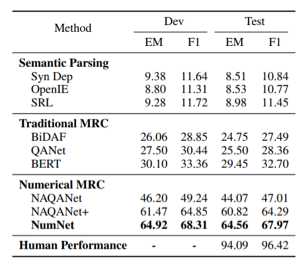

实验过程中发现，由于数字感知图是预先定义的，因此NumNet不适用于在推理过程中必须导出中间数字（例如从算术运算中得出）的情况，这是模型的主要限制。

## 

## **总结**

作者通过将数值感知图和NumGNN结合在一起提出了NumNet模型，将问题中的数字之间的数字关系编码并作为图形传递给图形，并利用数字感知图形神经网络对图形进行数字推理。一方面，数字感知图将数字编码为节点，并将它们之间的关系编码为边进行数字比较。另一方面，通过单步推理，NumGNN可以执行比较操作并确定数值条件。最后经过多步推理NumGNN可以进一步执行排序操作。模型很好地弥补了目前机器阅读模型中在数值推理上的不足，是一个很有趣且实用的研究，在例如财经类新闻或科学类文章的阅读理解中都是非常需要的。

 

**OpenKG**

开放知识图谱（简称 OpenKG）旨在促进中文知识图谱数据的开放与互联，促进知识图谱和语义技术的普及和广泛应用。

点击**阅读原文**，进入 OpenKG 博客。
