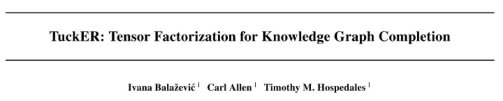
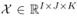
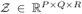
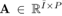
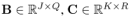
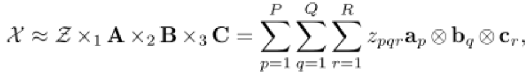
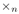
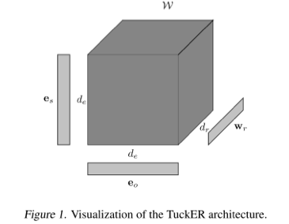
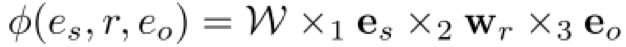
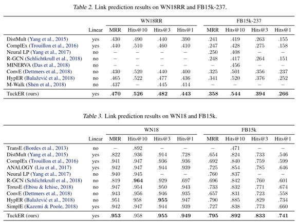

## TuckER：基于张量分解的知识图谱补全

> 笔记整理：孙泽群，南京大学计算机科学与技术系，博士研究生。

> 论文链接：https://arxiv.org/abs/1901.09590

## **背景**

知识图谱是图结构的数据库，以三元组(**es, r, eo**)的形式存储事实，其中**es**和**eo**分别表示主语和宾语实体，**r**表示它们之间的关系。然而，知识图谱中的事实是不完备的，人工补全费时费力，这就需要开发自动化补全知识图谱的算法。知识图谱可以表示为一个三阶二值张量，其中每一个元素表示一个三元组，1表示真实三元组，0表示未知三元组（或错误或丢失）。因此，很多基于张量分解的补全模型被提出。本文基于Tucker decomposition, 它可以将一个三阶张量分解为一个核心张量每一维度乘上一个矩阵。令是一个三阶张量，Tucker decomposition 会产生一个核心张量和三个矩阵，。其计算公式如下：

其中，表示沿着第n维的张量乘法，表示向量内积。

## **模型**

根据 Tucker decomposition 的计算方式，TuckER模型可以表示如下：

其中，**e****s **和 **e****o** 表示实体向量，**w****r** 表示关系向量，**de** 和 **dr** 分别表示实体和关系的向量维数，**W**是Tucker decomposition得到的核心张量。则TuckER的得分函数定义如下：

为了得到概率分布，作者又在该得分函数外面套了一个 sigmoid 函数。关于训练，作者没有使用传统的 margin-based 损失函数，而是使用了 log 似然损失函数：

其中，p 表示预测三元组真假的概率，y 是标签。

## **理论分析**

本文的亮点在于它的理论分析证明了 TuckER 有完全表现力：给定任意在实体集E和关系集R上的真实三元组（ground truth），TuckER 在 **de**=**ne**, **dr**=**nr** 的时候（**ne** 表示实体数量，**nr **表示关系数量），可以完全表示这些ground truth三元组。证明过程很简单，作者给了一个启发式的解：让实体和关系向量取one-hot形式，然后让核心张量**W**的维数是 **ne***** nr***** ne** 和原始的三阶张量相等，并且，如果其中一个元素对应的三元组是 ground truth，则置其为 1，否则置为 0。根据得分函数的定义，这种情况下计算得到的预测概率，正好可以准确表示真实概率。这个达到完全表现力的维度下界是远小于ComplEx和SimplE的，体现了 TuckER 的优越性。此外作者还分析了TuckER和之前一些张量分解模型的关系，证明了 RESCAL、DistMult、ComplEx 和 SimplE 都是 TuckER 的一种变体。

## **实验结果**

本文的主要实验任务是 link prediction。数据集采用了当前流行的 FB15K-237 和 WN18RR，同时也测试了传统的 FB15K 和 WN18。作者开源了基于 PyTorch 的代码https://github.com/ibalazevic/TuckER。实验结果如下表所示。可以看见，在目前主流的FB15K-237 和 WN18RR 数据集上，TuckER 取得了 SOTA 的效果，并且比第二名领先较多。而在传统的 FB15K 和 WN18 上面，TuckER 在主要指标上，也取得了最优结果。基本可以认为，TuckER 是当前 link prediction 的 SOTA 模型。

