## 一个模型解决所有问题：实体和事件的神经联合模型

> 笔记整理：康矫健，浙江大学计算机科学与技术系，硕士研究生。

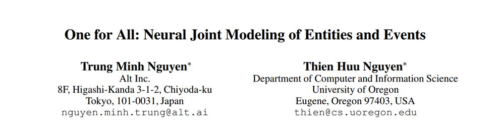

> 论文链接：https://arxiv.org/pdf/1812.00195.pdf
> 发表会议：AAAI 2019

## **摘要**

近来，针对事件抽取的工作大都集中在预测事件的triggers和arguments roles，而把实体识别当作是已经由专家标注好了的，然而实际情况是实体识别通常是由现有工具包预测出来的，而这将会导致实体类型预测产生的错误传播到后续任务中而无法被纠正。因而，本文提出一种基于共享的 feature representation，从而预测实体类型，triggers，argumentsroles 的联合模型。实验表明我们的方法做到了 state of the art. 

## **模型介绍**

**1. 概览**

如图1所示，该模型由三个核心部分组成，分别是实体类型预测（Entity MentionDetection - EMD）、事件类型预测（Event Detection - ED）和语义角色类型预测（Argument RolePrediction - ARP）。

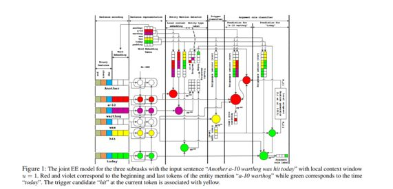

**2. Sentence Encoding**

句子中的每个词向量表示由两部分组成。一部分是由word2vec预先训练好的词向量；第二部分是binary vectors，由POS，chunk以及dependency信息组成。之后将这两部分拼接在一起。

**3. Sentence Representation**

将Sentence Encoding中得到的词向量输入到bi-GRU中得到每个词的隐藏层表示：

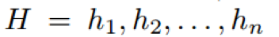

已经有实验表明 bi-GRU 可以 encode 非常丰富的上下文信息，这对事件抽取这个任务非常有效。之后，这个表示将作为 EMD、ED 以及 ARP 任务预测实体类型，trigger类型和语义角色类型的 shared representation。

我们的目标就是最大化三个预测任务的联合概率：

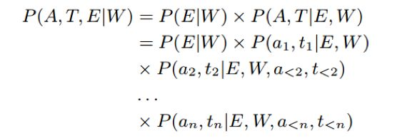

**4. Entity Mention Detector**

可以将实体类型检测的目标函数展开如下：

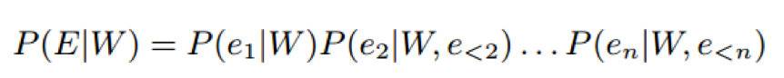

我们的目标是最大化这个概率。

其中：

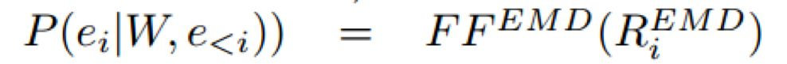

其中：

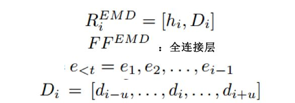

**5. Triggerand Argument Prediction**

可以将事件类型的检测和语义角色类型的预测展开成如下目标函数，我们的目标是最大化这个目标函数：

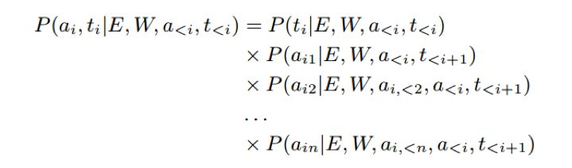

其中：

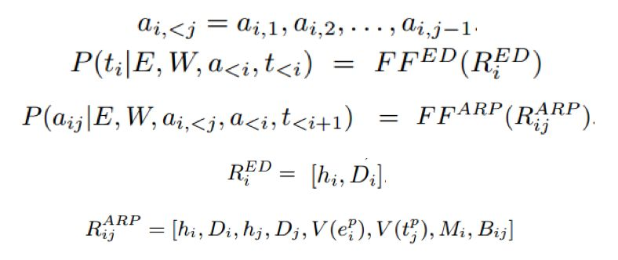

其中：

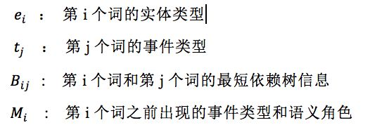

## **实验分析**

**1. Trigger和语义角色预测实验效果**

可以看到，本文提出的联合训练模型在event trigger identification、event triggerclassification、event argument identification、event argumentclassification上的F1值都达到了当前最优效果，具体结果如下：

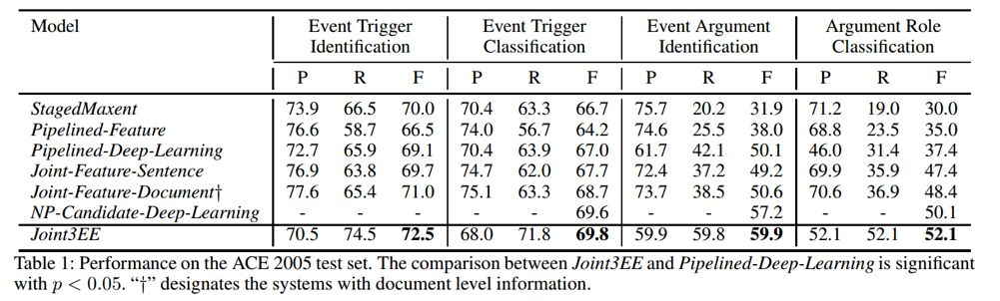

**2. 实体类型预测的结果**

试验结果表明，本文提出的模型在实体类型检测上的F1值同样达到了最优，具体结果如下：

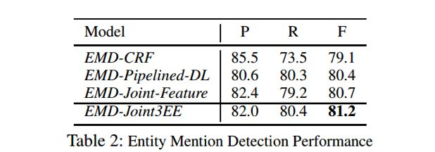

**3. Error Analysis**

可以看到 trigger classification（69.8%）和 trigger identification（72.5%）的效果相差不多，可见主要的错误来源于未能准确判断一个词属于 trigger word。

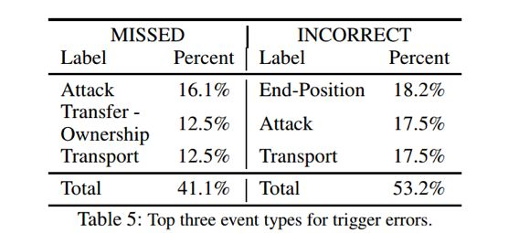

而通过对未能检测出来的 trigger word 的研究发现主要是由于在训练数据集上未出现过这个词，比如：

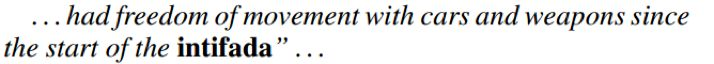

      通过对检测出来是trigger word而未能正确预测其类型的词的研究发现，主要错误来源于该词附近出现了有误导性的上下文信息，而我们的模型不能很好地判别，比如，下面这句话的fire可能会由于car的出现而被错误判断未Attack的事件类型，这启发我们去研究一个更好的能够encode上下文的模型：

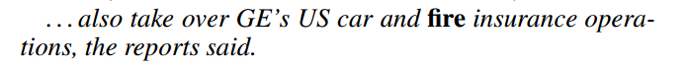
