## 一种可解释的语义匹配复值网络

&gt; 笔记整理: 

笔记整理：耿玉霞，浙江大学直博生。研究方向：知识图谱，零样本学习，自然语言处理等。

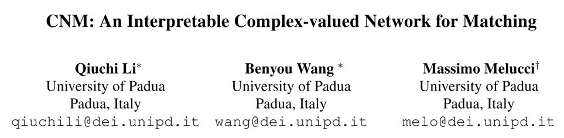 论文链接：https://arxiv.org/pdf/1904.05298.pdf

 

本文是发表在 NAACL 2019 上的最佳可解释性论文。受量子力学中数学模型的启发，在语义希尔伯特空间建模语言的基本单位：语义、词、句子，其中基于 complex-value 的end-to-end 网络，以 semantic matching 的方式在QA数据集上取得了SOTA，并具备一定的可解释性。

 

**1****、****Backgroundof Quantum**

(1)、Quantum Probability

微观粒子存在不同的运动状态，并且伴随着一定的概率，这些状态由一定的基态组成。以 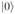,  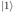 组成的二元基态为例，粒子状态的计算为这些基态的线性组合：

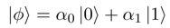

其中，α_0, α_1  为 complex value。

 

(2)、Measurement

      不同的粒子，组成一个小的微观系统，由于粒子状态伴有一定的概率，微观系统本身也带有不确定性。

       微观系统的不确定性由一元迹的半正定矩阵（也称densitymatrix）进行计算：

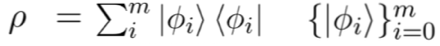

其中，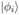 为第 **i **个粒子， 为量子力学中对粒子状态的向量表示，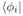为其转置，**m**表示此微观系统中粒子的数量。

在微观系统的状态空间，可观察到一些high-level的属性特征x，根据Gleason理论计算，这些属性的概率表示为：

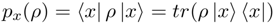

            其中，由于一元迹半正定矩阵的特性，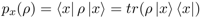。

**2****、****Semantic Hilbert Space**

(1) Linguistic Units

与微观系统类似，在语义系统中存在一些语义的基本单位：语义、词、句子。语义系统由一些基本的语义组成，这些语义通过一定的概率组合成词，由不同词组成的句子构成了一个小的语义系统。

其中：
- 语义：一系列正交向量组成的基态：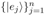- 词：由语义组成而成新的状态：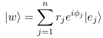
词：由语义组成而成新的状态：

其中权重为complex value，这里表示为极坐标向量，且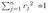，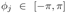
- 句子：由不同的词的状态构成一个微观系统。
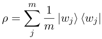

(2) Semantic Measurement

语义微观系统的 Hilbert space，同样可观察到一些high-level的特征**x**，给定句子的density matrix，计算其特征分布：

其中，特征的抽取由rank-oneprojector构成的measurement matrix进行计算，其作用相当于CNN中的卷积核或RNN中的cell。

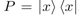

**3****、****Complex-valued Network for Semantic Matching**

2 中基于量子力学的数学模型，对语言系统进行了建模，其中词和句子均为 complex- value的表示，为度量语义建模的有效性，本文在QA语义匹配的场景中设计了一个基于 complex value 的端到端网络。

(1) word representation 的物理含义：

使用complex value组合词的表示，embedding向量的长度和方向均具备一定的物理含义，其中归一化的向量（方向）表示为词的状态，长度为词在句子中的重要性体现：

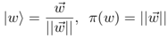

(2) sentence modeling

      考虑到句子过长时不能保持长距离的依赖，在句子建模的过程中，利用滑动窗口抽取局部状态。给定一个大小为3的滑动窗口，窗口中的所有词表示为一个子句，构成一个子系统，产生一个density matrix，因此文本中的句子由densitymatrix序列组成。同时，基于词向量的长度，对窗口中不同词的相对重要性进行计算：

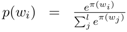

      不同于一个density matrix中对所有词向量求平均，局部窗口区域的densitymatrix表示为：

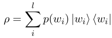

        如下图所示，以词为中心计算窗口范围内的 density matrix，对局部子语义系统的不确定性进行计算。

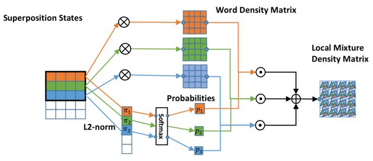

 

(3) match question and answer

        在QA场景中，给定一个问题，需要找到最匹配的答案，本文利用句子的density matrix对问题和答案分别进行建模，并计算它们的距离：

        首先，对长度均为L的问题答案对组成的句子对分别表示为：

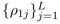  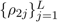   

       定义抽取特征的semantic measurement vector（K个，初始化为正交one-hot向量），用于抽取 density matrix 的high-level特征：

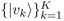

        利用semantic measurement vector和句子的 density matrix 序列，计算k-by-L的特征矩阵：

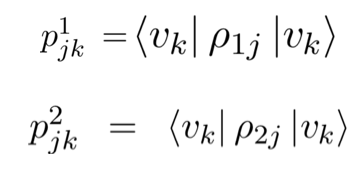

            整体框架如下图：

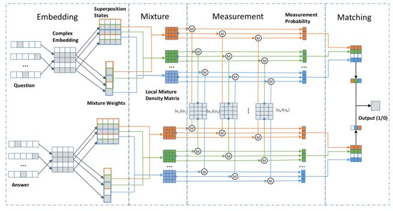

(4)、利用density matrix并提取特征计算语义距离的优势：

a. 保留了 density matrix 中所提取特征的概率分布；

b. 相比计算矩阵的迹，density matrix 利用measurement vector的计算方式更易于计算；

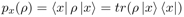

c. measurement vector 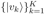 为可训练的向量，相比于CNN的卷积核/RNN的cell计算更方便，且易于理解；

d. datadriven的方式（complex-valued vectors）使得端到端的网络训练更方便。

 

**4****、****Experiment**

（1）QA semantic matching：

 本文在两个QA数据集上进行了实验，数据集特性如下图：

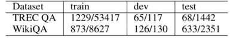

本文提出的方法在两个数据集上相比于quantum-inspired的QA模型（QLM,NNQLM-i, NNQLM-ii），表现更好，并且在WikiQA上击败了所有的方法。

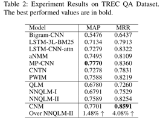

           

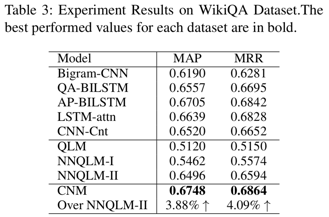

    同时，本文也针对实验的细节做了 ablation study：

•       **FastText-MaxPool** adopt max pooling over word-embedding

•       **CNM-Real **replaces word embeddings and measurements with their real counterparts

•       **CNM-Global-Mixture** adopts a global mixture of the whole sentence

•       **CNM-trace-inner-product** replaces the train- able measurements with trace inner product like NNQLM

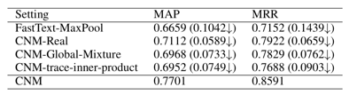

（2）可解释性

         基于 complex value 的向量表示，为模型提供了可解释性，本文从以下三个方面进行了可解释性的分析：

a.    Transparency

对模型中每一部分的元素的物理含义进行了解读。

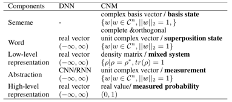

需要注意的是，进行特征抽取的 measurement vector 在模型中是可训练的，并且是一个具体的正交向量（表达一个基态），相比于CNN中的卷积核或RNN中cell更易于理解。

b.    Post-hoc interpretability

本文对模型进行语义匹配时，对问题和答案中相对重要的词进行了可视化，如下图所示，由图可知，在语义匹配的过程中，本文提出的模型确实选择出了一些相对重要的词，以此可匹配到问题答案对，从而对模型的匹配结果进行了解释。

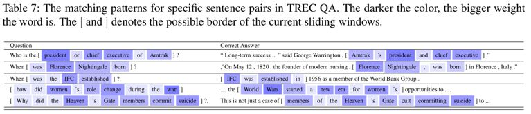

 

**5****、****Conclusion**

本文利用量子力学中的数学模型对语义空间中的语义单元进行了建模，并生成了与一般常用的实数值向量不同的复数值向量（complex-valued vector），使用复数表示的向量不仅在计算上更为方便，并且在空间中可表达一定的语义物理意义。

利用量子力学建模语义空间的思想，不仅在本文中被使用，早在一些论文中也被提出，不同于其他论文中的模型，本文选择在语义希尔伯特空间中对语言进行建模，并且在计算densitymatrix矩阵方面方法更高效。除此之外，基于量子力学的思想，也可利用其他空间的思想对语义进行建模，并设计神经网络应用到更多自然语言处理的场景中。

       本文提出的模型，在考虑语义单元物理意义的情况下，具备一定的可解释性。

 

 

**OpenKG**

开放知识图谱（简称 OpenKG）旨在促进中文知识图谱数据的开放与互联，促进知识图谱和语义技术的普及和广泛应用。

点击**阅读原文**，进入 OpenKG 博客。
