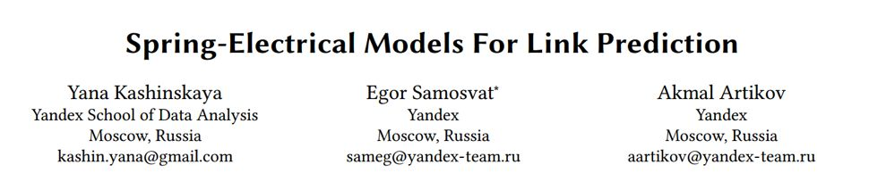
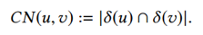
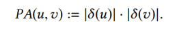
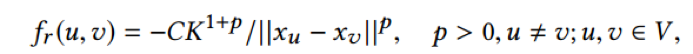
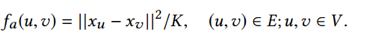
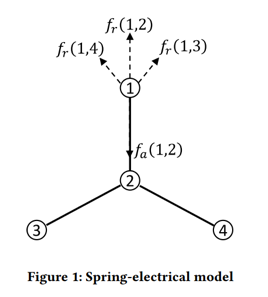
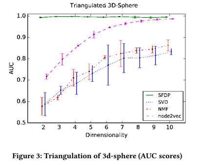
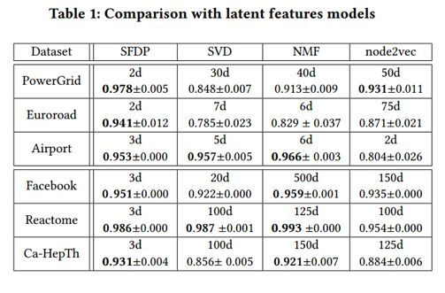

## 一种嵌入效率极高的 node embedding 方式

&gt; 笔记整理: 

论文笔记整理：叶群，浙江大学计算机学院，知识图谱、NLP方向。

会议：WSDM 2019

链接：**https://dl.acm.org/citation.cfm?id=3290961**

**Motivation**

基于spring-electrical的模型在网络可视化中取得了非常成功的应用，一个优秀的网络可视化算法意味着越相似的节点在空间中欧式距离越相近。本文将spring-electrical模型应用在了链接预测问题上，前提是假设节点之间的欧氏距离和节点之间存在link的概率成正相关。性能评估上，模型与baseline的对比显示了其性能的优越，尤其是在node embedding维度很低的时候。

**Problem Statement**

      知识图谱由于种种原因，其中很多节点之间存在缺失的边。链接预测算法指的是，给定网络节点和网络结构等信息，去预测尚未存在边的节点之间存在链接的概率。实验中，给定网络G=&lt;V,E&gt;，我们随机掩盖一定比例的边（如10%），并采样一部分负例作为测试集，然后将剩下90%的边和所有节点作为训练集。

评估指标采用AUC值：

**Baseline**

介绍三种常用的baseline

1. Local similarity indices

分析节点周围的局部结构，作为节点之间存在链接的概率（以下式子中δ表示节点的相邻一跳节点）。
- Common neighbours：以两节点公共邻居的个数来衡量存在链接的概率

- Adamic-Adar index：common neighbours的一种加权的改进

- Preferential Attachment index：以节点现有的度来衡量节点之间存在链接的概率（非常naïve的assumption）

2. Matrix factorization

矩阵分解的方式将网络的邻接矩阵作为输入，分解成两个低秩的矩阵。低秩矩阵的行或列可以作为节点的latent feature，将两节点的latent feature做点积，即可得到两节点之间存在链接的概率。
- Truncate SVD

- Non-negative matrix factorization（NMF）

3. Neural embedding

一些工作尝试用神经网络来学习graph embedding，比如经典的DeepWalk和node2vec算法，都是受word2vec的启发。基本思想是将图中的节点当做单词，在图中随机游走得到一系列节点当作一个句子，然后利用word2vec的目标函数来做训练。训练完成后，将节点的embedding做点积，即得到节点之间存在链接的概率。

**Model**

Spring-electrical中的spring指的是弹簧，electrical指的是电荷，其基本思想是将一张图当做一个机械系统，将图中的节点比作电荷，将边比作弹簧。所有的电荷均为同性电荷，相互之间存在斥力；弹簧力表现为引力。基于这样的假设，当这个力学系统达到平衡之后，不存在边相连的节点将会由于斥力，在空间距离上分布较远。

对库伦定律进行修改，引入超参p，电荷之间的斥力公式为：

对虎克定律进行修改，弹簧的引力公式为：

通过利用力是能量的负梯度这个性质，可以将一个力学系统转换成能量系统，力的平衡对应系统能量的最小值。所以，目标函数为求解系统能量的极小值，即：

     上式的求解存在两个问题：1）计算复杂度过大；2）容易收敛到局部极小值。本文采用了一种叫做ScalableForce Directed Placement（SFDP）的优化方法进行求解，较好的解决了这两个问题。

**Case Study **

      在实际的数据集上进行评估之前，本文先在由球体的三角剖分得到的图上进行了casestudy。链接预测的结果如下图所示，可以看到SFDP方法取得了很好的效果，同时注意到SFDP方法在向量维度极小的情况（d=2,3）下，依旧取得非常好的效果。

除此之外，实验将d=3的向量进行了可视化（如下图），比较了不同模型可视化的差异。可以看到，SFDP方法很好的保留了球体的原始形状，SVD向量分布在3条坐标轴上，node2vec则是一个锥形。造成这种差异的原因是，SFDP采用了欧式距离作为损失函数，而SVD和node2vec则是基于点积。基于欧式距离的损失函数会使不相似的节点在空间上尽可能远，而点积则会使不相似节点尽可能垂直。

**Experiment **

实验在以下几个公开数据集上做了评估：PowerGrid: 美国的电力供应网络；Euroroad: 欧洲道路交通网络；Airport: 美国航空机场网络；Facebook:      Facebook社交网络；Reactome: 蛋白质的相互作用网络；Ca-HepTh:arXiv上的作者合作关系网络。

实验结果如下图所示，SFDP在多数数据集上的表现都达到最优，同时在向量维度d=2,3时就可以得到非常好的实验效果。

下表是得到最佳结果时embedding维度的比较，SFDP方法在d=2,3维度时的结果就可以媲美其他模型100维甚至500维的效果，embedding效率极高。

下表给出了SFDP模型与localsimilarity indices方法的效果比较：

另外实验还在二分网络和有向图数据集上进行评估，并对SFDP做了相应的修改。

**Conclusion**

            本文将网络可视化中的spring-electrical模型应用在了链接预测问题上，在数据集评估上取得了十分优越的结果，尤其是在低维空间展现了非常好的效果。Embedding维度效率的提升可以解决向量嵌入在现实应用中的一些问题，如向量维度过高时最近邻搜索的计算复杂度过高。后续工作可以聚焦在如何为latent feature model选择更优的距离度量以及向量维度效率更深入的分析。

 

**OpenKG**

开放知识图谱（简称 OpenKG）旨在促进中文知识图谱数据的开放与互联，促进知识图谱和语义技术的普及和广泛应用。

点击**阅读原文**，进入 OpenKG 博客。
