## 为基于知识库的问答构建形式查询生成

> 论文笔记整理：刘晓臻，东南大学计算机科学与工程学院本科生。

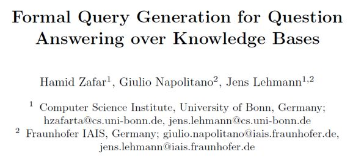

**Citation: H.Zafar, G. Napolitano, and J. Lehmann. Formal query generation for question**

**answering overknowledge bases. ESWC, 2018.**

**https://link.springer.com/content/pdf/10.1007%2F978-3-319-93417-4_46.pdf**

## 

## **动机**

QA 任务通常被划分为命名实体消歧（Named EntityDisambiguation, NED），关系提取（Relation Extraction, RE），以及查询生成（Query Generation,QG）几个子任务。但这种划分很少能够真正实现QA系统构造的模块化，这导致研究人员群体无法成功有效地将自己的研究建立在本领域之前的成果上。虽然的确有诸如OKBQA的模块化框架的存在，但OKBQA对查询生成关注的太少，其24个可重复利用的QA组件中只有一个是查询生成器。而且，不断增加的问题复杂程度给查询生成任务带来了几个难点：
1. 处理大规模的知识库；1. 识别问题类型，诸如布尔型；1. 处理有噪声的标注；1. 对一些需要特殊查询特性的复杂问题的支持，诸如聚集、排序和比较等；1. 输入问题存在句法上的不明确性，如语序可以颠倒等。
识别问题类型，诸如布尔型；

对一些需要特殊查询特性的复杂问题的支持，诸如聚集、排序和比较等；

因此，针对以上的问题及难点，本文提出了SPARQL查询生成器（SPARQL QueryGenerator, SQG），一个能够超越现有最高水平的，用于QA任务工作流的模块化查询构造器。SQG使用基于树形LSTM（Tree-LSTM）相似度的候选查询排名机制，能够处理含噪声的输入，且在基于DBpedia的大型Q/A数据集上经过评估。

## 

## **贡献**

文章的贡献有：

（1）给出了KBQA任务中QG任务的模块化、与其他子任务分开的正式定义。

（2）指出了影响QG任务性能的因素，并针对这些现有难点，提出了SQG这一模块化的、性能优良的查询生成器，并引入排名机制增强答案的准确度。

## 

## **方法**

（1）任务定义及理论基础

定义查询生成如下：给出问题字符串**s**和一个知识图谱**K =****（****E,R,T****）**，其中**E**为实体集合，**R**为关系标签集合，为有序三元组集合。在QA工作流的之前阶段已执行实体和关系的链接，即已给出一个从**s**的子串（话语串）到知识图谱中的**E**和**R**各自映射的集合**M**。查询生成这一任务即用 **s, D** 和 **M **来生成一个 SPARQL 查询。（**文中并未对****D****做出明确解释**）由于NED和RE模块会为问题中的每一个话语串列出一些候选注释，因此这一注释任务在此就不那么重要。基于查询生成的定义，可以定义高级查询生成任务：条件是每一个子串** s** 都已映射到**E**和**R**各自的一个非空子集上，即实体和关系都有一些候选注释。例如，如图 1 所示，实体“artists”有多个候选注释，诸如“dbo:Artist”，“dbo:artists”等。本文的实验表明考虑多个候选注释而不是只选择得分最高的注释会提升表现。

 

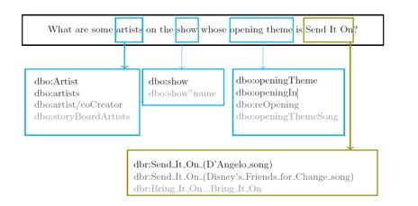

图1 一个经过NED和RE组件输出注释后的简单问题。

对于问句中每个已识别的话语串，根据可行度得分排名

列出一些候选注释。

 

本文猜想一个问题的形式化理解为知识图谱中的一个路径（walk）**w**，其只含有输入问题**s**的目标实体** E** 和关系 R，以及答案节点。其中，知识图谱**K =****（****E,R,T****）**中的一个路径定义为一串边和这些边连接的节点：**W **=** **(**e0­,r­­0,e1,r1,e2,…,ek-1,rk-1,ek**)，且对于 0≤i≤k-1，(**ei,ri,ei+1**)∈**T**。就一个实体集合**E’**和关系集合**R’ **而言，当且仅当一个路径**W**包含 E’ 和 R’ 中的所有元素时，此路径为有效路径，即 ∀**e**∈**E’ **:** e**∈**W** 且 ∀**e**∈**R’ **:** e**∈**W**。若一个节点** e**∈**W****，**但** e **∉ **E’**，此节点即为未连接的，未连接节点用来连接一个路径中其他的节点。

获取有效路径有两步：第一步，先确定问题的类型（例如为布尔型或计数型），根据类型来从知识图谱中抽取一些有效路径，但因为这些路径可能会无法正确获取问题背后的意图，大部分路径可能都是输入问题的错误映射。这时就需要第二步，根据候选路径和输入问题的相似度来对候选路径排名。SQG的大体框架如下图2。

 

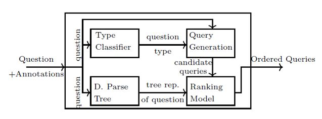

图2 SQG的框架

（2）查询生成

将任务限制在含有所有链接实体和关系的子图中，在其中列举出候选路径并直接映射到SPARQL查询中。另外还需要识别问题类型才能从有效路径中创建结构正确的候选查询。 

获取子图：从一个充满链接实体**E**作为节点的空子图开始，增加与在知识图谱中存在的链接关系**R**相对应的边，如图3中实线所示。在这一步中，一个关系可能连接两个子图中已有的节点，也可能将一个实体与一个未连接的节点相连。这样一来这个子图就可能包含一些有效路径，但根据问题的意图，可能需要包含距离实体两跳（hop）的节点，故这些有效路径可能都不是正确的。比如在图3中，由于答案节点“unbound1”距离实体“dbr:Send_It_On”两跳，就没有被包含在当前的子图（由实线连接）中。为了解决这个问题且避免在底层的知识图谱中搜索空间过大，本文的做法是用候选关系集合**R**来扩大子图中现有的边并且排除现有边代表的关系。如图3所示，虚线代表扩展的边。获取子图的算法如算法1所示。

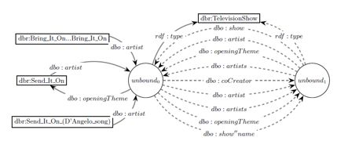

图3 为已标注候选实体和关系的所给问题获取的子图；

实线表示的是在一跳距离上的子图；

虚线是在大于一跳距离上的子图；

圆圈代表未连接节点，方框中是链接实体，

边是知识图谱中的关系。

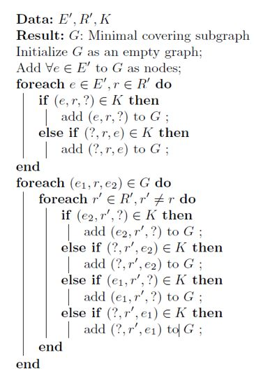

算法1 获取子图

列出候选路径：获取覆盖了问题中所有实体和关系的子图之后，视每个未连接节点为潜在的答案节点，由此需要寻找有效路径，有效路径的定义上文已给出。例如，图4中有四个有效路径。若子图中只有一个有效路径，映射该路径到SPARQL查询上并将其报告为所给问题对应的查询；若有不同类型的问题，比如要求计数或者是返回布尔值的问题，可能还需要进一步的扩大；若不只有一个有效路径，则需要执行如下文所示的排序任务。

 

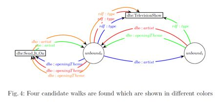

图4 找到的四个候选路径，分别用不同的颜色表示 

问题类型分类：SQG支持简单和复合问题。为了支持诸如布尔型和计数型的问题，首先需要识别问题的类型。本文的做法是训练一个SVM和朴素贝叶斯模型以根据问题的TF-IDF表示来将其分为布尔型、计数型或是列举型。给出问题的类型之后，查询生成器就可以根据类型来格式化查询。例如，查询生成器会为一个计数型查询的SPARQL查询输出变量增加相应的函数。

（3）查询排名

本文猜想路径的结构是用来区分候选路径与输入问题之间相似度的一个重要特性。比如，图7中，已生成的四个路径有独特的结构。因此，排名模型就应该需要包含输入问题的结构。

本文给出的排名模型基于树形LSTM（Tree-LSTM），该模型考虑候选路径关于问题句法结构上的树形表示，以此来计算相似度。树形LSTM旨在收纳在子节点中的信息，它考虑到子节点的状态来计算其内在状态和输出。这一结构使得树形LSTM能够轻松地涵盖本文中输入的树形结构。

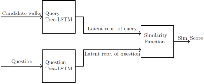

图5 排名模型结构

 

排名模型：图 5 展示了排名模型的架构，使用两个树形LSTM来将输入的路径和问题映射到一个潜在向量化的表达中。之后采用一个相似度函数计算相似度并来排名。在处理问题的树形LSTM准备阶段，用一个占位符来代替实体的表面提及(surface mentions)，在这之后创建一个依存分析树，如图 6。然后，查询树形LSTM接收候选路径的树形表示，如图7，其中只有7a是输入问题的正确表达。

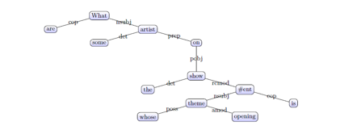

图6 问题“What are some artists on the show whose 

opening theme is Send It On? ”的依存分析树

 

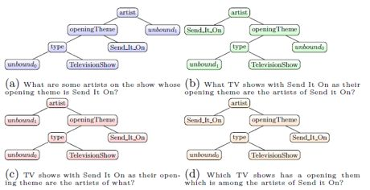

图7 候选路径的树形表示及其自然语言意思，其中颜色同图4。

## 

## **实验**

（1）实验相关细节

SQG用Python/Pytorch实现，其中排名模型中，单词表示采用Glove单词分词工具。实验的数据集为包含5000个问题-答案对的**LC-QuAD**，不过实验时用的是其中的3200对。对于排名模型的数据集生成，采用Stanford分析器来产生输入问题以及（查询生成步骤中生成的）候选查询的依存分析树，并将数据集划分成70%/20%/10%分别用于训练/开发/测试。

用精确率、召回率和F1值来衡量SQG的性能，基线系统为Sina、NLIWOD。

除此之外，本文还分别对SQG的子任务，即问题类型分类、查询生成及排名模型进行了评估。

问题类型分类的评估中，评估结果独立于实体/关系链接模块，在数据集的50%上执行k-折交叉验证，以训练模型并找到最优参数值然后用它评估分类器，分别评估了朴素贝叶斯和SVM的精确率、召回率和F1值。

在查询生成器的评估中，引入三个评估情形。第一个是**Top-1 correct**，只给出正确的链接实体/关系，以提供模型性能的上界估计。第二个是用于评估SQG健壮性的**Top-5 EARL+correct**，EARL是一个用于NER和RE任务的工具，此评估情形考虑来自于EARL的每个实体/关系的5个候选（查询）列表，为了评估SQG独立于链接系统之外的性能，当其不存在于列表中时，插入正确的目标实体／关系。第三个是**Top-5 EARL**，用EARL的输出来评估QG组件在一个功能正常的QA系统中的性能。

对于排名模型，本文实验了两种计算相似度的函数，分别为余弦相似度和基于神经网络的函数，不过经测试神经网络的方法明显优于余弦相似度，因此结果中只分别评估三种情形下，神经网络方法计算相似度的结果。

 

（2）实验结果

如下表1所示，SQG表现明显优于基线系统。基线系统中有三个缺点，一是必须要接收正确的实体/关系输入；二是查询扩大的能力有限；三是缺少排名机制，这些问题在SQG中都得到了解决。

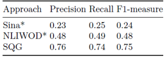

表1 SQG与现有成果的比较

问题类型分类的评估结果如下表2所示，尽管模型简单，但大量的多样化训练数据确保了其优良性能。SQG避免了手写模式集，因此它在不同环境下的应用性更强。

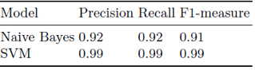

表2 在LC-QuAD数据集上，问题类型分类器的准确率

 

查询生成器的评估结果如下表3所示。在**Top-1 correct**中，由于只有真正的目标实体/关系被给到了查询生成器中，所以有效路径数量非常低。在** Top-5 EARL+correct **中**，**可看出查询生成器能够处理有噪声的输入，并能够涵盖98%的问题，并且平均每个问题生成的查询增加到了2.25。在**Top-5 EARL**中，表现显著下降，因为对于85%的问题，EARL提供的是部分正确而不是完全正确的注释。如果只考虑EARL能够容纳所有正确目标链接的问题，覆盖率就能够达到98%。

 

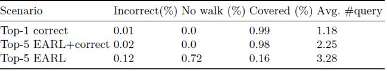

表3 查询生成器的评估标准

 

排名模型的数据集细节如下表 4。在 **Top-1 correct **中，每个问题生成的查询数量是1.18，因为没有很多可能的链接实体/关系的方式。表中第一行结果中正确/错误数据的不均衡导致排名模型接收的是一个不平衡的数据集，因为数据集中的样本大多是正例。而在**Top-5 EARL+correct**中，生成的查询数量增加带来训练数据数量和多样性的增加，此时正确和错误数据的分布几乎是平衡的，这带来模型性能上的提升。在**Top-5 EARL**中，尽管生成的查询的平均数相比前两种情形更高，但正确和错误数据的分布仍不均衡，这是因为72%的情况下没有路径被生成，导致生成的查询总数远比其他情形少。错误如此之高是因为NED和RE组件提供的错误注释。

 

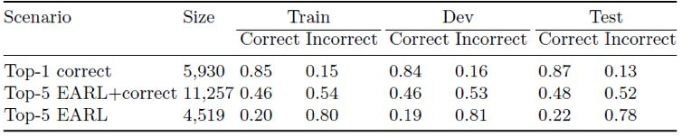

表4 每一个情形中正误数据的分布

 

排名模型的评估结果如下图5。在** Top-1 correct** 中，尽管数据集分布不均衡，排名模型也能达到74%的F1值，但由于此情形下平均查询数量只有1.18，故此结果不能准确地反映模型的性能。在**Top-5 EARL+correct**情形下，F1值增加到84%，表明模型相对于第一种情形，在数据集更大和更均衡的情况下表现更好。在**Top-5 EARL**中，微F1值下降到74%。这是由于数据集的不平衡和数量小。

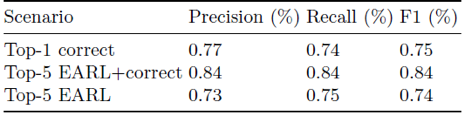

表5 使用排名最高的查询得到的排名模型微准确率

## 

## **总结**

本文探讨了QA系统中查询生成任务的难点，引入了可以轻松集成进QA工作流的模块化查询生成器SQG，其先生成候选查询，再进行排名。实验表明SQG性能优于现有的查询生成方法。

