## 从知识图谱流中学习时序规则

&gt; 笔记整理: 

论文笔记整理：汪寒，浙江大学硕士，研究方向为知识图谱、自然语言处理。****

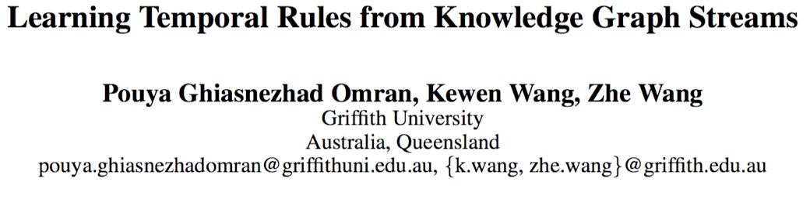

链接：http://ceur-ws.org/Vol-2350/paper15.pdf

## 

## **动机**

知识图谱是现在十分流行的数据管理方式，在最近几年应用广泛。但目前的基于KG的规则挖掘主要都是针对静态的KG，无法应用于有时间维度的KG。本文提出了一种针对有时间维度的KG流的规则挖掘算法，挖掘出的规则也有时间维度。

## ****

## **亮点**

文章的亮点主要包括：

提出了针对KG流的规则挖掘算法，可以挖掘出带有时间维度的规则。

## ****

## **概念**

1.Temporal closed-path rule r(k)，LHS记为body(r)，RHS记为head(r)

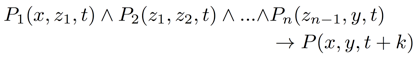

2. support degree of r(k) at time point τ，在时间点τ满足r(k)的实体对个数

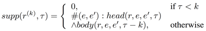

3.standard confidence和head coverage

 

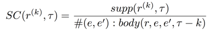

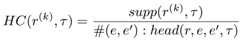

4.dynamic standard confidence (DSC) 和 dynamic head coverage(DHC)，作者认为不同时刻的rule的SC和HC应该与之前时间步的SC和HC相关

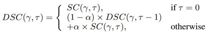

       5.S[i,j]表示时间步i到时间步j时刻的KG

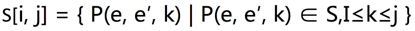

       6.S*[i,j]表示把S[i,j]的所有元组去掉时间维度后获得的静态KG

## 

## **方法**

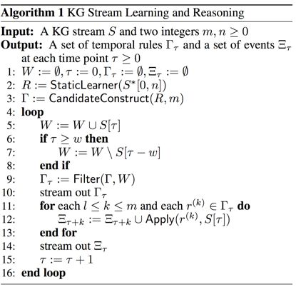

先把整个KG流转换成 static KG，用不带时间维度的规则挖掘算法 RLvLR 挖掘CP rules。然后根据DSC和DHC筛选规则，为了减少计算量，在筛选规则时加入了滑动窗口，只计算滑动窗口时间步内的KG。W包含了所有在当前滑动窗口的KG片段。

## 

## **实验**                                                                

⑴. 数据集

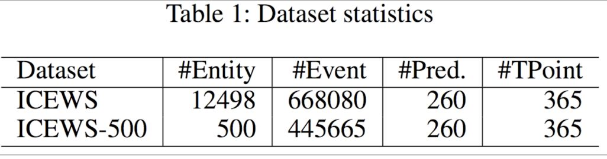

用的是Integrated Crisis EarlyWarning System (ICEWS) 数据集。

⑵. 实验结果

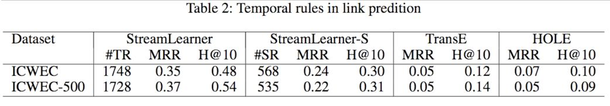

## 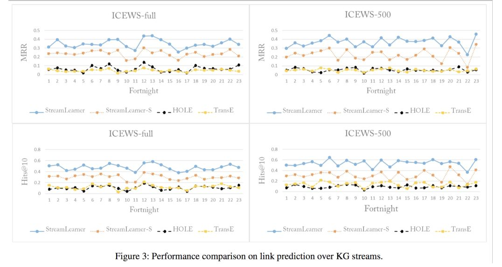

## **总结**                                                  

本文提出了一种可以在KG流中挖掘带时间维度的时序规则算法。****

** **

**OpenKG**

开放知识图谱（简称 OpenKG）旨在促进中文知识图谱数据的开放与互联，促进知识图谱和语义技术的普及和广泛应用。

点击**阅读原文**，进入 OpenKG 博客。
