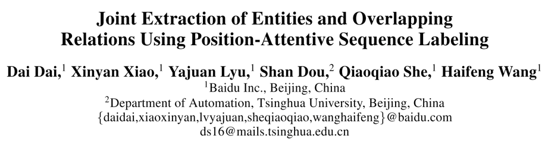
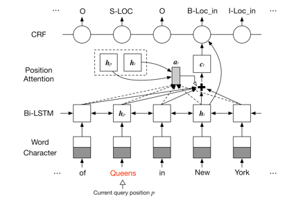
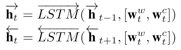
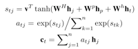
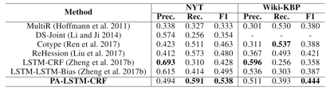
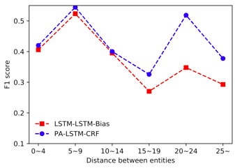

## 使用位置敏感的序列标注联合抽取实体和重叠关系

> 论文笔记整理：余海阳，浙江大学硕士，研究方向为知识图谱、自然语言处理。****

链接：https://wvvw.aaai.org/ojs/index.php/AAAI/article/view/4591

 

## **动机**

之前的联合抽取实体以及实体间的关系的方法，主要是采用管道模型，即先识别出实体，再找出实体间的关系。这样的框架容易推导但易导致错误传播，以及忽略了实体和关系间的内在联系。Copyre的方法采用seq2seq2连续生成三元组的方式进行抽取，却不容易处理当实体是多个多个词组成的情况。本文提出了一种新的统一框架，通过查询次同时对实体和关系进行序列标注的方式联合抽取出三元组。

## **亮点**

与之前的模型相比，我们提出了新的统一框架进行联合抽取。给定一个句子和一个查询位置p，我们的模型将回答两个伪问题：“p处的实体及其类型是什么？”和“ p处的实体与哪个实体有关系？”通过回答这两个问题我们将联合抽取问题转化为序列标注问题，对于n个单词的句子我们根据n个查询位置注释了n个不同的标签序列。为了在单个统一模型中对这n个标记序列建模，我们将一种新颖的位置注意力机制引入序列标记模型以生成n个不同的位置感知语句表示。另外，所提出的注意力机制可以在单词（实体）之间建立直接连接，这可能有助于提取远程关系（两个实体之间的距离很长）。

## **模型**

模型的标注方式如下图。

我们的标记方案是，对于n个单词的句子，根据不同的查询位置p对n个不同的标记序列进行注释。在每个标签序列中，如果实体类型是在实体的开始处，则在当前查询位置p标记实体类型，而在p处与该实体有关系的其他实体则用关系类型标记，其余令牌被分配了标签“O”（外部），表明它们与所关注的实体不对应。因此，可以基于标签序列提取由三元组（Entity1，RelationType，Entity2）表示的关系。显然，第一个实体可以多次使用组成重叠的关系。

 

模型的整体架构如下图。

首先使用 word-level embedding 和 charcter-level embedding 一同喂到 Bi-LSTM 网络中，得到双向的 rnn 结果，拼接后即可得到整个句子的表征信息。

检测一个实体与另一个实体存在关系的关键信息包括：（1）实体本身内部的单词；（2）依赖的另一个实体；（3）表征关系的上下文。基于这些考虑，我们提出了位置注意力机制，它可以对查询位置处的实体信息以及整个句子的上下文信息进行编码，生成位置感知和上下文感知的信息表征，其中 c_t 是整个句子在注意力池化后的向量表征。

最后使用CRF解码句子即可得到最终的标记结果，得到对应的三元组。

## **实验**

我们使用纽约时报（(Ren et al. 2017）和            Wiki-KBP （Xiao and Weld 2012）的数据集来评估该方法。NYT和Wiki-KBP的统计数据如下表所示。

为了证明我们的模型对实体间长距离的抽取效果更好，我们和lstm-lstm-bias模型做了对比，如下图。

## **总结**                        

在本文中，我们提出了一个统一的位置注意力的序列标注框架，用于联合抽取实体和重叠关系。实验表明，我们的方法可以有效地提取重叠关系，并在两个公共数据集上取得了最先进的结果。此外我们发现注意力机制有助于建模远程依赖关系，提高了模型在远程关系检测中的性能。****

** **