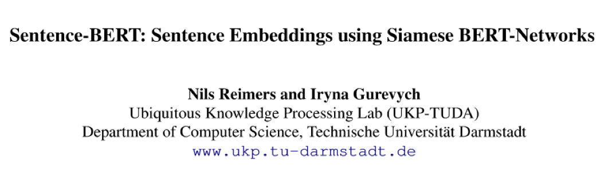
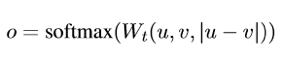
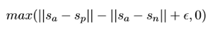
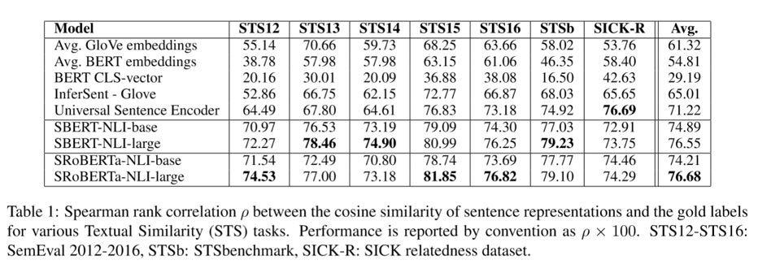
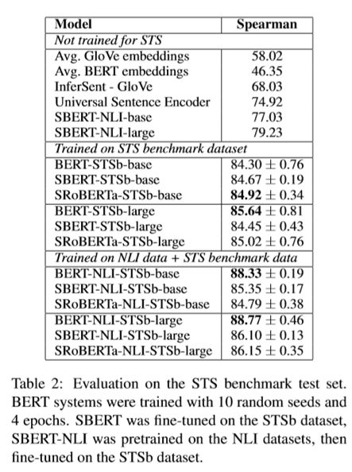
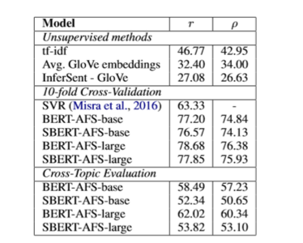
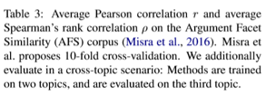
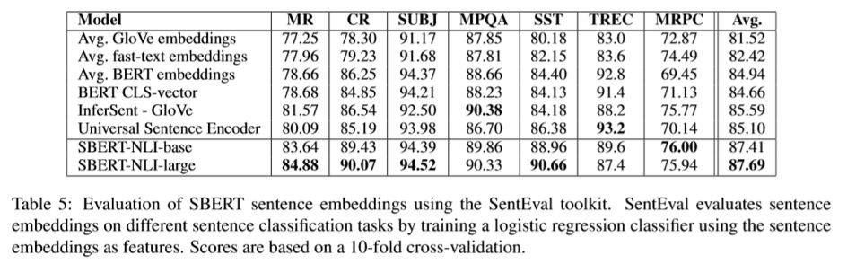
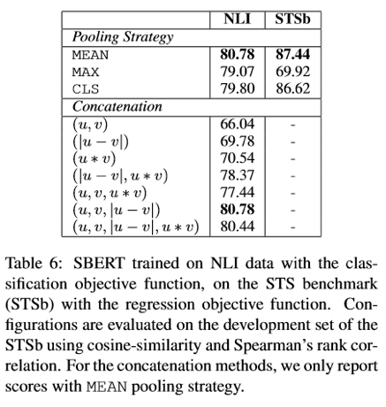
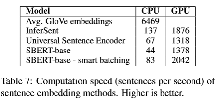

## 使用孪生BERT网络生成句子的嵌入表示

> 论文笔记整理：吴杨，浙江大学计算机学院，知识图谱、NLP方向。

> 来源：EMNLP 2019

## **动机**

谷歌的 BERT 预训练模型，已经能够在两个句子的语义相似度匹配等需要输入一对句子的任务上取得了非常好的效果，但是，假如说现在有N个句子，需要为每个句子找出与其最相似的另一个句子，显然使用BERT需要O(N*N)的时间，这是非常耗时的操作。因此有必要通过生成每个句子的Embedding，然后通过Embedding直接计算相似度来大大减轻计算量。由于直接使用BERT的输出（CLS，或者平均）作为句子Embedding的效果并不好，因此本文提出了使用孪生网络来输出优秀的句子Embedding。

## **方法**

**(1) 概述**

SBERT 网络是通过 SNLI 数据集（标注了一对句子之间的关系，可以是蕴含、矛盾或者中立）进行预训练的，所谓孪生网络其实就是两个一模一样共享参数的网络，我们首先将第一个句子输入到BERT，通过不同的Pooling方法获得句子的Embedding表示，第二个句子同样如此，然后将这两个Embedding变换后通过Softmax输出这对句子之间关系的概率进行训练（分类问题）。在训练完毕后，我们就可以将下面的BERT和pooling层拿出来，将句子输入得到其Embedding，再进行其他操作（比如计算相似度可以直接使用cosine-sim）

**(2) Pooling方法**

**a.** CLS:直接使用CLS的输出作为Embedding

**b.**MEAN: 平均所有token的输出作为Embedding

**c.** MAX:取每一维输出向量的最大值

**(3) 目标函数：**

**a. **分类目标函数：

其中 u 和 v 为两个句子的 Embedding，Wt为变换矩阵，最终的维度为3n*k

该目标函数可用于预训练Sentence Embedding

**b. **回归目标函数

该目标函数直接计算u和v的cosine相似度，将之均方误差作为loss。另外结构

也是预测时候的计算方式

**c. **三胞胎目标函数：

其中Sa为句子a的Embedding，Sp则为句子p，句子p是跟a属于同一类型的

正例句子，n 则是一个反例，三胞胎网络和孪生网络类似，这个目标函数是为了让

正例距离尽量近而反例尽量远

**(4) 预训练：**

SBERT在SNLI和MultiNLI数据集上训练，其中SNLI包括了570,000对句子标注了矛盾(contradiction)、蕴含(entailment)和中立(neutral)关系

**(5) 评测：**

**a.** 无监督语义相似度匹配(unsupervised STS)

- STS 数据集：语义相关度标注数据集，给定一对语句，标注其语义相关度（从0不相关到5非常相关）

- 在SNLI和NLI数据集上pre-train，不进行fine-tune，直接计算cos相似度，使用spearman计算cos相似度和标签的相关性，因为标签是离散值，而预测的时候使用的是回归模型，因此需要计算其相关度，论文中说普通的相关度计算不太好，使用Spearman是比较不错的选择

**b. **有监督语义相似度匹配(supervised STS)

- 在NLI数据集(两个语句是否蕴含、矛盾、中立)上pre-train

- 在STSb数据集(语义相似度数据集)上进行fine-tune并进行评测

- 使用cos相似度计算，使用Spearman计算与label的相关度

**c. **辩论观点相似度匹配(Argument Facet Similarity)

- AFS语料库包括了关于gun control, gay marriage, 和death penalty三个主题的一系列辩论观点，其标注了一对辩论观点的主题是否相同(0-完全不同的主题，5-完全相同的主题)，作者在论文中说，由于AFS的相似度判断不仅仅是观点类似，还需要是理由也类似，而且AFS的用词和语句表达跟SNLI差距很大，因此直接使用pre-train的Embedding计算相似度效果不太好。

- 同时采用了十折交叉检验和使用其中的两个topic训练，3个topic测试的方案，采用Spearman相关度计算

**d. ** Wikidata相同段落识别(Wikipedia Sections Distinction)

- 对wikipedia的任意两句话标注了是否属于同一小节

- 采用三胞胎网络进行训练，采样两个同一小节和一个不同小节的语句,让同一小节的Embedding尽可能近，不同小节尽可能远

**e. **SentEval迁移学习

- SentEval是专门用于测试Embedding效果的数据集，但是其任务跟本文这些pre-train和fine-tune时的没什么关联，其任务主要有：
- MR: 影评的情感预测                 
- CR:商品评价的情感预测
- SUBJ: 影评的主观程度预测       
- MPQA:新闻观点的两极分类
- SST: 斯坦福情感树分类              
- TREC:问题类型分类
- MRPC: 微软的判断语义是否等价的数据集

从结果中可以看出，SBERT输出的句子Embedding表现不错，并且对句子中的情感成分捕捉的很好。而相比之下，原生BERT输出的CLS向量表现的不尽如人意

**(6) 模型简化测试：**

作者在SNLI和STSb数据集上测试了使用不同的Pooling方法以及不同的u、v拼接方式对输出的SentenceEmbedding的影响。

事实证明，采用各种Pooling方式其实对SBERT的性能影响不大。而改变拼接方式影响较大，普通的(u,v)拼接的性能很差，最重要的一部分是|u-v|，毕竟分类的输出很依赖与计算两个Embedding的差异度

**(7) 计算效率:**

在计算效率上，主要与直接使用GloVe Embedding和使用Universal SentenceEncoder进行比较（BERT需要几十个小时）。

由于Transformer的并行性，因此虽然在CPU上SBERT的表现不太好，但是在GPU上还是不错的。当然直接使用GloVe的效率是显而易见的（直接进行向量运算即可）。Smart batching是说通过将长度相似的句子分为一组，这样在mini-batch中就只需要padding到最长的长度，可以减小padding token的计算开销。

## **总结**

本文提出了使用孪生BERT网络训练Sentence Embedding的方法，事实证明这种方式输出的Embedding在捕捉句子的语义和情感等方面都有不错的效果，在各种任务上都有着不输于fine-tune BERT的成绩，而且很大的提升了计算效率。

