## 使用循环神经网络的联合事件抽取

> 笔记整理: 余博涛，南京大学计算机科学与技术系，硕士研究生

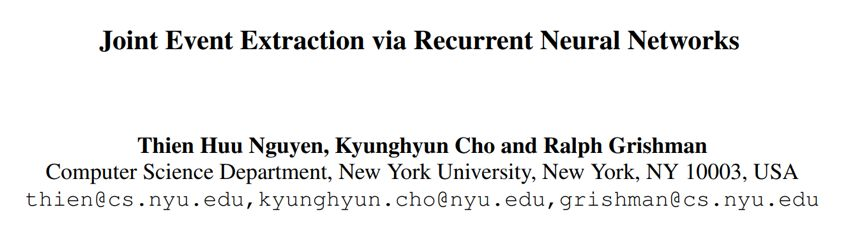

> 论文连接：http://www.aclweb.org/anthology/N16-1034
> 发表会议：NAACL-HLT 2016

## **摘要**

事件抽取（event extraction）是信息抽取中一个特别具有挑战性的问题。针对该问题的最先进的模型要么应用流水线框架（pipelined framework）的卷积神经网络（convolutional neural networks），要么采用通过具有丰富的局部和全局特征进行结构化预测（structured prediction）的联合架构（joint architecture）。前者基于连续和泛化的单词表示，能够从数据中自动学习隐藏特征表示，而后者则能够减缓流水线方法的错误传播问题，并通过离散结构来利用事件触发词（trigger）和论元角色（argument role）之间的相互依赖关系。在本文的工作中，我们提出了一个双向循环神经网络（bidirectional recurrent neural networks，bidirectional RNN）的联合框架来进行事件提取的方法，从而受益于前面所述的两个模型的优点，并解决现有方法中固有的问题。我们系统地研究了此联合模型的不同记忆特征（memory features），并验证该模型在ACE 2005数据集上达到了最好的性能。

****

## **模型介绍**

**1. 概览**

文章所提出的模型是基于ACE所定义的事件抽取任务，该任务包含4个子任务：触发词检测（找出句子中代表事件发生的词）、触发词分类（将触发词分类到预定义的8种类型、33种子类型中）、论元检测（检测事件的参与元素）和论元角色分类（将论元分类到预定义的35种论元角色中）。

本文对事件抽取任务建模如下：将一个句子记为，其中为句子中第个token，即为句子长度；将该句中的实体提及（entity mention）记为，其中是实体提及的数量并且可以为0，它包含实体在句子位置和实体类型的信息；将实体提及的最后一个词在句中位置的索引记为。对于句子中的每个，我们需要预测其事件类型，如果是我们所关心的事件的触发词，则继续预测每个实体提及关于该事件（触发词）的论元角色。因此，事件抽取可定义为分别针对触发词和触发词-论元对的分类问题。

本文所构建的模型如图1所示，主要分为编码（encoding）和预测（prediction）两个阶段。其中编码阶段使用RNN来获得句子的更抽象的表示，而预测阶段则是使用这个表示来同时预测事件触发词子类型和论元角色。

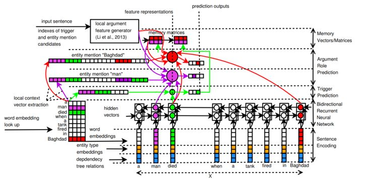

**2. 编码**

**2.1   ****句子编码******

该阶段将以下三个向量串联，将每一个token 转换成一个实数向量：

**1) w_i 的词嵌入（****word embedding****）向量******

通过查询预训练的词嵌入表获得。

**2) w_i 的实体类型嵌入（****entity type embedding****）向量******

采用BIO标注方法对token的实体类型赋值，并通过查询随机初始化的实体类型嵌入表获得该向量。

**3) w_i 与依存树（****dependency tree****）相关的二值向量******

该向量的维度等于依存树中所有可能的关系的数量，对句子做依存关系分析得到依存树，如果对于，依存树中有一边与其相连，则向量中这条边的依存关系对应的维度上置为1，其他维度为0。

对于每个 w_i 进行转换，就能将句子 **W** 转换为实数向量序列 X=(x_1,x_2,⋯,x_n)。

**2.2   ****Recurrent Neural Networks**

将作为RNN的输入序列，学习句子信息的更加有效的表示。对于步骤 **i**，RNN使用当前步骤的输入向量 **x_i **和上一步的隐藏向量 **α_(i-1)** 计算当前步骤的隐藏向量 α_i，即 α_i=Φ(x_i,α_(i-1)，其中 Φ 是非线性转换函数。本文使用的是以GRU为单元的RNN，并且为了解决在第步时正向RNN不能获取其后面的特征信息的问题，本文采用了双向RNN。记正向RNN为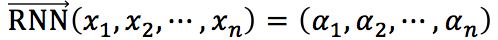 ，逆向RNN为 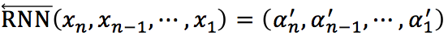。将正向和逆向的隐藏向量串联起来，组成向量 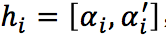，该向量封装了着眼于** w_i **的整句话的上下文信息。

**3.     ****预测******

在预测阶段，模型预测触发词子类型和论元角色。需要注意的是，本文提出使用记忆向量和记忆矩阵、对论元角色、触发词子类型之间的依赖关系进行编码。对于每一步，依次进行如下步骤：

**3.1   ****触发词预测******

在触发词预测阶段，对于当前token **w_i**，首先串联以下向量，得到特征表示向量 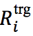.

**1) h_i**

通过双向RNN得到的隐藏向量，其包含输入序列的全局上下文信息。

2)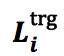

对于 **w_i** 的局部上下文向量，由该token为 d 中心的大小的窗口中的词的嵌入向量组成，即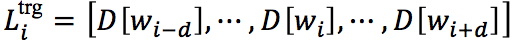。

3)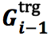

上一步的记忆向量。

随后，将特征表示向量 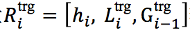 输入一个具有 softmax 输出层的前馈神经网络 F^{trg}中，计算该token在所有可能的触发词子类型上的概率分布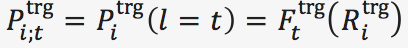，其中 t 为一种事件子类型，最终得到对于 **w_i** 的预测事件子类型 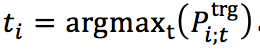。若 **w_i **并非我们关注的事件类型的触发词，则将 **t_i **赋值为“Other”。

**3.2   ****论元角色预测******

在论元角色预测阶段，首先检查上一阶段的触发词预测结果 t_i 是否为“Other”，即非触发词。如果是的话，可以直接将 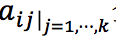 全部置为“Other”并跳至下一阶段。否则，需要针对每一个实体提及 **e_j**，预测其关于触发词 **w_i** 的论元类型。类似地，串联以下向量获取 e_j 和 w_i 的特征表示向量 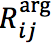：

**1) h_i 和 h_{i_j**}

分别为双向RNN中对应 **w_i** 和 **w_{i_j}**的隐藏向量，其中 w_{i_j} 代表 **e_j **中最后一个词所对应的token。

2)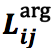

对于 **w_i** 和 **w_{i_j}** 的局部上下文向量，由分别以 **w_i** 和 **w_{i_j}** 为中心的 d 大小的窗口中的词的嵌入向量组成，即

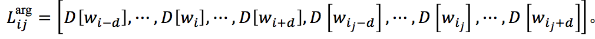

3) **B_{ij}**

对于 **V_{ij}** 的隐藏向量，其中 **V_{ij}** 是前人工作中所提出的表达 **w_i** 和 **w_{i_j}** 之间的局部论元特征信息的二值特征向量，这些特征包括最短依赖路径、实体类型和子类型等，而 **B_{ij}** 则通过将 **V_{ij}**  输入前馈神经网络 F^{bianry} 获得，即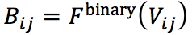。

**4)****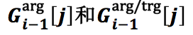**

分别为上一步的记忆矩阵 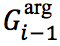和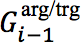中 **e_j** 所对应的行向量。

接下来，类似地，将特征表示向量 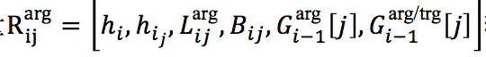 输入到具有 softmax 输出层地前馈神经网络 F^{arg}中，获得在所有论元角色上的概率分布 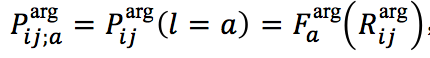，其中 a 为一种论元角色，最终获得对于 **w_i **和 **e_j** 的论元角色预测结果。若 **e_j** 并非我们关注的论元角色，则将 **e_j** 赋值为“Other”。

**3.3   ****更新记忆向量****/****矩阵******

本文提出使用记忆向量/矩阵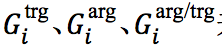来编码触发词和论元之间的依赖关系，具体如下：

**1) 记忆向量****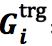****：****编码触发词子类型之间的依赖**

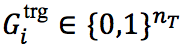，其中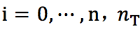，是所有可能的触发词子类型的数目，该向量的更新策略为

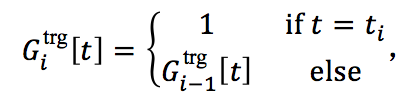

即若 **w_i **的触发词子类型被预测为 **t_i** ，则对应维度置为1，否则不做更改。这个记忆向量“记住”了到第** i **步为止，有哪些触发词子类型被预测。

**2) 记忆矩阵****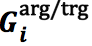****：****编码论元角色之间的依赖**

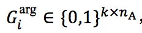，其中 i=0,⋯, n 是本句中所有事件提及的数目，n_A 是所有可能的论元角色的数目，该矩阵的更新策略为

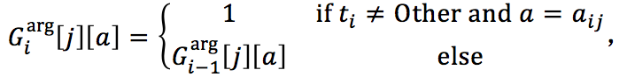

即若被 w_i 预测为是事件触发词，且 e_j 关于 w_i 的论元角色被预测为a_{ij}，则将矩阵中对应实体提及的 e_j 行和论元角色 a_ij 的列置为1，否则不做更改。这个记忆矩阵“记住”了到第 i 步针对 w_i 和 e_j 的论元角色预测为止，有哪些实体提及已经被预测成了哪些论元角色。

**3) 记忆矩阵****：****编码论元角色和触发词子类型之间的依赖**

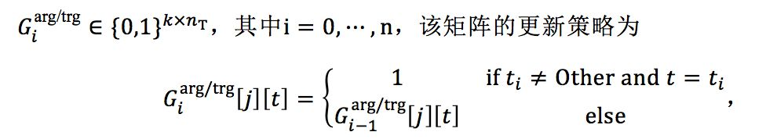

即若 w_i 被预测为是事件触发词且其子类型为 t_i ，则将矩阵对应实体提及 e_j 的行和触发词子类型 t-I 的列置为1，否则不做更改。这个记忆矩阵“记住”了到第 i 步针对 w_i 和 e_j 的论元角色预测为止，有哪些论元角色和触发词子类型被预测。

**4.     ****训练******

训练过程使用log似然函数作为损失函数，使用mini-batch和AdaDeltaupdate rule的随机梯度下降算法优化模型，训练时也同时优化词嵌入表和实体类型嵌入表。

**模型分析******

**1.     ****数据集******

本文使用一个大规模语料库预训练词嵌入表，使用ACE 2005语料库训练和评估事件抽取模型。

**2.     ****记忆向量****/****矩阵的效果实验******

本文在使用C-CBOW模型预训练词嵌入表的情形下，针对三个记忆向量/矩阵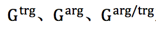对事件抽取的触发词预测和论元角色预测的效果进行了实验，有或没有每一个记忆向量/矩阵构成了总共8种情形，它们的实验结果如下表。结果显示，G^{trg} 和 G^{arg} 的应用对结果没有提升、反而降低了，本文认为是触发词子类型间和论元角色间的依赖不够强，导致它们并未在此模型中起作用。而编码论元角色和触发词子类型之间依赖的 G^{trg/arg} 的应用则显著提升了实验结果。因此在后续实验中，模型仅应用 G^{trg/arg}。

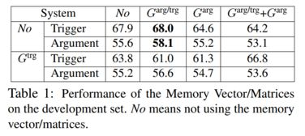

**3.     ****词嵌入的评估******

本文对使用不同词嵌入算法预训练词嵌入表的效果进行评估，结果如下表。其中RANDOM是随机初始化，WORD2VEC是前人工作中使用Skip-gram模型在Google News语料上训练的词嵌入表。结果显示，使用预训练词嵌入表的实验结果明显优于随机初始化，所以预训练词嵌入表对事件抽取任务有十分重大的意义。使用C-CBOW模型的效果优于其他模型，因此在后续实验中，预训练词嵌入表全部使用C-CBOW模型。

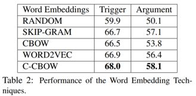

**4.     ****与其他模型的对比实验******

本文对比了Li’s baseline、Liao’scross-event、Hong’s cross-entity、Li’s structure、DMCNN，用JRNN指代本文所提出的模型，实验结果如下表。除了在触发词识别中略低于DMCNN模型，在其他任务中JRNN都取得了最好的效果，尤其是在论元检测和分类中，相比其他模型有较大的提升。实验结果证明了RNN和记忆特征在事件抽取任务中的特征表示的有效性。

**5.     ****一句多事件的实验******

本文对一句话中包含多个事件的情况下的性能进行了实验验证，结果如下表所示，其中1/1代表一句中仅有一个事件，1/N代表一句中有多个事件。结果显示，在不管是一个事件还是多个事件的多数情形下，本文模型都取得了最好的性能。仅仅在论元任务中对于一个句子仅包含一个事件的情况下，性能低于DMCNN，本文认为这是因为DMCNN对于论元使用了位置嵌入特征，而本文的记忆矩阵 G^{trg/arg} 在一个事件的情形下并未起作用。

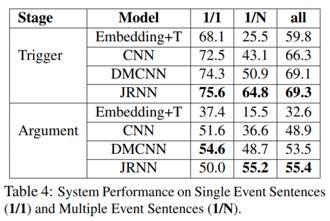

 

