## 使用预训练深度模型和迁移学习方法的端到端模糊实体匹配

> 论文笔记整理：高凤宁，南京大学硕士，研究方向为知识图谱、实体消解。

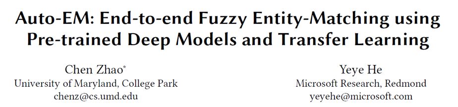

> 链接：https://doi.org/10.1145/3308558.3313578

## **动机**

目前实体匹配过程中实体之间的差异比较微妙，不同的情况下可能会有不同的决策结果，导致难以做出精确的匹配决策。另外现存的实体匹配方法在做出决策之前，往往需要大量的训练数据，而这在许多的应用场景中是难以做到的。

## **亮点**

本文的亮点主要包括：

（1）设计了一种层次化的深度模型，利用了字符级别和单词级别的信息，来预训练常见属性类型的相关模型。

（2）使用了迁移学习的方法，能够利用预训练模型并进行微调，使其能够处理新的属性类型的实体匹配任务。

 
## **系统结构**

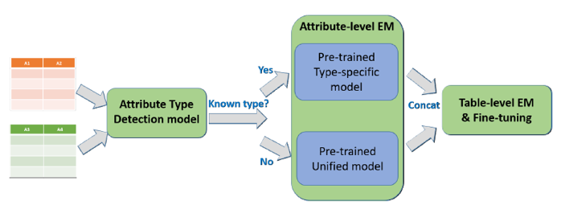

从上图可以看出，整个的系统分为三个组成部分，分别是Attribute Type Detection Model、Attribute-level EM、Table-level EM &amp;Fine-tuning。其中Attribute-levelEM是整个系统的核心部分。

## 概念及模型

1. HI-EM 模型

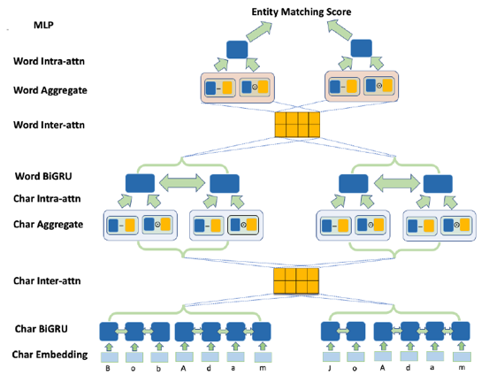

首先该模型针对字符级别和单词级别可以进行划分。在字符级别的层次上，先将输入的字符进行 embedding，转化为向量表示。再通过 BiGRU，使得模型能够学习到字符间的上下文信息。下面通过输入间的注意力机制，进行对齐工作。然后进行聚合工作，将对齐后的表示形式与 BiGRU 得到的表示形式分别进行作差和乘积，然后进行拼接，得到新的表示形式。最后通过输入内部的注意力机制，更新当前字符的权重，最后通过将其他输入对当前字符的影响进行求和，得到单词级别的表示形式。下面单词级别层次上的工作与之类似，最后每一个输入都得到相应的表示形式，然后通过MLP 进行打分，从而进行匹配决策。

2. Type-detection 模型

该模型与HI-EM模型结构相似，但是没有沿用HI-EM模型，是因为在这两个任务中，同一个输入的不同元组的重要程度恰好是完全相反的。基于这一点考虑，Type-detection模型在结构上进行了变动，并且对最后的MLP层的输出结果进行了softmax操作，得到分别表征某个输入属于某个属性这件事为True和False的表示形式。

3. Transfer Learning

在属性类型检测和属性级别的实体匹配中，在处理未知的实体类型时都用到了迁移学习的方法。例如，在属性级别的实体匹配中，对已知的49种属性类型，每种类型都要单独训练一个模型，而对于未知类型的属性，训练模型时采用之前的49种属性类型的训练集的并集，模型基本沿用HI-EM模型，大体结构不变，只改变了MLP层，并进行微调，最终结果是训练得到一个模型。

4. Table-level EM 模型

对属性类型明确的以及未知类型的属性级别实体匹配模型的最终表示形式进行了拼接，最终通过新的MLP层，并进行微调，即可得到表格级别的实体匹配模型。

## 

## **实验**

1.     Type Detection Experiments

（1）   Entity-value type-detection

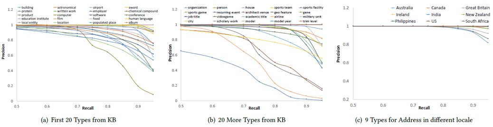

在40种常见属性类型中，绝大多数属性类型上面都有较高的准确率和召回率；在9种添加的地址类型中，尽管测试数据之间的差异较小，模型仍然能够较好地分辨属性类型。

（2）   Table-column type-detection

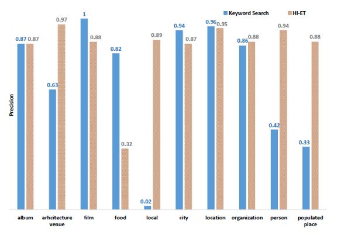

与基于关键字的这种很强的baseline方法相比，本文提出的模型在绝大多数属性类型上面，仍然能够取得跟前者相近甚至较好的实验效果。

（3）   Transfer-learning to new types
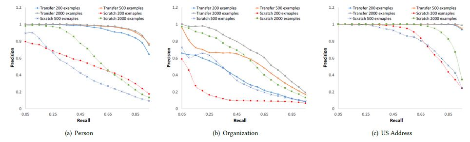

利用迁移学习方法的模型与从零开始学习的模型相比，前者的学习速度更快，有着更高的准确率和召回率。

2.     Attribute-Level Entity Matching

（1）   Pre-trained attribute-level EM

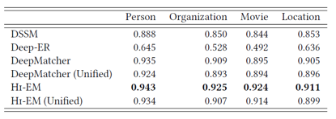

从上表中可以得到如下几点发现：
- 与其他所有方法相比，HI-EM 的实验结果是最好的；- HI-EM(Unified) 模型比 DeepMatcher (Unified) 模型的实验结果要好；- 与属性类型明确的实验模型相比，unified 类型的模型实验结果较差。

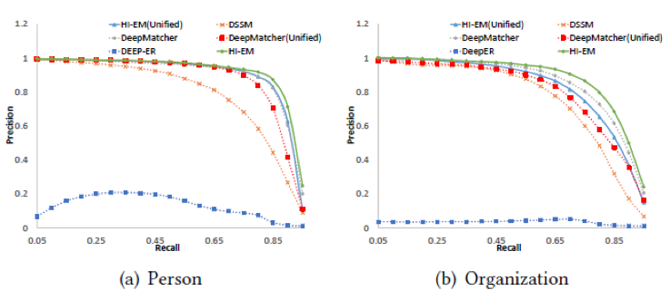

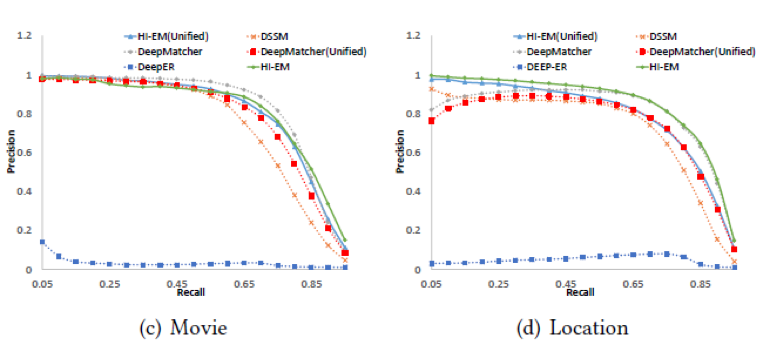

从上图可以发现，在准确率和召回率这对指标上面的实验结果，与MRR上的实验结果基本一致。

（2）   Transfer-learning to new types

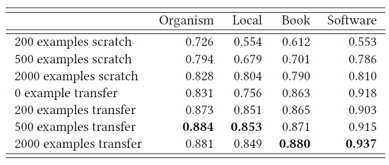

从上表中可以得到如下几点发现：
- 在相同的训练样本数量下，利用迁移学习训练的模型比从零开始训练的模型的实验效果要好；- 训练数据越少时，两个模型之间的差异越明显。
 

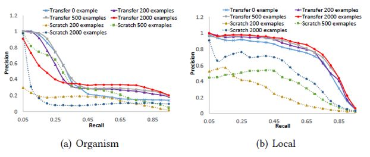

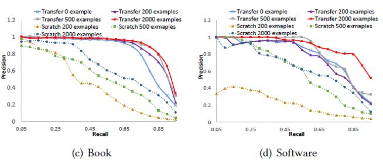

从上图可以发现，在准确率和召回率这对指标上面的实验结果，与MRR上的实验结果基本一致。

3.     Table-level Entity Matching

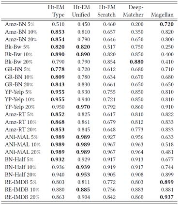

从上表中可以得到如下几点发现：
- 利用预训练模型的实验效果较好，即使只有少量的训练数据；- 在属性级别的实体匹配任务中，属性类型明确的模型是更为准确的；- 绝大多数情况中HI-EM模型的实验效果比 DeepMatcher 和 Magellan 更好。

## **总结**

本文提出了一种利用预训练模型的端到端的实体匹配系统，在迁移学习的帮助下，证明了表格级别的实体匹配模型可以仅用少量的训练数据进行训练。
