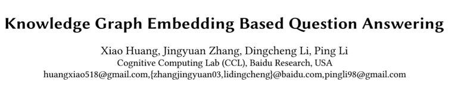
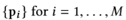
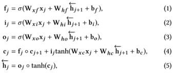
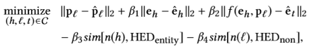
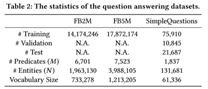
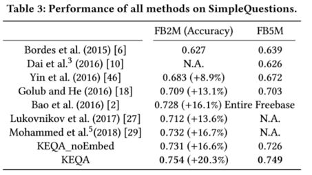

## 利用 KG Embedding 进行问题回答

> 论文笔记整理：吴杨，浙江大学计算机学院，知识图谱、NLP方向。

> http://research.baidu.com/Public/uploads/5c1c9a58317b3.pdf

## 

## **动机**

本文主要针对基于知识库的问题回答中的简单问题，也就是问题的答案只涉及KG中的一跳，此类问题在KG中找到对应的头实体和关系以后，获取到的尾实体即为问题的答案。本文的思路主要是：直接将问题的文本空间向量转化到KG空间向量，并在预训练的（通过TransE之类）KG Embedding中查找与该向量最相似的那个实体和关系，利用他们得到问题的答案。本文的主要贡献在于：

1. 提出了KEQA框架，能够使用KG Embedding查找问题的实体和关系来解决问题
2. 对预训练的KG Embedding和文本转化来的KG Embedding提出了新的距离度量
3. 解释了KEQA的效率和鲁棒性
4. 对预训练的KG Embedding和文本转化来的KG Embedding提出了新的距离度量

## **方法**

**(1) 概述**

对于一个三元组(h, r, t)组成的KG, 我们首先使用KG Embedding模型来对KG中的实体和关系Embedding进行预训练，通过使用TransE或者TransH等方法，最终的得到实体的表示，和关系的表示。随后我们通过神经网络，将问题的单词Embedding作为输入，训练其输出一个关系的Embedding和实体的Embedding，通过计算这两个向量与预训练的关系向量和实体向量的距离，我们取距离最小的两个，作为最终三元组的头实体和关系，来获取到答案。

**(2) ****转化到****KG ****Embedding****空间部分：******

将问题通过Bi-LSTM转化成为d维度的向量。随后经过Attention层并与原单词的Embedding做合并操作，在经过一个全连接层得到该单词映射到KG空间的Embedding，将所有的向量作加权平均，最终就可以得到问题转化成为的头实体向量或者是关系向量（注意转化到头实体和转化到关系使用的是相同的神经网络架构），该组神经网络的训练数据来源于原始QA对中直接取出Answer的头实体预训练Embedding和关系预训练Embedding。损失函数为向量的欧氏距离，涉及到的公式如下：

**(3) ****头实体探测：******

由于KG中的实体一般非常的多，因此有必要在KG中首先将不相关的实体进行剔除操作得到一个子图，然后将的得到Embedding与子图中的实体Embedding进行距离度量已加快速度，在这里，我们首先通过一个神经网络来探测问题中的各单词是否是一个实体。在得到的结果中，我们将输出值为有可能是实体的那些单词，送入KG做实体的字符串匹配，这样就可以拿出仅与这些单词相关的实体了。具体的模型如下：

  首先，单词经过一个Bi-LSTM后，直接进入全连接层，再通过SoftMax得到一个二维的向量，其中第一维表示这个单词是一个实体的概率，第二维表示不是实体的概率。 

 

**(4) ****度量部分：******

  这一部分需要对神经网络输出的实体Embedding和关系Embedding计算其与预训练的Embedding之间的度量：

 其中，(h, l, t)表示候选的三元组，度量项的前三项分别为输出的头实体、关系、尾实体和预训练的头实体、关系、尾实体之间的欧氏距离。注意，由于QA中一个头实体和关系可能对应有多个尾实体，因此这里不直接使用预训练的尾实体Embedding。而是使用预训练KG时的(h, l ,t)之间的关系函数t = f(h, l)来表示（对于TransE，其为h + l = t）。第四项和第五项分别表示头实体和关系的字符串与(3)部分提取出的问题中可能为实体的单词之间的相似度。至此总的KEQA的流程结束。其算法表示如下：

 

## **实验**

**(1)** 在各数据集的数据量：

   由于去解决的是简单问题，因此所用到的数据集为Freebase，其中Freebase的子集FB2M和FB5M以及FB2M的子集SimpleQuestions这三个数据集的数据量以及一些其他特征见下表：

**(2)** 性能评测：

 
可以看的出来，本文在简单问题上的正确率相较于当前的模型还是有一定的提升的。

如果对于使用了不同的预训练模型，比如TransE/H/R之间的性能区别，以及预训练的KG Embedding对QA问题的性能提升可以在下表中看出，对于noEmbed，也就是使用随机初始化的向量值作为实体和关系的Embedding（在距离度量时也采用该Embedding），由于随机初始化的结果服从均匀分布，因此问题退化为一个基本的分类问题。

最后，这一张图则体现了新的距离度量函数对性能的影响，其中第一项表示只保留，第二项表示只删除，第三项则表示依次按顺序将当前的度量项目加入到度量函数中得到的新能结果

## **总结**

本文提出了使用预训练KG Embedding。再使用神经网络将问题空间映射到KG空间的Embedding，并将这二者进行距离度量，取出距离最小的预训练Embedding，从而得到问题的答案头实体和关系的方法。
