## 利用知识-意识阅读器改进的不完整知识图谱问答方法

> 论文笔记整理：谭亦鸣，东南大学博士生，研究方向为知识库问答。

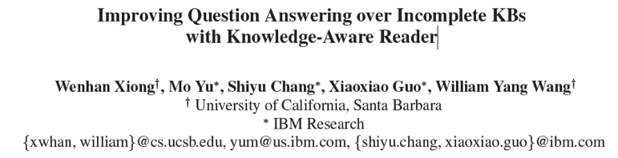

> 来源：ACL2019

 

本文提出了一种融合不完整知识图谱与文档集信息的end2end问答模型，旨在利用结构化的实体，边缘信息（来自问题对应的知识子图）帮助理解非结构化的文档信息（来自检索），从而获得融合的问答证据，用于答案的预测。在WebQSP数据集上的实验表明，本文模型对于完整度不同知识图谱均能在问答性能上带来提升。

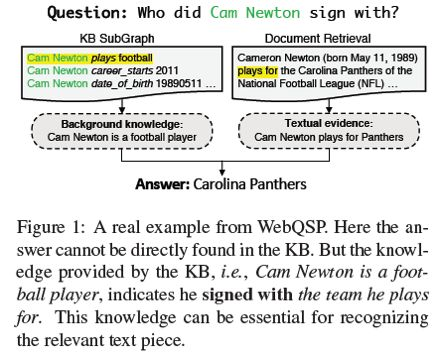

作者用上面这个例子阐述不完整知识图谱问答任务的必要性。从图 1 中的真实示例可以看到，现有的知识图谱并不能覆盖完全的知识信息。因此对于部分问答场景，同时使用到图谱和文本是获取到更精准答案的策略之一。

## **方法**

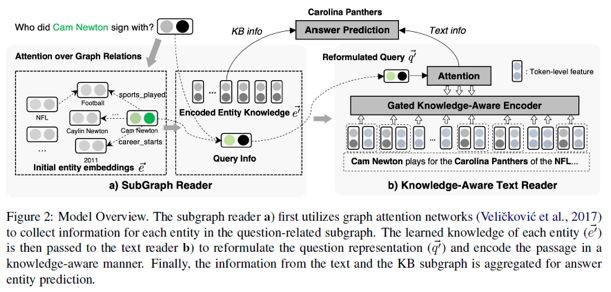

 图 2 描述了本文提出的模型框架，主要由一个SubGraph Reader模型（提取知识图谱信息）及一个Knowledge-Aware TextReader（提取文本信息）模型组成。

其中，原始问题经由SubGraph Reader整合得到与问题最为相关的实体/关系将用于重构问题信息（query information），并输入到Knowledge-Aware TextReader帮助从文本中预测问题的答案。

框架细节描述如下：

## **SubGraphReader**

该模型的设计思路在于利用图-注意力机制（Graph-Attention）收集关联实体e的邻居Ne知识。图-注意力主要考虑两个方面：
1. 邻居关系是否与问题相关；
2. 邻居实体是否是问题的主题实体；

模型的输出各实体的向量化表示，并利用实体的关联邻居编码知识。

因此这里需要解决的两个子问题分别为：

1.问题-关系匹配

这里利用了一个共享的LSTM编码问题序列{**w1q, w2q…, wnq**}及tokenized形式的关系词{ w1r, w2r…, wmr},从而得到两者对应的隐状态hq与hr。在此基础上，使用一个注意力机制对关系进行编码，形式如下：

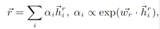

考虑到一个问题可能匹配多个关系，且一个关系可能只匹配问题的一部分，因此作者在这里提出使用关系去逐个匹配问题中每个词，而后融合得到整体的匹配分数，形式如下：

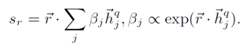

2.对于主题实体邻居的特别关注

在上述问题-关系匹配的基础上，作者发现由主题实体衍生的另一个特征也非常有用，即当主题实体的邻居在问题中出现，那么其在知识图谱中对应的三元组相对于不包含主题实体的其他三元组应该与问题具备更高的相关性。

邻居(**ri, ei**)其注意力得分的计算形式为：

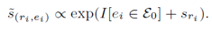

3.邻居的信息传播

为了聚合图谱中关联三元组的知识，作者对于每个实体定义了其传播规则如下：

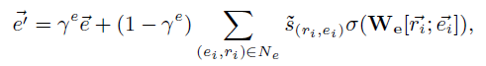

其中，e为预先计算的图谱embedding，W是一个可训练的矩阵，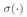是一个激活函数，是一个协调参数，由一个线性门函数（linear gate function）计算得到，用于控制原始实体信息的保留程度，形式如下：

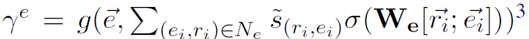

## Knowledge-AwareText Reader

  作者表示这个部分主要是基于现有的阅读理解模型(Chen et al. Reading wikipedia to answer opendomain questions, ACL 2017),改进部分在于对问题和文本均学习了更多的知识-意识表示。主要包括:

1.    潜在空间的查询重制

首先使用self-attention编码器编码原始问题向量hq,得到一个独立的问题表示:

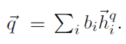

作者收集问题的主题实体知识描述为:

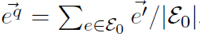

接着,利用一个门机制将两者聚合如下:

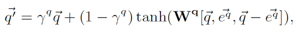

2.    知识-意识文本强化

对于文本,作者首先使用了一个双向LSTM获取token-level的特征,利用文本中的实体链接注释,以类似查询重制的方式将实体知识融合到上述特征中,不过这里作者采用了一个新的条件门函数用以明确问题的条件,这一方式帮助reader动态选择与问题更加相关的输入。

函数描述如下：

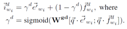

其中，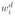表示文本的token，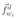表示其对应的token特征，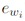则为其对应的链接实体。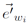则是来自SubGraph Reader的实体embedding

3.    文本阅读中的实体信息聚合

最后，将知识扩充后的信息作为BiLSTM的输入，并且使用输出的token-level隐状态计算注意力得分，形如：

而后，获得每个文档的表示，形如：

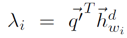

对于确定的实体e及包含该实体的文本De，通过以下方式简单的将信息聚合并平均：

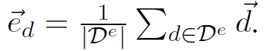

  最后，利用获取的各实体表示（来自知识库和文本），通过匹配问题向量和实体实现答案的预测：

## 实验

**数据集**

实验使用的数据集来自WebQSP数据集，为了模拟真实场景的，作者也使用了（Sun et al. Open domain question answering using early fusion of knowledge bases and text）的数据集进行测试。

Baseline方面使用Key-Value Memory Network作为参照，分别测试了基于图谱和图谱+文本的两个版本，以及GraftNet的多个版本（GN-KB, GN-LF, GN-EF）

 

**实验结果**

相关实验结果罗列如下

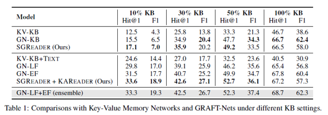

此外，作者分析了在30%完整性的图谱场景下，各个子模块产生的效果

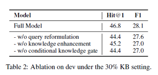

以及一些人工分析结果：

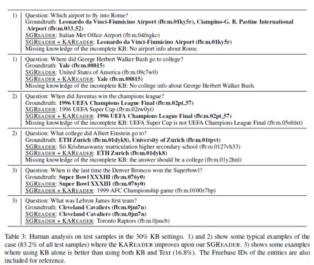
