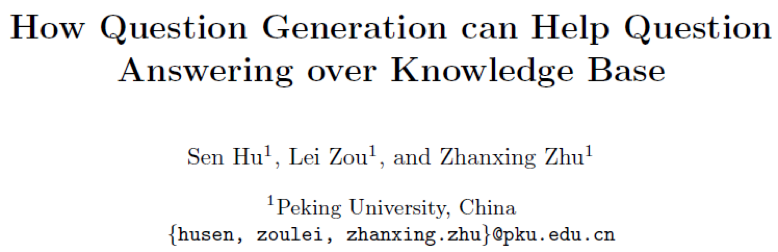
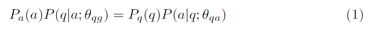
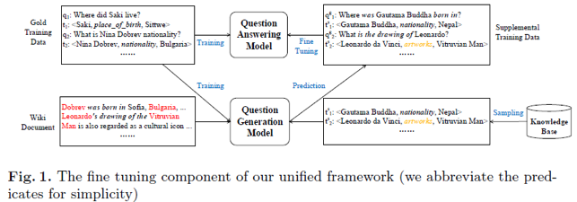
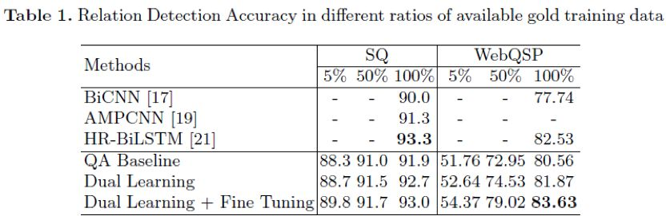
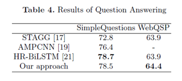

## 利用问题生成提升知识图谱问答

&gt; 笔记整理: 

论文笔记整理：谭亦鸣，东南大学博士生，研究方向为知识库问答。

来源：NLPCC2019

链接：http://tcci.ccf.org.cn/conference/2019/papers/183.pdf

           

    本文提出了一种利用问题生成提升知识图谱问答模型性能的方法（一个框架），动机主要有两个，其一是问答模型训练基于大量有标注问答数据集（人工成本高，且规模有限），其二是当问答模型面对训练过程中没见过的谓词（predicate）时，性能将会受到严重影响。因此作者提出基于现有知识图谱和文本语料，联合问答（QA）和问题生成（QG），将问题生成的结果用于问答模型的微调（fine-tune）中。

           

**方法**

1.    联合策略

作者提出使用对偶学习（dual-learning）联合QA和QG模型，训练的目标符合以下约束，其中 θ**qg** 表示训练得到的 QG 模型，θ**qa** 表示 QA 模型，QG 模型对于给定答案 a 生成的问题 q 需要对应 QA 模型对于问题 q 给出的答案 a：

即对于给定的问答对 &lt;q, a&gt;，QA 和 QG 模型均需要最小化他们的初始损失函数，规则化后如下：

作者给出了基于对偶学习的fine tuning过程如下图，初始训练数据集被分别用于QA和QG模型，而后QG模型将文本语料和其内容对应知识库的三元组（triple）作为输入生成&lt;q, a&gt;对，用于QA模型的fine tune：

2.    问答模型

为了实验方便，本文的简化问答模型为一个关系分类模型（relation classification model），作者表示在现有高质量 Entity Linking的 基础上，实际影响问答性能的主要因素依赖于关系/谓词的识别精度。

作者构建了一个简单的RNN关系抽取模型，为了更好的支持模型对未识别谓词的处理能力，关系名被分解为词序列，因此关系抽取实质上是一种序列匹配+排序的过程。

问题的表示也使用了相同的RNN完成，且为得到更 general 的表示形式，问题中的实体均用&lt;e&gt;标记替换，得到类似于“where is &lt;e&gt; from”这样的形式，同时对于&lt;e&gt;的类型添加了约束，以避免模型训练中可能存在的样本冲突。

 

3.    问题生成模型

       作者基于 Seq2Seq 翻译模型（基于 GRU）设计并构建了本文的 QG 过程，该模型包含图谱和文本两个编码器：

图谱编码将给定的事实三元组中的头实体，谓词，尾实体分别进行编码，而后融合三者的编码结果，作为解码输入；

另一方面，对应事实三元组的文本信息也从Wiki中抽取获得，利用文本编码器编码，也作为解码过程的输入，从而实现基于知识库的自然语言问题生成。

 

**实验**

**数据集**

**       **本文实验使用的数据集包含以下两个：

       SimpleQuestion：一个包含超过 10 万标注数据的问题集，每个问题由一个实体和一个关系组成，这里作者使用到了它的子集 FB2M，包含 2M 的实体。

       WebQSP：一个中等规模的知识图谱问答数据集，包含单三元组和多三元组问题，作者使用 S-MART 实现实体链接。

 

**实验结果**

** **为了验证模型对未知谓词的处理能力，作者分别取5%~100%训练集对模型进行评估，结果如表1所示，指标反映的都是关系检测的准确性。

 

问题生成的结果如下表所示：

该评估包含BLEU-4自动评价和人工评价。

 

问答实验的结果如下：

 

**OpenKG**

开放知识图谱（简称 OpenKG）旨在促进中文知识图谱数据的开放与互联，促进知识图谱和语义技术的普及和广泛应用。

点击**阅读原文**，进入 OpenKG 博客。
