## 基于事理图谱的脚本事件预测

> 论文笔记整理：邱圣广，南京大学硕士，研究方向为自然语言处理。

> 链接：https://www.ijcai.org/proceedings/2018/0584.pdf

## **绪论**

**1.****脚本事件预测**

脚本事件预测这个任务最早是由Chambers andJurafsky于2008年提出来的，要求给定一个事件的上下文 (context)，需要从候选列表中选出接下来最可能要发生的事件，如下图所示：

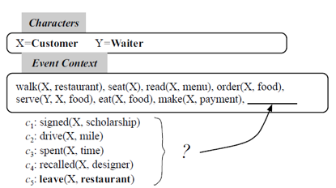

这是在餐馆场景下发生的一系列事件，根据已经发生的事件，5个候选事件中下一个最可能发生的事件就是离开餐馆(leave)。

**2.****亮点**

现有的关于脚本事件预测的方法主要是基于事件对和事件链的，但是会存在以下缺陷，如下图所示：

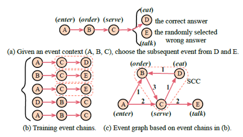

给定上下文：enter,order,serve，现在要从talk和eat这两个候选事件中选出下一个最可能发生的事件。在基于事件对和事件链的方法中，如（b）所示，在训练的时候，会发现（serve,talk）一起出现的频率要高于（serve,eat），因此在预测的时候选择talk的概率会更高；而在基于事件图结构（即事理图谱）的方法中，如（c）所示，（order，serve，eat）构成了一个强联通分量，这暗示了eat更可能是正确答案。

**3.****论文贡献**

（1） 第一个在脚本事件预测这个任务上提出基于图结构的方法

（2） 提出一个大规模图神经网络（Scaled Graph Neural Network），从而可以对大规模稠密有向图中的事件关系进行建模，进而学习出更好的事件表示。

## **模型**

**1.****事理图谱（****NEEG****）的构建**

**（1）****从语料库中抽取事件链**

从语料库中抽出所有事件链：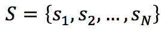, 其中 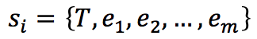表示一个事件链 ,e_i 表示事件，采用四元组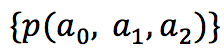的形式表示，其中 **p** 表示谓语动词, a0, a1,a2 分别表示谓语动词的主语、直接宾语、间接宾语； T 则是被这个事件链中所有事件共享的主人公。下面是一个事件链的例子：s_i = {T=customer, walk{T,restaurant,-}, seat(T,-,-), read(T,menu,-), order(T,food,-),serve(waiter,food,T),eat(T,food,fork)}。

**（2）****根据事件链构建图谱**

- 根据抽出的事件链，事理图谱就可以形式化定义成一个图结构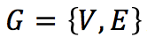，其中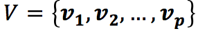中每个节点代表事件， 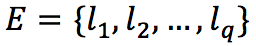中每条边表示事件之间的关系。

- 为了解决稀疏问题，在图谱中每个事件都采用一种叫做谓词语法（predicate-GR）的形式 (v_i, r_i) 来表示，其中 v_i 表示为谓语动词，r_i 表示谓语动词与链实体之间的语法依赖关系，如 eat(T,food,fork) 用 predicate-GR 表示就是 (eat,subj)。

- 然后每条有向边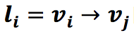的权重就可以通过以下公式计算得到：

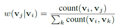

**2.****大规模图神经网络（****SGNN****）**

SGNN在GGNN的基础上进行改进，在训练阶段借鉴了分治的思想，只将当前所需子图作为训练样本，从而克服了GGNN不能处理大规模图的缺陷。整个模型的框架图如下所示：

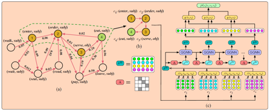

其中（a）为部分事理图谱，（b）为本次训练所需子图，（c）为网络结构图，分为三部分：表示层、GGNN、相关性计算。下面将对这三部分进行介绍：

- **表示层**

将输入的事件转成向量表示（即初始化），给定一个事件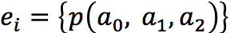，分别获得谓语动词以及参数的word embedding，即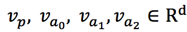，文中采用三种不同的方法获取事件 e_i 的表示：

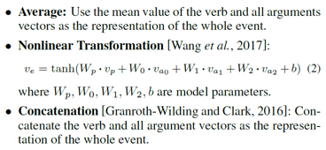

- **GGNN**

GGNN用于更新事件表示，GGNN的输入为两个矩阵：初始隐藏层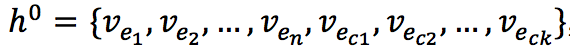,邻接矩阵 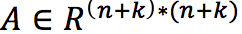，n, k 分别表示上下文事件、候选事件的个数，其中：

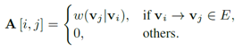

然后通过各种门不断地进行更新、计算，最终得到所有事件的最终表示h^t

- **相关性计算**

获取最终表示 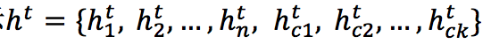后，就可以计算context和候选事件之间的相关性：

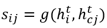

其中 **g** 表示相似度计算函数，常用的有以下几种：

然后给定上下文: e_1, e_2,...e_n，候选事件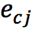发生的可能性为：

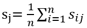

选择可能性最大的候选事件。

- **Attention****机制**

考虑到不同context在选择候选事件的时候占有的比重应该不同，所以作者加了一个attention机制，用来计算每个context对每个候选事件的权重，最后得到新的相似度计算函数：

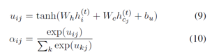

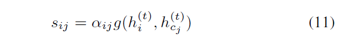

- **目标函数**

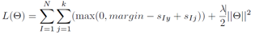

其中 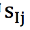 表示第 I 个 context 和第 j 个候选事件之间的相似度，y 表示正确答案的下标，margin表示的是Margin loss参数， θ 表示模型参数。

## **实验**

1. 数据集

数据集采用的是Gigaword语料库中的NYT部分，其统计情况如下：

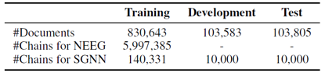

2. 实验结果

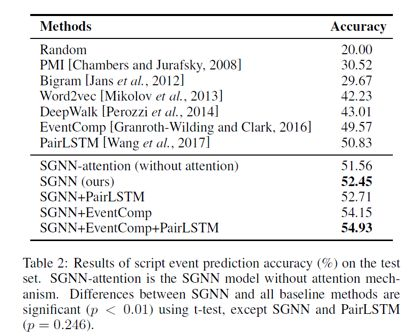

作者与很多baseline进行了比较，实验结果表明：

（1） 基于神经网络的模型要比传统统计学习的模型要好。

（2） 基于事件图结构的模型要优于基于事件对或事件链的模型。

（3） 加了attention能够提高实验效果，说明不同context在选择时所占权重是不同的。

（4） 作者将自己的模型与baseline方法进行了结合，实验效果有不同程度的改变。

3. 比较性实验

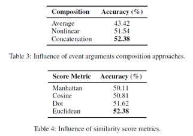

作者还在验证集上进行了比较性的实验，从实验结果可以看到，采用连接方式获取事件表示，以及采用欧拉距离作为相似函数的时候，模型效果最好。

## **结论**

本文提出了一种基于事理图谱的脚本事件预测方法，通过引入一个大规模图神经网络，用来对事件关系进行建模并学习事件表示。通过实验结果表明，基于事件图结构的方法要比基于事件对、事件链的方法好。
