## 基于图注意力的常识对话生成

&gt; 笔记整理: 

OpenKG 祝各位读者新春快乐，猪年吉祥！

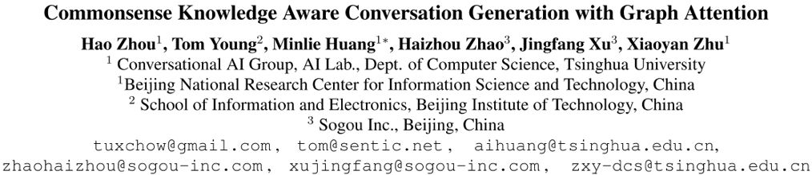

**来源：****IJCAI 2018.**

**论文下载地址：****https://www.ijcai.org/proceedings/2018/0643.pdf**

**项目源码地址：****https://github.com/tuxchow/ccm**

# **动机**

在以前的工作中，对话生成的信息源是文本与对话记录。但是这样一来，如果遇到OOV 的词，模型往往难以生成合适的、有信息量的回复，而会产生一些低质量的、模棱两可的回复，这种回复往往质量不高。

为了解决这个问题，有一些利用常识知识图谱生成对话的模型被陆续提出。当使用常识性知识图谱时，由于具备背景知识，模型更加可能理解用户的输入，这样就能生成更加合适的回复。但是，这些结合了文本、对话记录、常识知识图谱的方法，往往只使用了单一三元组，而忽略了一个子图的整体语义，会导致得到的信息不够丰富。

为了解决这些问题，文章提出了一种基于常识知识图谱的对话模型（commonsense knowledge aware conversational model，CCM）来理解对话，并且产生信息丰富且合适的回复。本文提出的方法，利用了大规模的常识性知识图谱。首先是理解用户请求，找到可能相关的知识图谱子图；再利用静态图注意力（static graphattention）机制，结合子图来理解用户请求；最后使用动态图注意力（dynamic graph attention）机制来读取子图，并产生合适的回复。

通过这样的方法，本文提出的模型可以生成合适的、有丰富信息的对话，提高对话系统的质量。

# **贡献**

文章的贡献有：

（1）首次尝试使用大规模常识性知识图谱来处理对话生成问题；

（2）对知识图谱子图，提出了静态/动态图注意力机制来吸收常识知识，利于理解用户请求与生成对话；

（3）对比于其他系统，目前的模型生成的回复是最合适的、语法最正确的、信息最丰富的。

# **方法**

**⒈ Encoder-Decoder 模型**

经典的Encoder-Decoder模型是基于sequence-to-sequence（seq2seq）的。encoder模型将用户输入（user post）X=x_1 x_2…x_n 用隐状态 H=h_1 h_2…h_n 来表示。而decoder模型使用另一个GRU来循环生成每一个阶段的隐状态，即 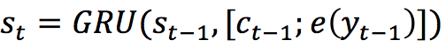。在解码过程中利用了注意力机制。

当decoder模型根据概率分布生成了输出状态后，可以由这个状态经过softmax操作得到最终的输出：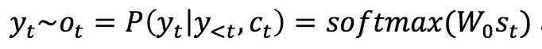。可以看到，在这个经典的encoder-decoder模型中，并没有图的参与。

 

**⒉模型框架**

如下图1所示为本文提出的CCM模型框架。

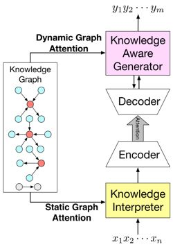

图1 CCM模型框架

如图1所示，基于n个词输入，会输出n个词作为回复，模型的目的就是预估这么一个概率分布：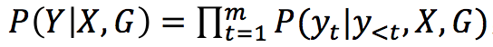，即将图信息 G 加入到概率分布的计算中。在信息读取时，根据每个输入的词x，找到常识知识图谱中对应的子图（若没有对应的子图，则会生成一个特殊的图Not_A_Fact），每个子图又包含若干三元组。

**⒊知识编译模块**

如图2所示，为如何利用图信息编译post的示意图。

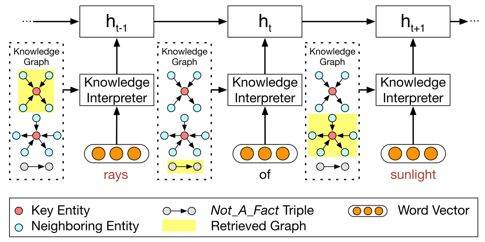

图2 知识编译模块

      如图所示，当编译到“rays”时，会把这个词在知识图谱中相关的子图得到（图2最上的黄色高两部分），并生成子图的向量。每一个子图都包含了key entity（即这里的rays），以及这个“rays”的邻居实体和相连关系。对于词“of”，由于无法找到对应的子图，所以就采用特殊子图Not_A_Fact来编译。之后，采用基于静态注意力机制，CCM会将子图映射为向量，然后把词向量 **w(x_t)** 和 **g_i** 拼接为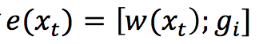，并将这个替换传统encoder-decoder中的 **e(x_t) **进行GRU计算。

对于静态图注意力机制，CCM是将子图中所有的三元组都考虑进来，而不是只计算一个三元组，这也是该模型的一个**创新点**。

**⒋知识生成模块**

如下图3所示，为如何利用图信息生成回复的示意图。

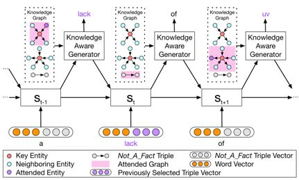

图3 知识生成模块

在生成时，不同于静态图注意力机制，模型会读取所有相关的子图，而不是当前词对应的子图，而在读取时，读取注意力最大的就是图中粉色高亮的部分。生成时，会根据计算结果，来选择是生成通用字（generic word）还是子图中的实体。

**⒌损失函数**

损失函数为预期输出与实际输出的交叉熵，除此之外，为了监控选择通用词还是实体的概率，又增加了一个交叉熵。

# **实验**

**⑴ 实验相关细节**

常识性知识图谱选用了ConceptNet，对话数据集选用了reddit的一千万条数据集，如果一个post-response不能以一个三元组表示（一个实体出现于post，另一个出现于response），就将这个数据去除。然后对剩下的对话数据，分为四类，一类是高频词，即每一个post的每一个词，都是最高频的25%的词；一类是中频词，即25%-75%的词；一类是低频词，即75%-100%的词；最后一类是OOV词，每一个post包含了OOV的词。

而基线系统选择了如下三个：只从对话数据中生成response的seq2seq模型、存储了以TransE形式表示知识图谱的MemNet模型、从三元组中copy一个词或生成通用词的CopyNet模型。

而选用metric的时候，采用了刻画回复内容是否语法正确且贴近主题的perplexity，以及有多少个知识图谱实体被生成的entity score。

**⑵ 实验结果**

如下图4所示，为根据perplexity和entity score进行的性能比较，可见CCM的perplexity最低，且选取entity的数量最多。并且，在低频词时，选用的entity更多。这表示在训练时比较罕见的词（实体）会需要更多的背景知识来生成答复。

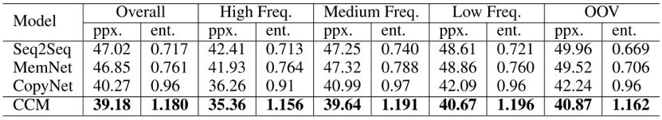

图4 CCM与基线系统对比结果

另外，作者还采用众包的方式，来人为审核response的质量，并采用了两种度量值appropriateness（内容是否语法正确，是否与主题相关，是否有逻辑）与informativeness（内容是否提供了post之外的新信息）。如下图5所示，为基于众包的性能比较结果。

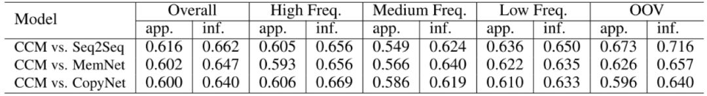

图5 CCM与基线系统基于众包的对比结果

从图5中可见，CCM对于三个基线系统来说，都有将近60%的回复是更优的。并且，在OOV的数据集上，CCM比seq2seq高出很多，这是由于CCM对于这些低频词或未登录词，可以用知识图谱去补全，而seq2seq没有这样的知识来源。

如下图6所示，当在post中遇到未登录词“breakable”时，seq2seq和MemNet都只能输出一些通用的、模棱两可的、毫无信息量的回复。CopyNet能够利用知识图谱输出一些东西，但是并不合适。而CCM却可以输出一个合理的回复。

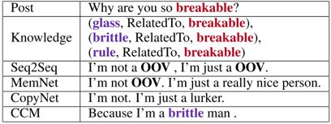

图6 case study

# **总结**

本文提出了一种结合知识图谱信息的encoder-decoder方法，引入静态/动态图注意力机制有效地改善了对话系统中response的质量。通过自动的和基于众包的形式进行性能对比，CCM模型都是优于基线系统的。

 

论文笔记整理：花云程，东南大学博士，研究方向为知识图谱问答、自然语言处理。

****

**OpenKG.CN**

中文开放知识图谱（简称OpenKG.CN）旨在促进中文知识图谱数据的开放与互联，促进知识图谱和语义技术的普及和广泛应用。

点击**阅读原文**，进入 OpenKG 博客。
