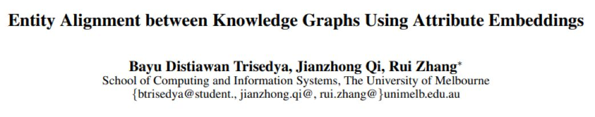
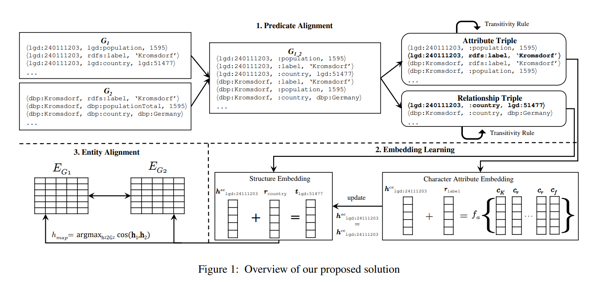
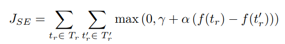
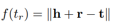
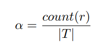
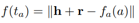
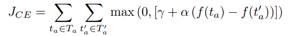
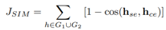
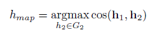
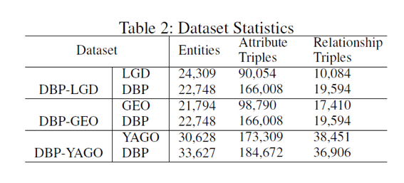

## 基于属性embeddings的跨图谱实体对齐

&gt; 笔记整理: 

论文笔记整理：谭亦鸣，东南大学博士生，研究方向为知识库问答。****

来源：AAAI 2019

链接：https://aaai.org/ojs/index.php/AAAI/article/view/3798

 

     跨图谱实体对齐任务的目标是从两个不同知识图谱中找出同一 real-world 实体，对于这一任务，目前主流的方法多是利用已有的小规模实体对齐作为桥梁，通过 KG embedding 捕获图谱中与之相近的实体，构建新的对齐。作者发现不同知识图谱的谓词（或者说关系）设定往往具有一定规律性，和表达的相似性，利用这一点，可以初步构建不同图谱之间的谓词对齐。知识图谱中的三元组可以分为“关系三元组（实体-谓词-实体）”和“属性三元组（实体-谓词-属性）”，而不同图谱中对于同一属性的表达往往差异较小。以此为基础，便可以将不同图谱embedding至同一空间，实现同一空间中的实体相似性匹配（对齐）。

 

**贡献**

作者认为本文的主要贡献包括以下几点：
1. 提出了一种跨图谱实体对齐框架，有谓词对齐，embedding学习，实体对齐三个模块组成；1. 提出一种新的embedding方法，利用实体embedding和属性embedding之间的关联，将两个不同知识图谱学习到同一的embedding空间中；1. 在真实的数据集上评估了本方法的性能为目前最优，在对齐任务上达到了50% 的hits@1（在top1的对齐结果中，命中了50%的正确实体）
提出一种新的embedding方法，利用实体embedding和属性embedding之间的关联，将两个不同知识图谱学习到同一的embedding空间中；

 

**方法**

            图1是本文方法的框架概述，包含以下几个过程：

**1.    ****谓词对齐（****predicate alignment****）：**目标是将两个图谱的谓词对应，并改写为统一命名，作者发现对于不同的图谱，其谓词的命名存在惯例，比如rdfs:label, geo:wgs84pos#lat, and geo:wgs84 pos#long等等。除此之外，还有一些谓词的描述是局部匹配的，例如：dbp:diedIn vs.yago:diedIn, and dbp:bornIn vs. yago:wasBornIn。因此，作者将这些描述统一（即去除其不相同的部分，比如dbp/yago…），从而构建起图谱之间的谓词对齐。

**2.    ****Embedding****学习：**通过谓词对齐，两个知识图谱的三元组便共享了统一的谓词空间，因此可以联合学习两者的结构embedding和属性字符embedding，从而生成一个统一的实体向量空间。

**结构****embedding**

这里使用TransE学习知识图谱的结构embedding，其目标函数形式如下：

其中，，t’表示负样本，α为控制embedding学习的权值，由以下公式得到:

其中，|T| 为总三元组样本数，r 为当前谓词，count(r) 为当前谓词的出现次数，这一做法增强了“已对齐谓词”的样本权值。

**属性**** embedding**

在TransE模型中，属性可以看作头实体（head entity）向量与谓词向量转换得到。对于不同知识图谱的同一属性，其描述存在一些差异，但大体相同，例如：50.9989 vs.50.9988888889；"BarackObama" vs. "Barack Hussein Obama"。为了使同一属性的不同描述归一化，作者提出将属性识别为字符串，而后投影到同一个空间中，具有相似字符描述的属性将具有更短的向量距离（这一步作者分别使用SUM/LSTM/N-gram等方法实现，这里不过多赘述，简写为fa(t)）。

因此属性embedding的损失函数中， 属性embedding损失函数为：

**Joint learning**

在获取上述两个embedding后，作者联合两者的实体向量，构建目标函数将两者实体投影到同一个空间中：

并整合上述三个目标函数构成embedding整体目标函数为：

**3.    实体对齐**

在完成上述embedding学习后，实体对齐的目标就是获取向量距离较小的实体对，即：

**实验**

**数据集**

**  **本文在四个 KG 上测试了框架的性能，包括：DBpedia，LinkedGeoData，Geonames 以及 YAGO；图谱对齐实验的匹配组合为（DBpedia- LinkedGeoData）,（DBpedia-Geonames），（DBpedia-YAGO），详细统计信息如下表：

**实验结果**

**     **模型性能实验结果如下表所示，

**     **值得注意的是，当属性 embedding 采用 N-gram 策略时，性能尤其突出。

 

**OpenKG**

开放知识图谱（简称 OpenKG）旨在促进中文知识图谱数据的开放与互联，促进知识图谱和语义技术的普及和广泛应用。

点击**阅读原文**，进入 OpenKG 博客。
