## 基于属性嵌入的知识图谱间实体对齐方法

&gt; 笔记整理: 

笔记整理：张清恒，南京大学计算机科学与技术系，硕士研究生。

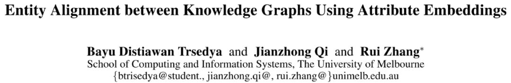

论文链接：https://people.eng.unimelb.edu.au/jianzhongq/papers/AAAI2019_EntityAlignment.pdf

发表会议：AAAI 2019

**摘要**

近来，针对跨知识图谱（KGs）的实体对齐任务，研究者提出并改进了多种基于embedding的模型。这些模型充分利用实体与实体之间的关系以得到实体之间的语义相似度，换言之，这些模型更关注于关系三元组（relationship triple）。本文发现KG中存在着大量的属性三元组（attribute triple），本文提出的模型利用属性三元组生成 attributecharacter embeddings，使其帮助不同KG中的实体映射到同一空间中。与此同时，模型还使用传递规则进一步丰富三元组。实验结果表明，相比于现有方法，本文提出的模型在实体对齐任务上取得了较大的提升。

**模型介绍**

**1.     ****概览**

如图1所示，该模型由三个核心部分组成，分别是谓词对齐（predicate alignment）、嵌入学习（embedding learning）和实体对齐（entity alignment）。

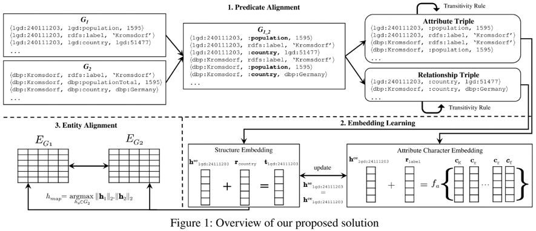**2. Predicate Alignment**

该模块通过重命名潜在对齐的谓词将两个KG合并成一个KG。通过计算谓词的名称（URI的最后一部分）相似度，发现潜在对齐的谓词对，然后使用统一的命名格式将其重命名。例如，将对其的谓词对，“dbp:bornIn”和“yago:wasBornIn”重命名成“:bornIn”。

**3.     ****Embedding Learning**

**3.1   ****Structure Embedding**

Structureembedding模块采用TransE实现，与TransE不同的是，模型希望更关注

已对齐的三元组，也就是包含对齐谓词的三元组。模型通过添加权重来实现这一目的。Structure embedding的目标函数如下：

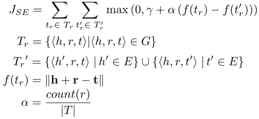

其中，**count(r)** 是包含的三元组的数量，表示合并之后的三元组集合。

**3.2 ****Attribute Character Embedding**

与 structure embedding 一样，attribute character embedding 也借鉴了 TransE 的思想，把谓词作为头实体与属性值之间的转换媒介。但与 structure embedding 不同的是，对于相同含义的属性值，在不同的KG中表现形式存在差别。因此，本文提出了三种属性值组合函数。在组合函数编码属性值之后，模型希望属性三元组满足 h+r≈f_a(a)，其中 f_a(a) 是组合函数，表示属性值的字符串 a={c_1,c_2,c_3,…,c_t}。三种组合函数如下：

**1. Sum compositional function****（****SUM****）**

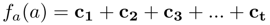

**2. LSTM-based compositional function****（****LSTM****）**

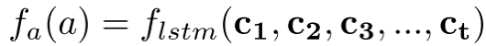

**3. N-gram-based compositional function****（****N-gram****）**

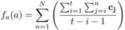

Attribute character embedding 模块的目标函数如下：

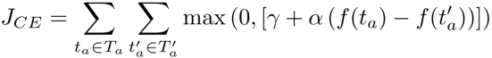

**3.3   ****Joint Learning of Structure Embedding and Attribute Character Embedding**

本文提出的模型旨在使用attribute character embedding **h_ce** 帮助structure embedding **h_se** 在同一向量空间中完成训练，联合训练的目标函数如下：

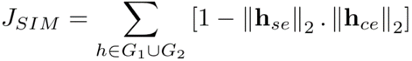

本文提出的模型的整体目标函数如下：

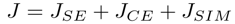

**4.     ****Entity Alignment**

在经过上述训练过程之后，来自不同KG的相似的实体将会有相似的向量表示，因此可通过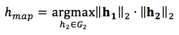获得潜在的实体对齐对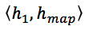。此外，模型设定相似度阈值来过滤潜在实体对齐对，得到最终的对齐结果。

**5.     ****Triple Enrichment via Transitivity Rule**

本文发现利用传递关系可以丰富三元组，从而提升实体对齐效果。给定三元组 〈h_1,r_1,t〉 和三元组 〈t,r_2,t_2〉，可将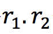 作为头实体 **h_1** 和 **h_2** 尾实体的关系，使其满足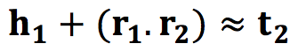。

**实验分析**

**1.     ****数据集**

本文从 DBpedia (DBP)、LinkedGeoData (LGD)、Geonames (GEO) 和 YAGO 四个 KG 中抽取构建了三个数据集，分别是DBP-LGD、DBP-GEO和DBP-YAGO。具体的数据统计如下：

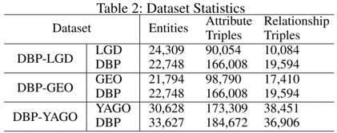

**2.     ****实体对齐结果**

本文对比了三个相关的模型，分别是 TransE、MTransE 和 JAPE。试验结果表明，本文提出的模型在实体对齐任务上取得了全面的较大的提升，在三种组合函数中，N-gram函数的优势较为明显。此外，基于传递规则的三元组丰富模型对结果也有一定的提升。具体结果如下：

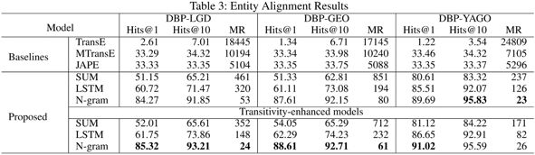

**3.     ****基于规则的实体对齐结果**

为了进一步衡量 attribute character embedding 捕获实体间相似信息的能力，本文设计了基于规则的实体对齐模型。本实验对比了三种不同的模型：以label的字符串相似度作为基础模型；针对数据集特点，在基础模型的基础之上增加了坐标属性，以此作为第二个模型；第三个模型是把本文提出的模型作为附加模型，与基础模型相结合。具体结果如下：

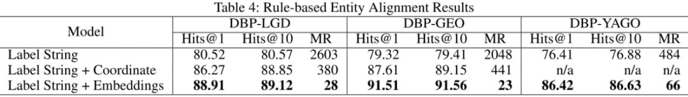

**4.     ****KG****补全结果**

本文还在KG补全任务上验证了模型的有效性。模型主要测试了链接预测和三元组分类两个标准任务，在这两个任务中，模型也取得了不错的效果。具体结果如下：

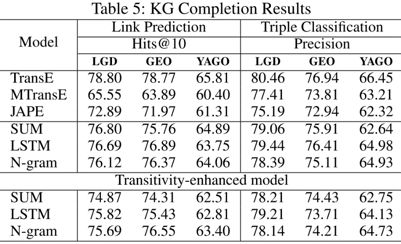

****

**OpenKG**

开放知识图谱（简称 OpenKG）旨在促进中文知识图谱数据的开放与互联，促进知识图谱和语义技术的普及和广泛应用。

点击**阅读原文**，进入 OpenKG 博客。
