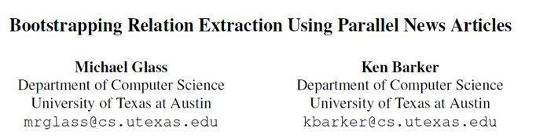
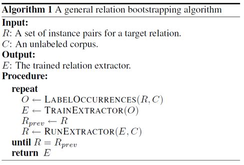
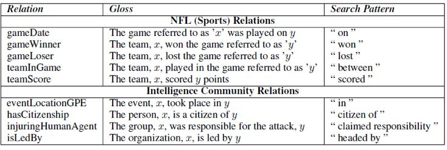
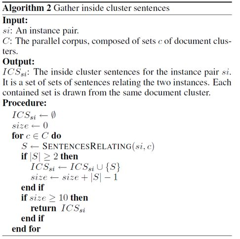
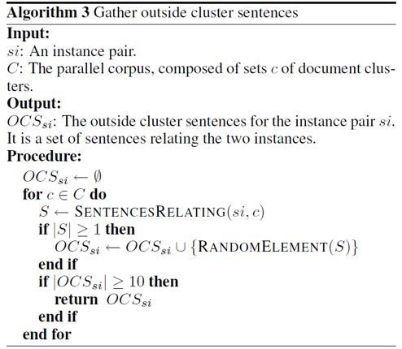
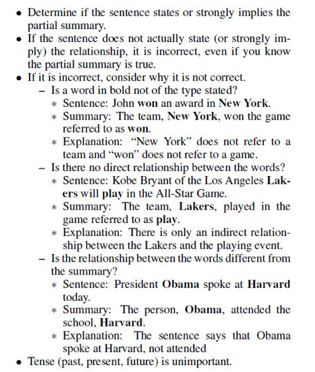
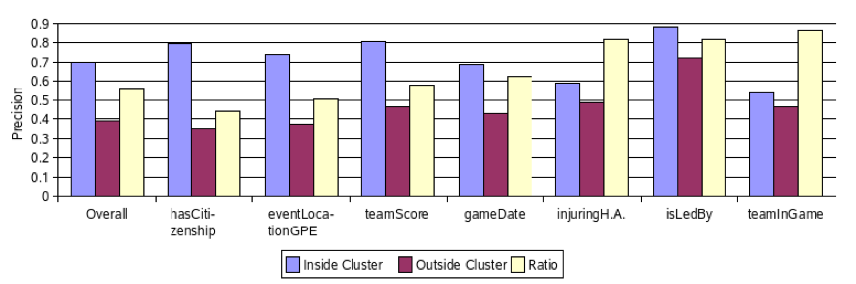

## 基于平行新闻的Bootstrapping关系抽取

> 笔记整理：吴锐，东南大学大四本科生，研究方向为自然语言处理。

****

**Citation****：****Michael Glass, K. B. . (2012). Bootstrapping relation extraction using parallel news articles.**** Retrieved from ****https://pdfs.semanticscholar.org/bfa5/1cf7fa3e0b10893908d909cd8932d76bb7ae.pdf****  **

** **

**动机**

近年来，针对关系抽取的 bootstrapping 方法得到了广泛的关注，一个简单的 bootstrapping 可以用下图表示。这些方法都基于同一个假设，那就是如果句中的两个词在某种情况下具有特定的关系，则包含这两个词的句子很可能会表达出这种关系。本文在考虑该假设在平行语料库中更可能成立的情况下，探索了在平行与非平行语料库下，分别使用 Bootstrapping 进行关系抽取的实验效果。在实验中发现，基于平行语料库的实验效果普遍更好。

图1

**方法**

本文所采取的方法大致如下：

1、构建平行语料库

该文章主要针对NFL与IC领域建立了大型的平行语料库，由于前者领域中关系在各类运动中均较为普遍，文中直接将其当做运动领域。文中使用了谷歌新闻来对描述同一事件的新闻进行定位以及分组。每一组只描述一个新闻故事，通常指一个事件，例如一场游戏或者一次恐怖袭击。文中表示，通过在谷歌新闻上搜索领域相关的关键词，可以得到一系列类似于下图的结果。通过单击链接“all 285 news articles”，可以收集到一组均在描述同一个事件的文档。由于组内文档的相关性以及新闻的质量都会随着检索排序的上升而下降，所以文中只取前三分之一，或者最多100篇文章。

图2

最终运动语料库总共包含3861组，合计145000个文档，大约每一组有37.5个文档。IC语料库与之类似，共3114组，合计130000个文档，平均每一组约41.5个文档。

2、具体实验

为了判定平行语料库对于bootstrapping关系抽取的潜在价值，该实验度量了两个具有一定关系的种子实体分别在平行与非平行语料库中的关系的持久性。下图列出了文中所进行实验的5种关系。Gloss是为关系的解释，x与y是两个有关系的实体，Search Pattern则用来定位语料库相关的文本。

图3

通过使用这些Search Pattern，作者首先收集到了一些可能表达这些关系的句子，然后手动从这些句子中找到部分确实表达目标关系的句子，并在其中定位出有关联的实体，最后将定位出来的这些实体对作为种子数据，即图1算法的初始集合R。

该文章主要针对实验及评估算法1中的LABELOCCURRENCES函数，其中针对平行语料库的具体的实验过程如下图所示。对于每一个种子实例对，它都会在单个组中挑选十个句子来评估LABELOCCURRENCES的精确率，这些句子称之为叫做“组内”(inside cluster)语句。函数SENTENCESRELATING(si, c)能够找到文档簇c中与种子实例si相关的所有句子。

图4

针对非平行语料库，我们同样选择了另外十个分布在不同组中的句子，来测试LABELOCCURRENCES的精确率，叫做“组外”(outside cluster)语句。具体的实验过程如下图

图5

3、结果评估

为了评估LABELOCCURRENCES函数分别在有文档组和没有文档组下的精确率，文中使用了亚马逊Mechanical Turk服务上的工作者。其他研究表明[Snow 等人, 2008]对于自然语言处理领域的一些简单工作，包括文本蕴涵，Mechanical Turk的非专家可以提供与专家建立的黄金标准同等质量的标注。

            下图表现了工作人员的工作方式。工作人员被要求将句子标记为正确或者不正确（且如果不正确，需选择一个原因）。作者提供了示例来说明三种不同类型的错误摘要。

图6

**实验结论**

图7

上图表明，至少对部分关系来说，使用平行语料库是很重要的。总的来说，组内的精确率为0.7，组外的精确率为0.39，说明平行语料库可能会为LABELOCCURRENCES函数带来50%的错误率的下降。

作者预计平行语料库对gameDate、teamInGame和injuringHumanAgent关系的影响很小，而对其他关系影响很大。他的推理是这样的，当这些关系的典型实例出现在同一句话中时，它们很少会有除目标关系之外的关联。虽然无法对一些关系进行有效的测试，但作者通过该实验证实了对于gameDate和isLedBy关系的假设。

从组内到组外，hasCitizenship关系的精确率发生了急剧的下降，这可以解释为一个国家的公民往往与这个国家有着各种各样的联系。对于teamScore关系，我们可以看到，在一个组（通常是一场游戏）内，如果一个队伍和一个比分有这种关系，那么在所有其他的语义相关的相同实体之间，非常有可能保持这种关系。然而在组外，这种可能性要低于50%。通常情况下，这个得分其实是其他队伍的得分。

总而言之，在很多情况下，种子实体对之间只含一种关系的假设是不成立的，但是在描述单个故事的文档组内是可靠的。关系抽取的Bootstrapping方法可以通过使用能从中受益的关系的平行语料库来让结果得到一定的提升。

 