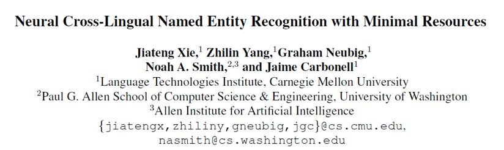
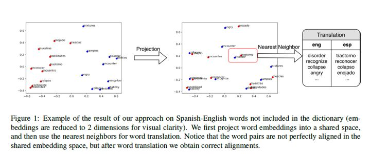
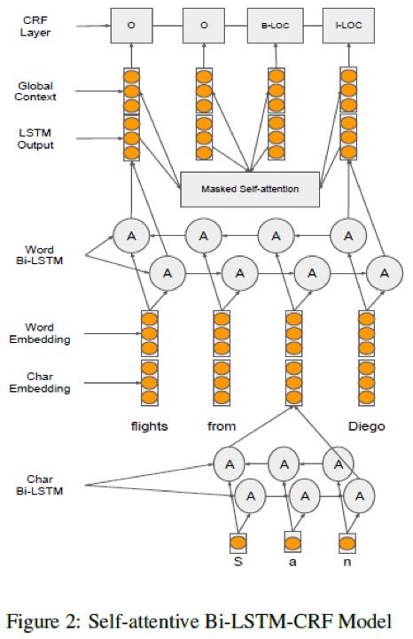
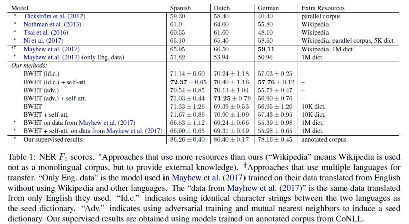
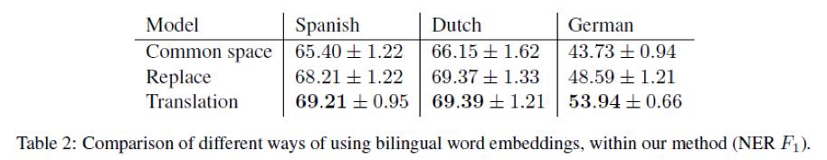
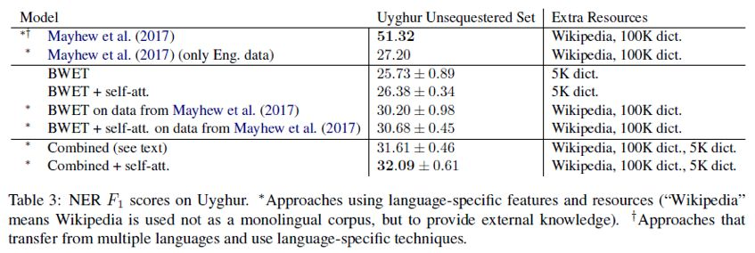

## 基于微量资源的神经网络跨语言命名实体识别

> 论文笔记整理：谭亦鸣，东南大学博士生，研究方向为跨语言知识图谱问答。****

> 来源：EMNLP 2018

> 链接：https://www.aclweb.org/anthology/D18-1034

 

## **问题背景与动机******

本文关注小语种/资源匮乏语言的跨语言命名实体识别问题，首先作者肯定了现有无监督/弱监督方法在单语资源丰富的情况下能够取得不错的性能。但是对于单语资源不足的情况下，这些方法却无法适用，原因在于：无监督方法需要构建单语embedding并投影到共享空间中，但是单语资源不足的情况下，无法构建有质量的embedding；弱监督方法则需要使用一定规模（10K~1M）的双语词典作为语言对齐的seed，显然这个要求对于小资源语言（如维吾尔语）也是相对苛刻了。

为了解决这一问题，作者提出结合词典方法与embedding方法，利用微量平行数据（&lt;10K）构建embedding，将丰富资源的英语数据与微量资源的小语种词汇投影到共享空间中，而后利用近邻方式构建规模更大的双语词典，再利用双语词典将英语数据word-by-word译为小语种数据，用于NER模型的训练。同时，考虑到这种方法产生的语言距离真实的自然语言表达存在差异，作者在NER模型中引入self-attention试图减缓这种影响

 

## **贡献******

1. 提出了一种通过语言迁移实现的跨语言NER策略

2. 提出一种 order-invariant self-attention 机制用于缓解语言迁移以及数据量不足对 NER 模型产生的影响

 

## **方法说明******

本文的方法过程描述如下：

1. 使用单语语料独立训练两种语言的 embedding 单语嵌入使用的方法类似 (Mikolovetal., 2013b; Pennington et al., 2014; Bojanowskiet al., 2017)等人的工作，利用单语文本训练嵌入矩阵。

2. 利用给定的微量双语字典，将上述两种语言的embedding投影到一个共享空间中投影方法，采用的是 (Zhang et al., 2016; Artetxe et al., 2016; Smithet al., 2017) 等类似的方式，通过训练投影矩阵，实现将两种语言的 embedding 投影

3. 对于单语资源丰富的英语embedding，利用最近邻策略，挑选另一语言的词语的embedding作为其翻译结果，从而构建较大规模的双语字典在计算embedding相似度方面，采用cross-domain similarity local scaling (CSLS) metric(Lample et al., 2018)实现。

4. 利用3中的翻译将英语命名实体识别语料译为另一语言，同时保留命名实体标签，用于NER模型的训练

下图是上述过程的一个示意，语言对为英语-西班牙语：

## **模型******

NER模型方面，作者采用了一个分层神经网络+self-attention+CRF的序列标注方案：其中输入粒度被细化到了char级，每个单词的字母都通过双向RNN融合得到，此基础上再通过一层双向RNN做词级别的embedding，之后使用self-attention对得到的每个词的embedding做一步转换得到embedding_a，而后将embedding与embedding_a进行组合，得到用于训练CRF序列标注过程的单词表示。

 

## **实验******

**数据集******

实验数据方面，作者采用了CoNLL 2002以及2003 NER公开数据集，其中包含英德荷及西班牙语共四种语言，通过将英语与其他三种语言组合为“资源丰富-资源缺乏”的语言组合，构建出上述方法所需的数据形式。

 

**实验结果******

表1 反映了本文方法在公开数据集上的实验，采用F1值作为评价指标，结果上看，相对其他同类模型，本方法的性能提升较为显著。

同时作者也针对embedding过程的效果进行统计评判，这种使用近邻进行翻译的方法，在双语性能上表现出了一定提升。

同时作者也对小语种维吾尔语进行了NER实验对比，在无额外知识补充的且使用微量平行数据的情况下，本文增量模型的性能提升还是比较明显。但是整体结果上，相对目前最好的模型差距还是是否明显，作者认为产生这一情况的原因在于维吾尔语极低的单语质量，且英语和维吾尔语之间的天然差异本身就非常的大。

