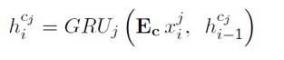
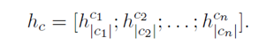
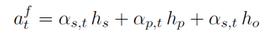
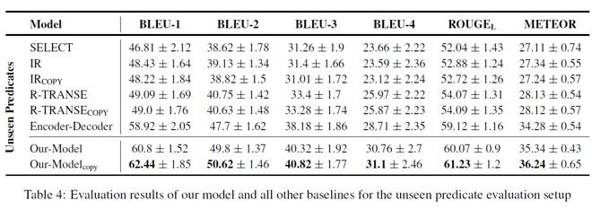

## 基于未知谓词与实体类型知识图谱的 Zero-Shot 问题生成

> 论文笔记整理：谭亦鸣，东南大学博士生，研究方向为跨语言知识图谱问答。

> 来源：NAACL 2018

> 链接：https://www.aclweb.org/anthology/N18-1020

 

## **问题背景与动机**

问题生成的目标是将知识图谱三元组作为输入，生成自然语言问题的过程。目前大多数的问题生成方法都依赖于大规模有标注数据（例如SimpleQuestion，基于freebase），但是事实上，由75.6%左右的freebase谓词并未被SimpleQuestion所覆盖。对于这类训练过程中谓词，实体类别均未知的问题生成模型，称之为Zero-Short Question Generation（QG）。

目前的QG方法主要依据已有的QA对数据集，当遇到未知谓词及实体类别后，问题将由随机文本生成问题。

对于上述问题，作者从以下直觉角度提出Zero-Shot问题生成模型：

当人们尝试根据给定知识库三元组提出问题时，会阅读包含这些实体或谓词的自然语言文本，之后依据阅读得到的词法和语法理解，将这些信息对应到问题设计当中。

## **贡献**

1. 提出了一种基于encoder-decoder框架的Zero-Shot问题生成模型

2. 提出一种新的位置复制机制，用于处理问题生成过程中遇见的新谓词、实体类型

 

## **模型**

图1 是本文模型的整体encoder-decoder框架结构，令**F = {s,p, o}**为输入的事实信息，C为与事实相关的上下文文本，Y为对F生成的问题，整体模型的目标是，获取到Y，使得以下公式最大化。

可以看到，在encoder部分，单个事实三元组与多组上下文语境文本分别进行了独立的嵌入过程，并设计了各自的attention机制，其中文本嵌入采用glove方法利用词向量得到句子的表示，知识图谱嵌入则采用了经典的TransE模型进行表示学习。

事实三元组encoding过程：

对于输入的事实三元组 **F = {s, p, o}**，每个实体** es,ep, eo** 均由 K 维的 1-hot 向量表示，并利用知识嵌入矩阵** Ef**（由 TransE 得到）对向量进行转化** hs=Efes, hp=Efep, ho=Efeo**，得到F的编码结果表示 **hf=[hs; hp; ho]**

 

上下文语境文本 encoding 过程：

对于输入的一系列与F相关的上下文文本，在获取到句子中词向量表示后，利用 RNN 对句子进行 embedding。其中，文本句子 cj 的向量表示由下式获取；

整个文本集的向量表示则通过以下方式得到

decoder 部分则由基于 GRU 的 RNN 构成，在问题生成过程中，每一个词的输出，都由经过 attention 机制调整权值分布后的事实表示以及相关文本上下文表示解码后得到。

其中，三元组 attention 主要对 s, p, o 的权值进行调整，

文本attention则是对不同文本之间的权值分布进行调整。

**Part-of-Copy Action**

与传统方法使用位置信息引导 copy 方式不同，本文采用词性信息决定输入与输出文本之间的对齐，输入文本中的每个词语都使用词性标签进行替换。当出现未登录词或者未知实体时，则通过上述对齐从文本中择词复制替换。

 

表2反映的就是本文采用文本加事实双输入的学习目标，即找到事实知识在文本中对应的表示形式（上下文），从而生成高质量的自然语言问句。

## **实验**

**实验数据说明**

本文使用的文本问题集来自于SimpleQuestion，包括100K的问题以及对应的三元组事实，此外，引入了FB5M用于扩充三元组规模，语境文本扩充方面，则引入Wikipedia文本数据。

总体用于实验的数据统计如下表：

**实验结果**

以下是本文实验的对比结果列表

以及一些事实问题生成的实际样本示例：

