## 基于用户反馈的交互式自然语言回答系统提升机制

&gt; 笔记整理: 

本文转载自公众号：图谱学苑。

 

今天介绍的工作是An
 Interactive Mechanism to Improve Question Answering Systems via 
Feedback，作者：张欣勃，邹磊，胡森，被CIKM2019接收。本文是一篇与知识库自然语言问答系统（QA）相关的工作。在本文中，我们设计了一种旨在通过用户对QA系统的反馈，来进行提升QA系统的交互式框架（IMPROVE-
 
QA），不仅可以使现有QA系统基于对原始答案的局部反馈获得更精确的答案，还可以提升已有的解析映射词典，以确保QA系统具有自动不断学习增强的能力。为了提供更好的交互性和在线性能，我们设计了一种整合的启发式图挖掘算法（HWspan）以进行查询图的自动修正。在Freebase和DBpedia上进行的大量实验，证实了我们方法的有效性和优越性。

 

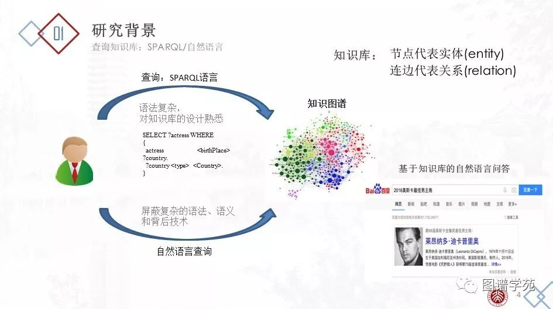

先介绍一下问题的研究背景和意义。基于知识图谱的自然语言问答（KBQA，Knowledge-based
 question 
answering）系统接收用户的自然语言问题，通过知识图谱自动返回给用户答案，向用户屏蔽了翻译、检索、查询的复杂技术，有效地减轻了用户的负担。但是，基于知识图谱的自然语言问答系统存在很多技术挑战。第一，由于自然语言本身的歧义性和多样性，同一个实体/关系可能对应不同的自然语言短语，同一个自然语言短语在不同的语境中可能对应到不同的实体/关系。第二，由于语言学本身复杂的语法特性，如省略，倒装，从句等，用户的自然语言可能表达了丰富的语义，并具有多样的结构。第三，由于用户本身不了解背后知识图谱的语义模式，用户的自然问题表达方式和知识图谱的存储方式之间存在鸿沟。所以，现有的基于知识图谱的自然语言问答系统的能力有待提高。在实际情况中，往往会产生错误回答。本文关注单轮问答情景下的基于知识图谱的事实类的自然语言问答系统，将常见的错误概括为以下三类：

1） 实体错误（entity/class linking error）

该错误发生在从自然语言句子中，识别出了错误的实体，或者进行了错误的实体链接。例如问题“怎么得到李白这张卡？”，知识图谱中可能有名为李白的两个实体，一个是诗人李白，一个是王者荣耀游戏中的李白。KBQA系统可能会进行错误的实体链接，而影响到问题的答案。例如问题“华中科技大学在哪个城市？”，KBQA系统可能将“华中科技大学“进行了错误的拆分“华中/科技大学”，而没有链接到正确的实体上。

2） 关系错误（relation paraphrasing error）

该错误发生在关系抽取阶段。通常情况下，关系抽取会采取远监督的方法，即给定输入的一个三元组&lt;s,p,o&gt;，把句子中主语s和宾语o之间的短语映射到谓词p上。这种方法经常会出现错误。例如语料库中常有某人出生和死亡在同一个地方的记录，因此关系释义词典中常出现谓词&lt;birthPlace&gt;和&lt;deathPlace&gt;混淆的情况。

3） 语义结构错误

该问题常发生在某一实体有更高层的类别归属或某一实体有更为具体的细分类目的情况下，对于这个关系的若干种描述都符合待查实体的属性，但是难以判断究竟哪一种是存储于RDF数据集之中的描述。例如“问中国有哪些山”，可以直接指向中国，也可以先指向中国的一个城市，再指向中国，而已有系统往往出现结构错误或缺失。

基于知识图谱的自然语言问答主要可以分为两类。

第一类是基于语义解析的知识图谱自然语言问答系统。这类系统会将用户的自然语言问题转化成查询图、SPARQL 等可执行的形式，更适用于复杂问题。这类系统往往需要独立的串联的实体链接、关系抽取等模块，常依赖实体链接、关系释义等词典 和模版 。

第二类是基于信息检索的知识图谱自然语言问答系统 。这类系统并不显式地理解用户的自然语言，会将自然语言问题和候选答案映射到向量空间中，并通过一个匹配模型，对候选进行打分，选出最匹配的答案。

本文关注第一类，即基于语义解析的RDF自然语言问答系统。

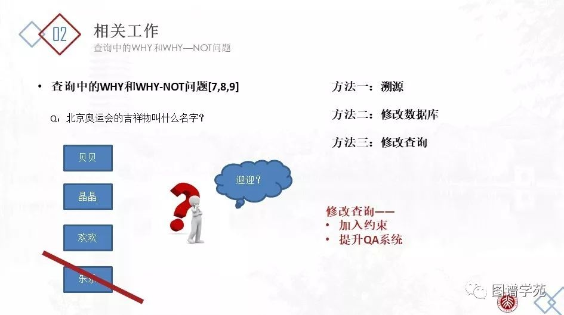

当用户查询传统的关系型数据库，而返回的结果出乎用户意料时，用户通常需要更改自己的查询，直至获得自己想要的结果。但是通常，用户没有这样的能力调整自己的查询，并且想知道为什么某一个自己期望的特定答案没有出现在查询结果中（WHY-NOT），而为什么一个自认为不该出现的答案出现在了查询结果中（WHY）。传统关系型数据库查询中的WHY问题和WHY-NOT问题激发了广大研究者的极大兴趣并得到了完善的研究，大致包含以下几类：（1）溯源。针对WHY问题，将数据的来源展示给用户或追踪其检索路径，以向用户解释为什么我们的系统会检索出这样的结果。（2）修改数据库。适用于有些时候，Q/A系统检索的数据集中的数据来源可能不可靠，可以试图通过修改数据库中已有的数据，来使得再一次检索的答案集包含用户指出的被遗漏的答案。（3）修改查询。更多时候，出错的不是数据集而是查询语句本身，因此最佳的方法是修改错误的查询语句。本文关注的就是第三种情况，即自动的查询修正。

 

我们设计了一套提升QA系统的交互式框架（IMPROVE- QA），以使现有QA系统基于对原始答案的局部反馈获得更精确的答案。具体地，当用户不满意返回的答案Q(D)时，他/他可以提供有关Q(D)的反馈，包括删除一些错误的答案Q-(D)，添加缺失的正确答案Q∆(D)，并标记一些现有的正确答案Q+(D)。请注意，我们的系统不需要用户提供错误/遗漏的完整列表或标记所有正确答案（实验结果显示2-3个提示即可）。IMPROVE-QA从原始查询Q和用户的反馈中学习，生成更精确的查询Q'作为自然语言N的表达方式，并返回更精确的答案Q-(D)。此外，基于从Q到Q'的修正，我们总结了映射关系并增强了已有字典以避免此后查询中类似的错误，从而可以从根本上改善QA系统并确保赋予其自动连续学习的能力。 

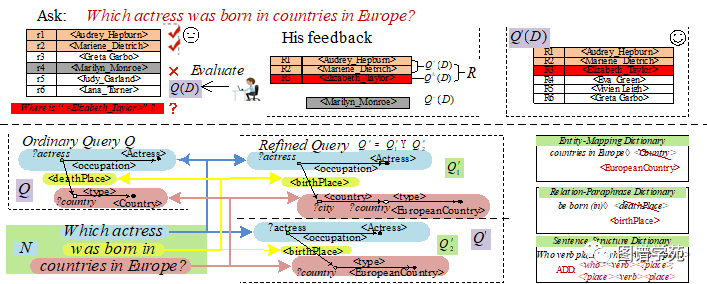

图1:基于用户反馈进行查询修正

【示例】考虑一个由伊丽莎白·泰勒（Elizabeth
 Taylor）的忠实粉丝提出的问题N “哪个女演员在欧洲国家出生？”。图1显示了答案集Q(D)，其中包括由RDF 
QA系统在知识库D上返回的六个答案。答案中意外地排除了“伊丽莎白·泰勒”（英国伦敦，1932年）。令她更加困惑的是，“ Marilyn 
Monroe”（美国洛杉矶，1926年）显示在答案列表中。QA系统发生了什么问题？然后，她给出针对Q(D)的反馈。如图1所示，她添加了一个遗漏的正确答案Q∆(D)（伊丽莎白·泰勒(Elizabeth Taylor)），划掉了一个错误的答案Q-(D)（玛丽莲·梦露），并标记了两个存在的正确答案Q+(D)（奥黛丽·赫本和玛丽莲·迪特里希）。令R = Q∆(D)∪Q+(D)表示给出的所有正向的答案。根据她的反馈，IMPROVE-QA找到了一个新查询Q'，其中包含两个BGP(basic group pattern)查询Q'1和Q'2，即Q'=Q'1 UNION Q'2，每个子查询都可以表示为查询图。注意到在这个情况下，不可能生成单个BGP查询在覆盖R中的所有正确答案的同时，又排除Q-(D)中的任何错误答案。因此，我们允许在修改后的查询Q'中出现多个BGP查询。并且，为了避免过度拟合，我们需要最小化BGP查询的数量和从Q到Q'的总编辑距离。则query refinement的问题可以形式化定义为：

在知识库D上，一个SPARQL查询Q得到的答案集为Q(D)，通过用户反馈，得到的线索答案集中，正确的为R=Q+(D)∪QΔ(D)，错误的为Q-(D)。我们的目标是找到一个新的SPARQL查询Q'=Q'1∪ Q'2∪…∪ Q's，s≥1，使得，

1）Q'(D)能覆盖到R中的全部答案，且排除掉Q-(D)中的全部答案

2）Q和Q'间的编辑距离最小

另一方面，在Q中原顶点v4的标签Lv_4 =&lt;Country&gt;在Q'1和Q'2中被重新标记为Lu_4 =&lt;EuropeanCountry&gt;。实际上，这是Q中的实体/类别链接错误。在原始查询中，自然语言问题N中的“countries
 in 
Europe”与&lt;Country&gt;链接，但正确的应该是&lt;EuropeanCountry&gt;。我们将“countries 
in Europe”→ &lt;EuropeanCountry&gt;的映射记录到实体/类别链接词典（entity / 
class-linking dictionary）中，以修正后续的查询。同样地，原查询Q中的边上的标签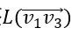=

&lt;deathplace&gt;在Q'1和Q'2被重新标记为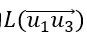=&lt;birthplace&gt;。这是一个关系释义错误，它将短语“be born in”映射为&lt;deathplace&gt;。基于此，我们可以更正关系释义词典（relation-paraphrasing dictionary）。以及，Q中的边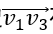在Q'1中被扩展成一个长度为2的路径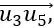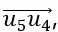意味着我们可以在句法结构词典（sentence
 structure dictionary）中添加一个模板模式“?who verb place?”→“?who verb ?place1. 
?place1 verb1 
?place2?”，该词典也可以提升QA系统的准确性。我们在从Q到Q'的修改中总结如上述的模式，从而修正上述的三个词典，这些词典的修正可以用于避免今后查询中类似的问题，如下所示。

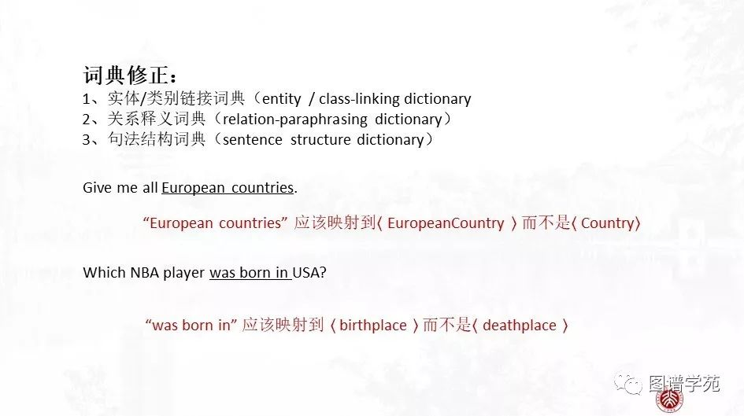

尽管查询优化过程似乎类似于通过示例答案以查询数据库（Query
 By Examples，QBE） 
，但是IMPROVE-QA和QBE基于完全不同的假设和意图。QBE为用户查询或探索知识库提供了方便的接口，而IMPROVE-QA旨在帮助KBQA系统更好地理解自然语言问题并返回更精确的答案。对于QBE问题，示例答案是唯一的输入，而IMPROVE-QA不仅考虑用户给出的种子答案（包括正向和负向），还考虑原始的翻译查询Q。这是因为从问题N到查询图Q的许多翻译错误都反映在Q的某些部分中，例如实体/类别链接（节点错误），关系释义错误（边标签错误）和句子结构（结构错误）。我们希望利用现有查询Q并根据用户的反馈以优化Q。

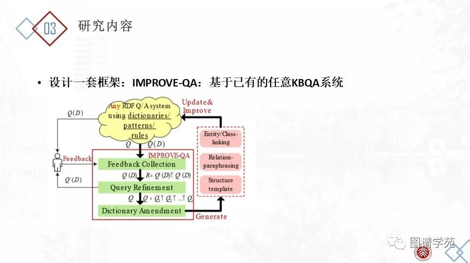

IMPROVE-QA系统包含三个组件：

（1）反馈收集：用户对Q(D)进行评价，于是我们得到一个新的答案集合R+，其中R+包括用户认可的正确答案集Q+(D)，以及用户指出的丢失答案集Q∆(D)，并将用户指出的错误答案集Q-(D)排除在外，即R+= Q+(D)∪ Q∆(D), Q-(D)∩R+= ∅。

（2）查询优化：这是本文章的核心组件成分。目的是找到Q'={Q'1,Q'2,…,Q's}，使得Q'(D)能覆盖用户给出的R+中的所有答案，而将Q- (D)排除在外。并且，为了避免过拟合，使Q'到Q的距离尽可能小。

（3）字典修改：这个模块用于从每次查询的优化过程中学习，以应用到今后的查询。基于某次的修改，我们从修改过程中抽取以更新实体链接词典、谓词映射词典和结构模板。

上述过程可以迭代进行。

本文中，我们重点关注于模块2，即查询优化部分。为此我们提出了两种算法，分别是生成筛选两阶段法和启发式带权子图模式挖掘法。

**(一）生成筛选两阶段法**

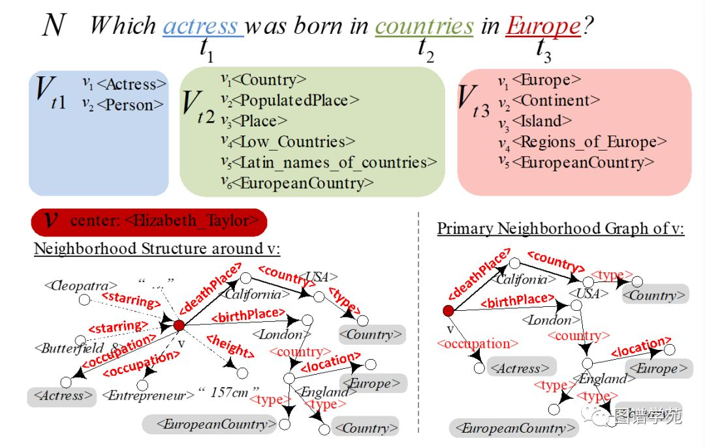

我们设计了一种两阶段法：模式生成，模式筛选。在模式生成阶段，我们首先挖掘出正确线索答案集R+中的所有频繁模式。我们只保留带有变量?x的频繁模式。所有可以覆盖到至少一个正确答案，排除任何错误答案的模式是符合条件的模式，将这些模式选中进入到模式筛选阶段。注意到，为了减小频繁模式挖掘的候选规模，我们设计了如上图所示的压缩算法，将节点v周围的邻居子图压缩成Primary
 Neighborhood Graph。在模式筛选阶段，我们从中挑选出能覆盖到所有正确答案集，且距Q的总图编辑距离最小的模式，作为修改后的Q'={Q'1,Q'2,…,Q's}。在该阶段，我们采取一种带权重的贪心策略，候选查询图与原始的查询图的编辑距离Q与候选查询图可匹配的正确答案个数决定了每个候选图的权重，每次贪婪地选择最好的候选图，直到所有的正确线索答案都被匹配到。权重的定义为单位权重覆盖（wc，weighted
 cover）如下公式。

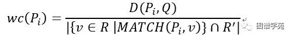

但是上述方案有着如下三个缺点。第一，在线处理时间比较久。生成筛选两阶段法需要先在生成阶段挖出所有的候选频繁模式，然后在筛选阶段进行挑选形成最后的集合，大大浪费了时间。第二，搜索空间冗余。传统的频繁模式挖掘算法采取DFS或BFS的搜索顺序，而并不适合我们的问题情景。我们希望最具希望被筛出的模式（具有最小单位权重覆盖）能被尽早筛出，而一旦已筛出的模式能匹配全部正确线索集，搜索就停止。第三，不确定的阈值。传统的模式挖掘算法需要我们指定置信度的值，而这个阈值并不是可以提前预知的，一个小的阈值会带来更大的搜索空间和更长的在线时长，一个大的阈值可能会造成候选答案的匹配缺失。综上，我们进一步设计了一个启发式的带权子图模式挖掘算法HWspan，将模式生成和模式筛选整合在一起。

**（二）启发式带权子图模式挖掘法**

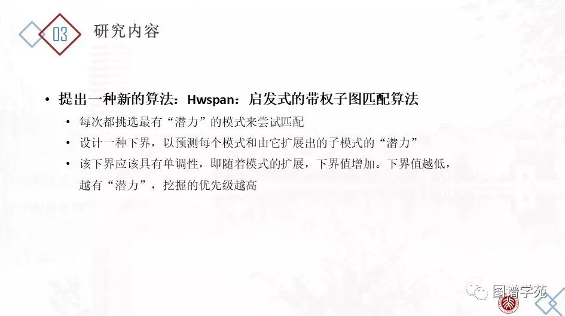

HWspan的思想是，我们每次都挑选最有“潜力”的模式去匹配正确线索答案集合。我们知道，任何一个模式P（子模式）都可以通过其父模式扩展产生。我们不采取传统的BFS或者DFS方式来挖掘，而是按单位权重覆盖由低到高赋予候选模式优先级。

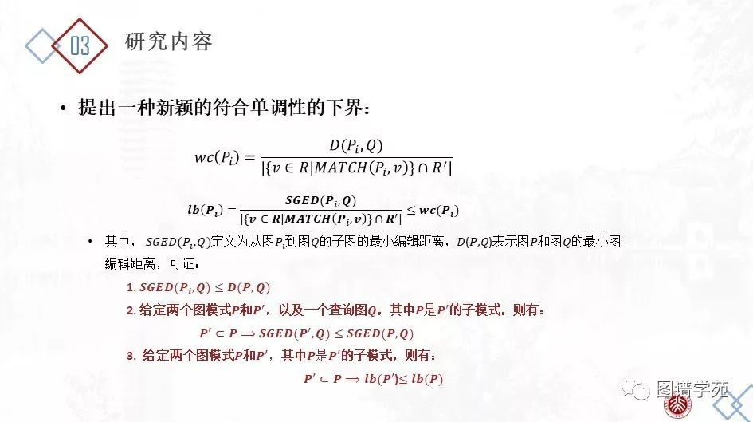

为此，我们设计一个单位权重覆盖的下界来预测模式和其子模式的单位权重覆盖。下界越低，优先级越高。特别地，随着模式的扩展，下界在单调增加，这意味着如果某时模式P并不好到被挑选出来，那也就不必要扩展出其子模式。因此，我们设计了一种启发式的搜索策略，以避免搜索到不必要的空间，也避免了阈值的设定。下界的定义如下公式所示。

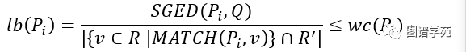

其中，SGED(Pi,Q)定义为从图Pi到图Q的子图的最小编辑距离，易知SGED(Pi,Q)≤D(P,Q),其中D(P,Q)表示P和Q之间的最小图编辑距离。我们证明了如下定理。

引理：给定两个图模式P,P’,和一个查询图Q，其中P是P’的子模式，则有：

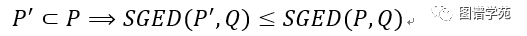

定理：给定两个图模式P,P’, 其中P是P’的子模式，则有：

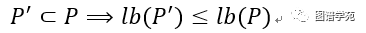

于是就有了如下的剪枝策略：在某一时刻，若P1和P2都是面临被筛选的图模式，若wc(P2)&lt;lb(P1)，则此时不需要计算P1和其子模式的单位权重覆盖，也就意味着在此时不需要对P1进行扩展。

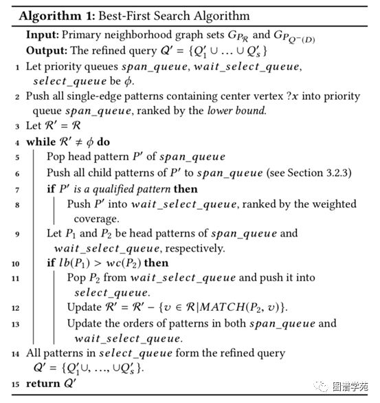 

为了找到具有最小的单位权重覆盖的模式，我们设计一种贪心的搜索策略。在该方法中，我们维持三个优先队列：可挖掘队列、待筛选队列、已筛选队列。其中，可挖掘队列存储所有已经被挖掘的图模式，并按单位权重覆盖的下界值进行递增排序。初始时，所有的单边作为起始模式加入可挖掘队列中。在每一步，我们总是将可挖掘队列中的头模式P'弹出，将其扩展为P'的子模式，并把它们加入可挖掘模式中。同时，如果P'是一个符合条件的模式（可以覆盖到至少一个正确答案，排除任何错误答案），我们把P'加入待筛选队列中。待筛选队列是时刻按单位权重覆盖递增维持的。假设P1和P2分别是可挖掘队列、待筛选队列的头模式，某一时刻，P1的单位权重覆盖的下界值大于P2的单位权重覆盖，这就意味着可挖掘队列、待筛选队列中的所有模式的单位权重覆盖都比P2大。根据单调性（定理），所有未探索到的子图的单位权重覆盖都不可能低于P2的单位权重覆盖。换句话说，在这一时刻，P2拥有最小的单位权重覆盖。因此，我们将P2从待筛选队列中弹出，加入已筛选队列。已筛选队列中存储所有我们选出的查询以组成修正查询集合的Q'。P2被选中后，我们更新所有的待匹配的正确答案集R'（初始时R'=R+）。注意R'的更新会引发可挖掘队列、待筛选队列的更新。最后，当待匹配的正确答案集R'为空，已筛选队列中的集合即为所求Q'={Q'1,Q'2,…,Q'S}。

实验在Freebase和DBpedia上进行，并各自选取了基准数据集：WebQuestionsSP和QALD-6。我们挑选了一个基于Freebase的QA系统Aqqu和一个基于DBpedia的QA系统gAnswer。实验设计分为两种，第一种是将IMPROVE-QA视为接在QA系统后的一个模块，直接根据用户的反馈来修改查询和展示给用户的答案。第二种是将IMPROVE-QA与基本的QA整合，通过在训练数据集上获取用户的反馈来修正实体链接词典、谓词映射词典和结构模板，从而赋予QA系统不断增强的能力。在两个系统上的两类实验结果如下。

 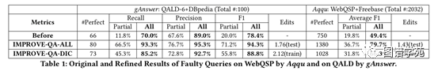

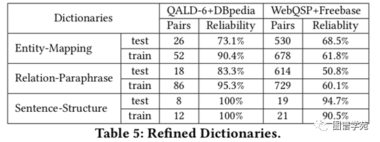

实验表明，只需要2-3个反馈线索，IMPROVE-QA就能获得近乎完美的效果。

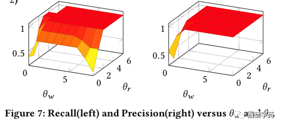

更多关于IMPROVE-QA的介绍和实验结果，请参照我们的CIKM2019的文章。

[i] Zou,
 Lei, et al. "Natural language question answering over RDF: a graph data
 driven approach." Proceedings of the 2014 ACM SIGMOD international 
conference on Management of data. ACM, 2014.

[ii] Abujabal,
 Abdalghani, et al. "Automated template generation for question 
answering over knowledge graphs." Proceedings of the 26th international 
conference on world wide web. International World Wide Web Conferences 
Steering Committee, 2017.

[iii] Bordes,
 Antoine, Sumit Chopra, and Jason Weston. "Question answering with 
subgraph embeddings." arXiv preprint arXiv:1406.3676 (2014).

[iv] Marcelo Arenas, Gonzalo I. Diaz, and Egor V. Kostylev. 2016. Reverse Engineering SPARQL Queries. In WWW. 239–249.

**OpenKG**

开放知识图谱（简称 OpenKG）旨在促进中文知识图谱数据的开放与互联，促进知识图谱和语义技术的普及和广泛应用。

点击**阅读原文**，进入 OpenKG 博客。
