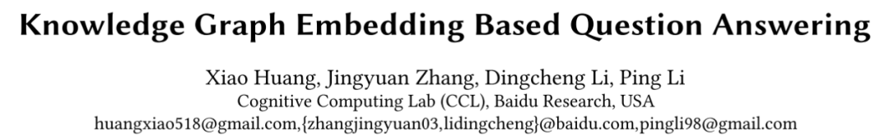
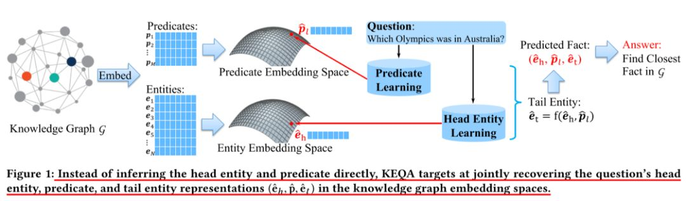
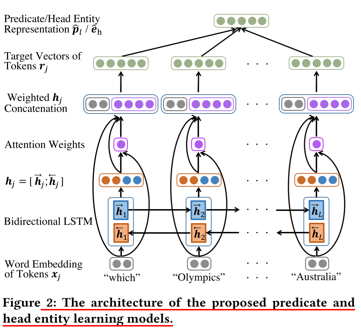
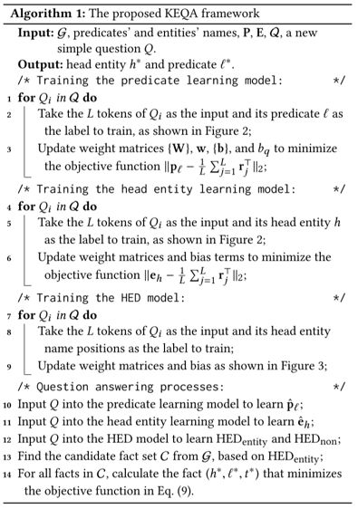

## 基于知识图谱 Embedding 的问答

> 论文笔记整理：谭亦鸣，东南大学博士生，研究方向为知识图谱问答。

> 来源：WSDM 2019

目前知识图谱问答（本文简写为QA-KG，question answering over knowledge graph）存在的一个主要问题在于图谱与自然语言之间的gap，具体表现为：命名实体再自然语言问句中的模糊描述及不完整描述，谓词具有多种自然语言表述形式等，从而使得图谱中搜索的候选答案规模较大，影响问答系统的性能。为了解决该问题，本文作者提出了一种基于知识图谱Embedding的问答框架（KEQA），该框架关注了大部分常见的问题类型，以简单问题为例（该问题的答案可由一个头实体及一个谓词定义得到），不同于直接从头实体和谓词进行推理的过程，该方法的目标是在图谱Embedding空间中联合得找到问题的头实体，谓词及尾实体。基于一个精心设计的联合距离评价方法，图谱中与上述三个向量最接近的fact作为问题的答案返回。

 

## **贡献**

作者认为本文主要研究贡献如下：
1. 正式的定义了基于问答的知识图谱embedding问题
2. 建立了一个有效的KEQA框架，通过从图谱embedding空间联合地找到头实体，谓词和尾实体，实现自然语言问题的回答
3. 设计了一个联合距离评价方法，该方法在embedding表示中保留了图谱的结构和关系信息
4. 在SimpleQuestion上进行的测试取得了非常优质的性能表现
5. 建立了一个有效的KEQA框架，通过从图谱embedding空间联合地找到头实体，谓词和尾实体，实现自然语言问题的回答
6. 在SimpleQuestion上进行的测试取得了非常优质的性能表现

 

## **方法**

KEQA的框架的整体思路如图1所示：

图谱被embedding到两个低维空间中（实体空间和谓词空间），每个事实（即图谱中的三元组）可由三个潜在的向量表示（即两个实体向量和一个谓词向量）。对于一个给定的问题，模型首先预测它所对应事实的头实体和谓词，接下来就可以准确给出该问题的答案。

因此，上述框架的过程可以描述为三步：
1. 基于问题库及其问题对应的谓词embedding表示，学习一个谓词学习模型，以问题为输入，输出其对应的谓词向量表示（对应到图谱的Embedding空间中）
2. 考虑到图谱中的实体规模较大，KEQA提供了一个头实体识别模型，用于减少候选头实体的数量。主要的目标是找到问题中的一个/多个token预测头实体命名，从而通过找到相同或相似的命名减少候选规模。
3. 给定一个relation函数（由KG embedding算法定义），KEQA利用头实体和谓词的表示预测计算尾实体，构成事实三元组，而后将图谱中与之最近的事实输出为问题的答案

考虑到图谱中的实体规模较大，KEQA提供了一个头实体识别模型，用于减少候选头实体的数量。主要的目标是找到问题中的一个/多个token预测头实体命名，从而通过找到相同或相似的命名减少候选规模。

 

### 图谱 embedding 方法

本文使用现有的图谱 embedding 算法 TransE 学习 entity embedding 及 predicatee mbedding，

 

### 头实体/谓词学习模型

图2描述了谓词和头实体的学习模型，可以看到，经过word embedding之后，问题中的token以向量的形式输入到双向LSTM中，而后将两个方向LSTM的输出直接拼接合并，通过一个Attention层对原始词向量，变换之后的文本向量等进行加权，而后用于预测对应到图谱实体/谓词embedding的向量表示。

 

### 头实体识别模型

图3描述了本文提出的头实体识别模型，本模型的目标是从问题中选出一个或多个tokens作为头实体的命名，从而减少获取头实体的搜索空间。网络构成不再赘述，相对谓词学习模型减少了attention层，模型的训练数据由问题及其头实体构成，输出结果表示当前word是否是头实体。

### Embedding 空间的联合搜索

对于每个新的样本问题，模型已经预测它的谓词和头实体表示，接下来的目标是从图谱中找到与之最为匹配的事实。

作者提出了一种联合距离评价机制用于完成上述匹配，其定义如公式9所示：

C表示候选事实集合，函数n(·)返回实体命名或者谓词，HED表示token是否是头实体（由Detection模型给定），sim[·,·]表示衡量两个字符串的相似性，β表示平衡权值，用以调整函数各部分的贡献程度。

 

整合上述模块，得到KEQA框架的整体算法如下：

 

## **实验部分**

### 数据集

本文实验使用的数据集及统计信息如表2所示：

主要包含FB2M/FB5M知识库，问答语料来自SimpleQuestion

### 实验结果

相关实验模型参数在论文中均有明确说明，这里不再赘述，表三给出了模型的实验结果如下：

