## 基于知识图谱中图卷积神经网络的推荐系统

> 笔记整理：王若旭，浙江大学在读硕士，研究方向为关系抽取，零样本学习。

> 来源：WWW 2019

 

为了解决推荐系统中协同过滤方法面对的数据稀疏和冷启动的问题，很多研究者将关注点放在 user 和 item 的属性上，通过设计一些算法来探索这些辅助信息。本篇文章基于属性之间并非独立的观点提出 Knowledge Graph Convolutional Networks (KGCN)，通过挖掘 item 在 KG 属性上的关系有效地捕获item内部的联系。

 

**具体的做法如下**（参考下图理解）：

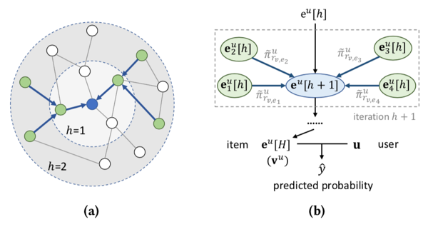

1）首先，将 user-item 中的 item 和 KG 中 entity 对齐。

2）计算 user **u** 和 KG 中 relation **r **的得分，表示用户 **u **对关系 **r **的重视程度，如：一些用户更注重某部电影的导演而非演员。

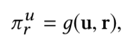

3）通过对周围 entity **e** 施加不同权重，计算 item** v** 拓扑机构表示。其中，**N(v)** 是 **v **的邻接节点。

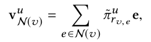

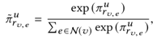

4）文中提出三种聚合方法来聚合item **v**的表示和它邻接节点的表示 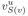 (**S(v)**是为了保持每批次的计算模式固定且更高效，从**N(v)**中采样得到的)。

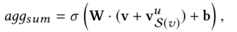

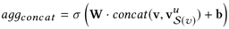

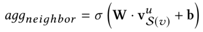

5）论文采用 hinge loss，考虑到算法的效率，为每个样本产生 Tu 个负样本，且样本满足均匀分布。

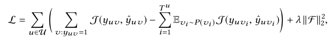

**KGCN**算法流程如下：

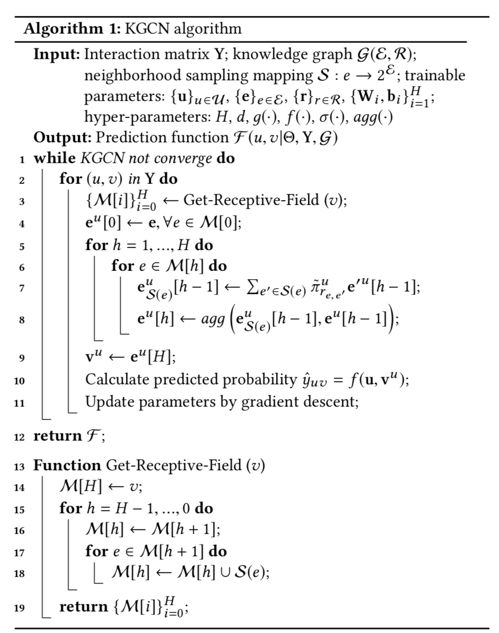

**数据集：**包括 **movieLens-20M**，**Book-Crossing**，**Last.FM**，用 **Microsoft Satori** 进行对齐，丢掉了多个匹配的和没有匹配上的 item。数据集统计如下：   

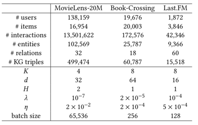

K: 感知的宽度，即考虑的邻居节点数量

d：u,v表示的维度

H: 感知的深度，即递归的次数

 

**实验结果：**

**1）整体结果**

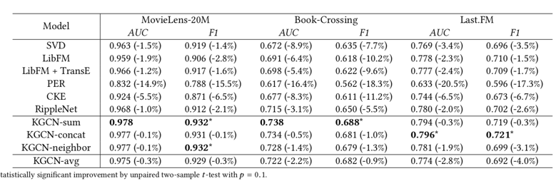

**2）邻居节点数量K，表示的维度d,感知的深度H对结果的影响**

 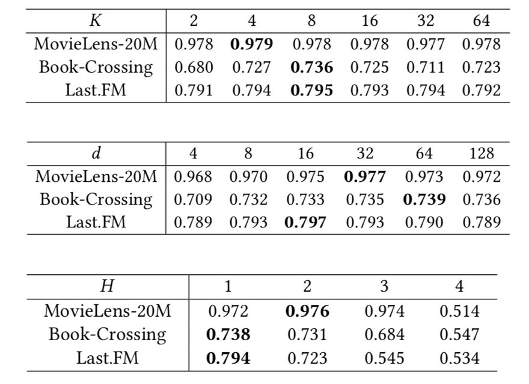

