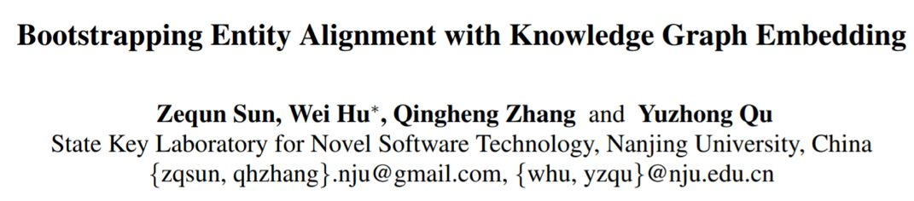
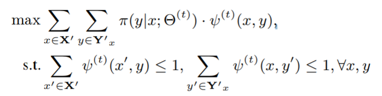
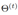
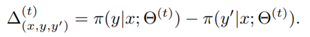
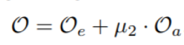
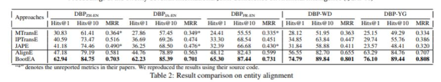

## 基于知识图谱嵌入的 Bootstrapping 实体对齐方法

&gt; 笔记整理: 

来源: IJCAI 2018

链接: https://www.ijcai.org/proceedings/2018/0611.pdf

 

本文关注基于知识图谱嵌入(后文全部简称为知识嵌入)的实体对齐工作，针对知识嵌入训练数据有限这一情况，作者提出一种 bootstrapping 策略，迭代标注出可能的实体对齐，生成新数据加入知识嵌入模型的训练中。但是，当模型生产了错误的实体对齐时，这种错误将会随着迭代次数的增加而累积的越来越多。为了控制错误累积，作者设计了一种对齐样本编辑方法，对每次迭代生成的对齐数据加以约束。

 

## **动机**

目前面向知识库的实体对齐研究中，基于知识嵌入的方法取得了比传统策略更好的实验效果。但是对于知识嵌入的实体对齐，仍然存在着一些挑战。

其一：虽然近年单知识库知识嵌入研究成果颇丰，但面向知识对齐的嵌入工作仍有很多待研究的空间。

其二：基于知识嵌入的实体对齐往往依赖已有对齐作为训练数据，虽然有研究表示仅需少量对齐样本即可完成模型训练[Chen et al. 2017]，但有限的训练数据依然会影响知识嵌入的质量以及实体对齐准确性。

 

## **方法**

**1.****对齐引导的知识嵌入**

作者将实体对齐视为分类问题，目标就是从基于知识嵌入的实体表示中(包括有标注对齐实体，及无标注实体)，找到最有可能的实体对齐(最大对齐似然)。

对于知识嵌入，在translation-based的基础上，针对对齐问题，作者对目标函数做出如下改进：

由基本知识嵌入目标函数

引入正负例样本集T+与T-，将目标函数改写为：

其中[ f(x) ]+表示max(f(x), 0)，gamma_1, gamma_2 &gt;0是两个超参，mu_1 是个平衡参数，这里使用的负例通过随机替换正例中的部分得到。

 

**2.Bootstrpping****实体对齐方法**

本方法的目的是最大化对齐似然，并符合1对1的对齐约束，在这种设定下，对于一组实体对齐(x, y)，y被视为是x的标签(我个人是这样理解的)。故该问题建模为以下形式：

其中  表示第t次迭代得到的实体嵌入，Y’ 表示对于x存在的候选对齐样本集合。

     是一个标记函数，当(x, y)构成一组对齐的时候其函数值为1，否则为0。当得到新的对齐实体时，将其作为增量添加到训练集中用于下一次迭代。

 

考虑到新生成的对齐样本可能引起矛盾，这里作者使用的策略是对比出现矛盾的对齐实体，取对齐似然更高的样本保留，计算形式为：

结果&gt;0时保留(x, y) ，反之选择(x, y’ )。

 

**3.****利用全局信息**

这里的全局信息指全部实体样本存在对齐(有标注)的概率分布情况，作者将其定义为以下表示：

以此为基础，作者构建了一个负对数似然函数，用于强化原始样本中对齐实体对知识嵌入的优化。

添加全局信息函数后，整体目标函数扩充为以下形式：

## **实验**

作者列出了自己的实验配置，并开源代码供读者研究使用

开源地址：https://github.com/nju-websoft/BootEA

数据方面使用DBP15K，DWY100K两个数据集

最后，综合实验结果看来，这确实是目前最好的对齐模型。

 

论文笔记整理：谭亦鸣，东南大学博士生，研究兴趣：知识问答，自然语言处理，机器翻译。

**OpenKG.CN**

中文开放知识图谱（简称OpenKG.CN）旨在促进中文知识图谱数据的开放与互联，促进知识图谱和语义技术的普及和广泛应用。

点击**阅读原文**，进入 OpenKG 博客。
