## 基于知识图谱注意力网络的商品推荐

> 论文笔记整理：康矫健，浙江大学计算机科学与技术系，硕士研究生。

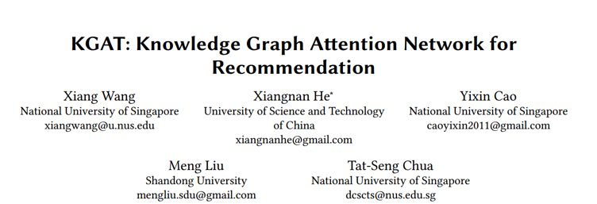

> 来源：KDD 2019

## **任务定义**

**输入**：协同过滤知识图谱

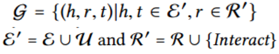

具体来说包括两个部分，其一是用户和商品的二部图

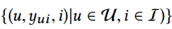

其二是原始的知识图谱

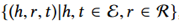

**输出**：预测用户u喜爱商品 i 的概率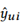

## **动机**
1. KG 存在的商品之间的高阶连接关系，比如商品 1 和商品 2 是同一个导演，对推荐系统是有作用的1. 在引入 KG 的两类方法中，Meta-Path based Method 需要 domain knowledge 预先设计好 Meta-Path，且并非端到端的训练过程1. 而 Regularization-based methods 缺乏显式地捕获商品之间的高阶连接关系
在引入 KG 的两类方法中，Meta-Path based Method 需要 domain knowledge 预先设计好 Meta-Path，且并非端到端的训练过程

基于以上 3 点，本篇论文作者将 KG 引入到推荐系统，提出了一个新的模型 KGAT，该模型能够以一种端到端的方法，显式地捕获商品之间的高阶连接关系，从而克服了之前 KG-Based Method 的不足之处

                                          

## **模型**

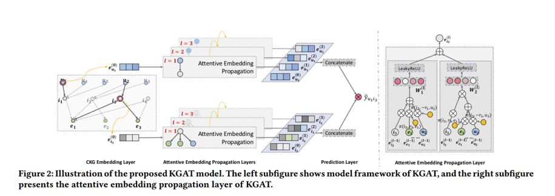

**1.Embedding Layer**

基于 TransR，使得真实的 triplet 尽可能地满足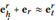，而非真实的 triplet尽可能地不满足该关系，损失函数如下：

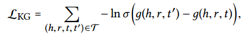

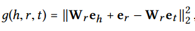

**2.Attentive Embedding Propagation Layers**

Information Propagation: 用于聚合周围节点的信息

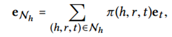

其中

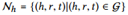

Knowledge-aware Attention:聚合时候采用 knowledge attention的方式，而不是 averaging pooling 的方式

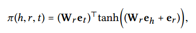

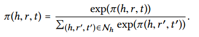

Information Aggregation:将聚合过来的周围节点信息和节点自身的信息结合在一起作为更新后的节点信息。这里边作者提供了三种方式，后续也有对照实验比较这几种方式的优劣

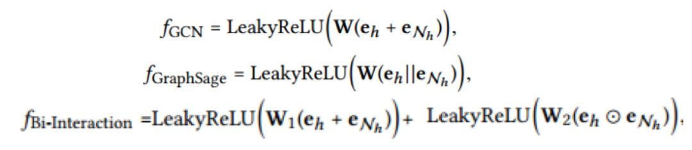

High-order Propagation:聚合多次就可以得到 high order 的 embedding。

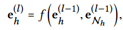 

**3.Prediction Layer**

将L+1层的embedding拼接在一起作为最终user和item的embedding，并用两者的内积作为最终的预测值

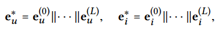

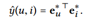

**4.Optimization**

Loss 包括两个部分，一个是KG embedding的loss，还有一个是商品推荐的loss，因此模型是一个联合训练的过程

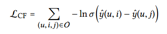

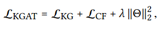

## **实验分析**

**1.Performance Comparison**

可以看到，本文提出的KGAT在recall和ndcg指标上都不同程度地好于目前效果最好的模型，具体结果如下：

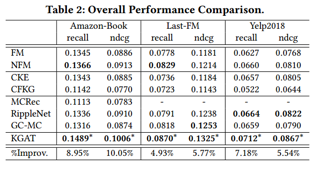

**2.Performance Comparison w.r.t. Interaction Sparsity Levels**

在不同sparsity设定下，KGAT均好于当前所有模型

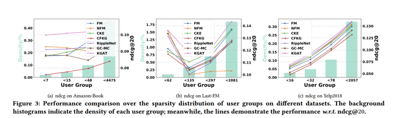 

**3.Effect of Model Depth**

可以看出，在大多数情况下，当KGAT的层数达到4层时，效果最好，证明了high order信息被我们有效地捕获到了

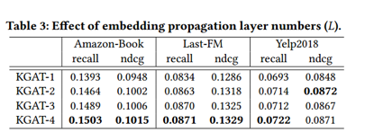

**4.Effect of Aggregators**

 可以发现，Bi-Interaction的聚合方式能够达到最好的performance

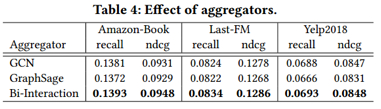

**5.Effect of Knowledge Graph Embedding and Attention Mechanism**

可以发现，缺少了KG embedding或者attention mechanism之后，模型性能都在一定程度上有所下降，证明了这两个模块是有用的。

**6.Case Study**

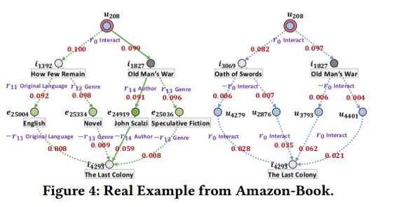

根据左图的 attention 值，可以发现给用户 u208 推荐商品 i4293 是由于用户 u208 曾经购买过商品 i1827，且商品 i1827 和商品 i4293 有共同的作者，这很明显为模型提供了一定程度的可解释性。

 