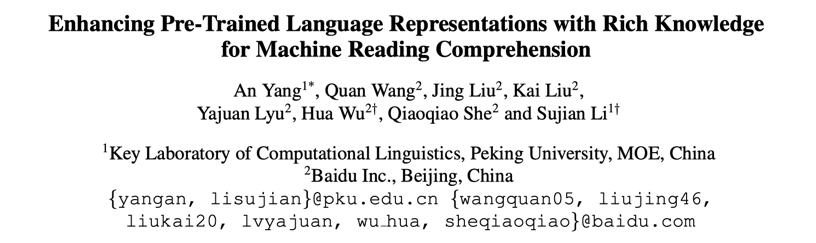
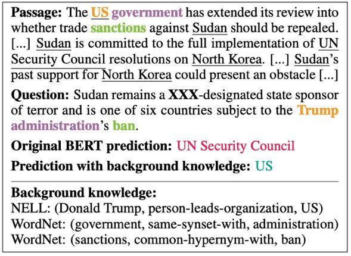
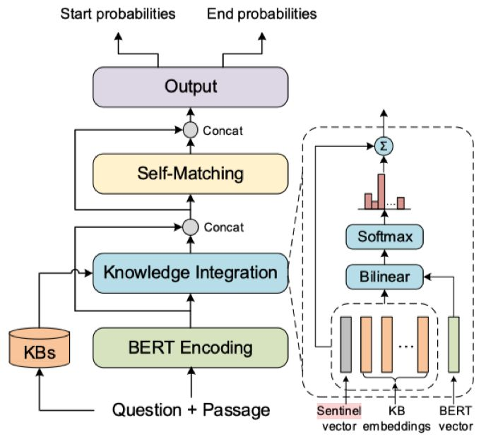

## 如何利用外部知识提高预训练模型在阅读理解任务中的性能

&gt; 笔记整理: 

论文笔记整理：吴桐桐，东南大学博士生，研究方向为自然语言处理。

链接：https://www.aclweb.org/anthology/P19-1226/

 

近年来，机器阅读理解已经逐渐发展为自然语言理解方向的主流任务之一。最近，预训练模型尤其是 BERT，在各项阅读理解任务中取得了不俗的表现。该篇文章沿用了预训练模型+精调的思路，在经典的 BERT 模型的基础上，通过引入知识图谱中的语义信息来增强阅读理解模型感知上下文和知识的能力。不同于 ERNIE(百度)，ERNIE(清华)，以及 K-BERT(腾讯)等模型在预训练阶段就引入外部知识，该模型设计了 Knowledge Integration 模块，用于在面向任务的精调阶段引入知识。这里的知识特指存在于 NELL 和 WordNet 中的概念及同义词等信息。

本文核心思想在于强调对两个数据源信息的整合(Integration), 即通过预训练模型BERT学习自然语言文本信息，通过预训练的表示学习模型学习知识图谱全局拓扑结构信息，整合的过程也是挑选知识的过程，模型学习的目标之一是学会如何挑选对当前任务有用的知识概念的能力。

如上图所示（来自数据集 ReCoRD），普通的BERT模型在没有美国政权等相关背景知识及低频词汇的语义关系的前提下，很难仅通过段落的字面表达选取正确的答案，只有在我们补充了特朗普和美国政府的关系，以及 sanctions 与ban是近义词之后才能让模型明白问题的含义，从而作出正确的回答。

# 结构

KT-Bert 中引入知识的基本单元是单词，即文本中的每一个词汇都会去知识库中寻找相关的概念和同义词，并取出已经预训练的 KB embedding 作为知识的候选集。KT-Bert 通过双线性层对文本表示以及知识图谱表示进行关联，也就是利用 attention 机制计算每一条候选知识在当前任务中的贡献程度。

# 总结

本文模型结构清晰，例证符合推断，同时在标准数据集上的效果提升明显。核心模块 Knowledge Integration 虽然和[1]中的 KBLSTM 比较相似，但的确是一种引入知识的可行方案之一。在零样本、少样本问题，长尾问题，数据不均衡问题等设定下，如何引入知识，在模型的什么位置引入外部知识，引入什么样的外部知识都是值得研究的内容，更进一步的，如何判断是否需要引入知识，引入具体的哪几条知识更有待于我们持续探索。

 

[1] Yang, B., Mitchell, T., 2017. Leveraging Knowledge Bases in LSTMs for Improving Machine Reading. Association for Computational Linguistics, pp. 1436–1446.

 

**OpenKG**

开放知识图谱（简称 OpenKG）旨在促进中文知识图谱数据的开放与互联，促进知识图谱和语义技术的普及和广泛应用。

点击**阅读原文**，进入 OpenKG 博客。
