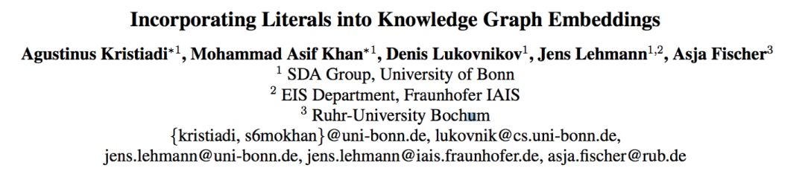
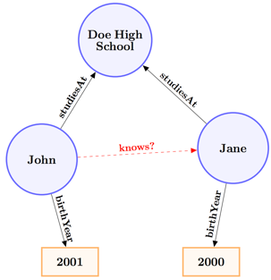
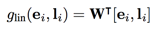
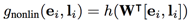
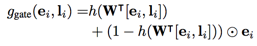
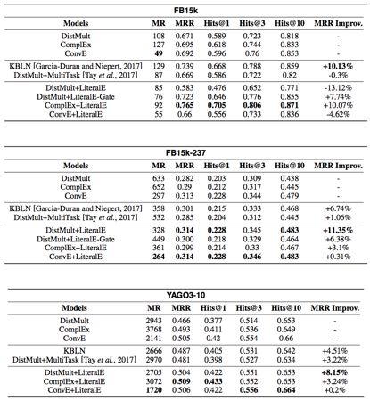

## 将字面含义嵌入知识图谱表示学习

> 论文笔记整理：吴桐桐，东南大学博士生，研究方向为知识图谱，自然语言处理。

> 链接：https://arxiv.org/pdf/1802.00934.pdf

 

本文主要关注知识图谱中的链接预测问题，在既有的知识图谱表示学习模型的基础上提出了一种引入实体名字面信息的表示学习机制LiteralE。LiteralE是一个可训练的参数化的方程即可，可能是是一种简单的线性或非线性的变换，或是一个多层的神经网络。实验显示通过引入字面信息可以较大的提高链接预测的准确性。

# 

# **介绍**

知识图谱表示学习的目标是通过机器学习将知识图谱中实体及关系的语义信息表示为低维稠密的实数向量。在该向量空间中，我们可以通过欧式距离或余弦距离等方式计算任意两个对象之间的相似度。在既有的工作多是关注知识图谱中的拓扑结构而忽略了实体名称字面含义中所携带的语义信息，如下图所示，忽略字面含义的知识图谱表示学习并不能直接预测John和Jane之间的关系，但是，在考虑到相近的出生日期以及校友关系等因素之后，在John和Jane的关系预测上可以更加确信。

# **模型**

如下图所示是LiteralE机制的结构示意图，其中f是三元组的评分函数，文中主要基于DistMult，ComplEx和ConvE等三个模型对LiteralE机制进行了验证。LiteralE机制的改进策略是指在对实体的向量e表示进行评分之间，通过变换函数g（·）整合实体的字面信息l。在本文中，g（·）可以是线性变换

也可以是非线性变换：

也可以是多层神经网络或是带有门控机制的多层神经网络：

# **实验**

本文中在FB5K，FB5K-237和YAGO-10等三个数据集上进行了实验，实验结果显示通过引入LiteralE机制能够较大的提高既有模型在链接预测任务中的性能。

