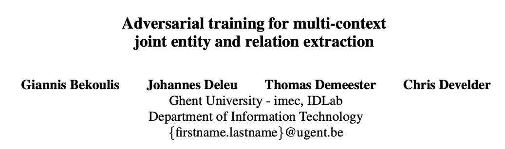
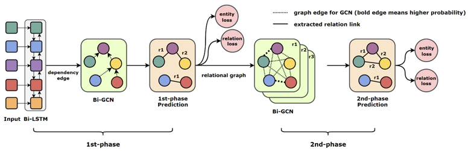
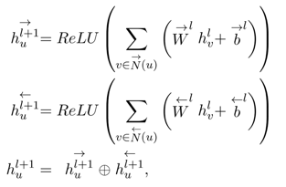
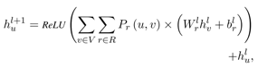
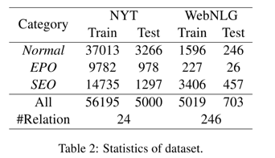
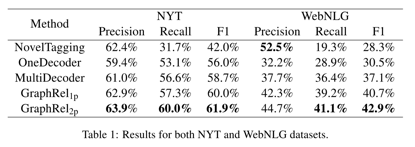
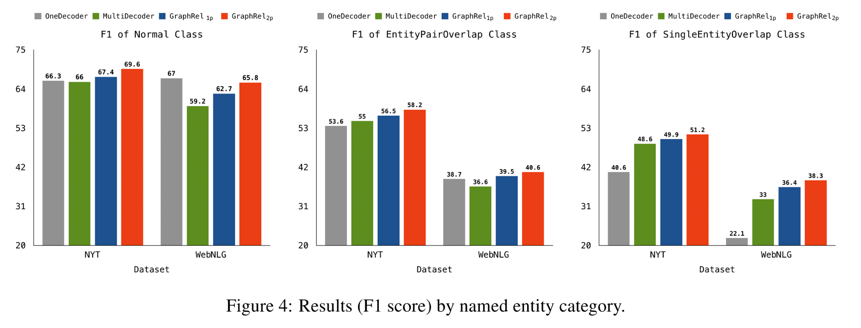
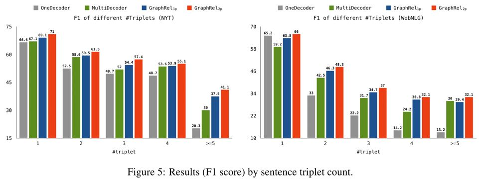
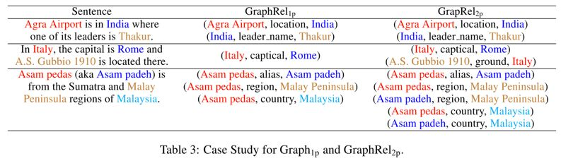

## 将文本建模为关系图，用于联合实体和关系提取

> 论文笔记整理：余海阳，浙江大学硕士，研究方向为知识图谱、自然语言处理。

链接：https://www.aclweb.org/anthology/P19-1136

 

## **动机**

本文提出了一种利用图卷积网络（GCNs）联合学习命名实体和关系抽取的端到端抽取模型GraphRel。之前抽取模型较少的同时抽取命名实体和关系，而且对实体对间的多关系问题处理不当，并且很少考虑不同关系间的相互影响，特别是一对实体间的多个关系之间的作用。

## ****

## **亮点**

与之前的模型相比，我们通过关系加权的GCN来考虑命名实体和关系之间的交互，从而更好地提取关系。同时利用线性结构和依赖结构用于提取文本的序列特征和区域特征，并利用完整的词图进一步提取文本所有词对之间的隐式特征。使用基于图的方法，对重叠关系的预测比以前的顺序方法有了很大的改进。我们在两个公共数据集上评估GraphRel:NYT和WebNLG。结果表明，GraphRel在大幅度提高查全率的同时，保持了较高的查全率。GraphRel的性能也比之前的工作好3.2%和5.8% (F1分)，实现了一种新的关系提取技术。

## ****

## **模型**

模型整体的框架如下图。

 

模型分为两个阶段的预测。

第一阶段：

首先使用word embedding和pos embedding一同喂到Bi-LSTM网络中。然后输入得到的双向结果，分别喂到GCN网络中，由此构成Bi-GCN网络架构。GCN的邻接矩阵为句子的语法依赖树得到的结果，在依赖树中相连则邻接矩阵中的权值为1，否则为0。双向GCN的结果再拼接一起，得到最终encoder的结果。

在第一阶段预测中，将Bi-GCN得到的结果经过一个RNN之后再经过一次全连接层，即可做实体预测的任务。在关系预测中，将句子中词语两两组合分别去计算关系。具体公式如下：

第二阶段：

将第一阶段得到的结果，继续经过gcn，此时的gcn邻接矩阵的权值就是第一阶段求得的relation概率值。如此经过gcn之后再做聚合，然后继续做预测任务即可。公式如下：

## **实验**

我们使用纽约时报（Riedel et al. 2010）和WebNLG（Gardentet al.2017）的数据集来评估该方法NYT和WebNLG的统计数据如表2所示。

我们把关系种类分为三类：Normal、entityairoverlap(EPO)和SingleEntityOverlap(SEO)。每个类别的计数也显示在表2中。实验结果如下：

 

另有样例分析，证明两阶段的抽取比单独第一阶段的抽取效果好。

## **总结**                        

本文提出了一种基于图卷积网络(GCN)的端到端关系抽取模型GraphRel，该模型可以联合学习命名实体和关系。将RNN和GCN相结合，不仅提取整体序列特征，而且可以提取每个词的区域依赖特征。我们的方法还考虑了文本中所有词对之间的隐式特征。我们预测每对词之间的关系，解决了实体重叠的问题。此外，我们还引入了一种新的关系加权广义网络，它考虑了命名实体和重命名之间的相互作用。我们在NYT和webnlg数据集上对该方法进行了评估。结果表明，该方法比以往的方法分别提高了3.2%和5.8%，实现了一种新的关系提取方法。