## 引入“引用”的语言模型

&gt; 笔记整理: 

笔记整理：杨帆，浙江大学硕士，研究方向知识图谱.

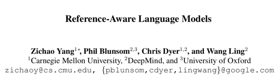

**论文链接**：https://arxiv.org/pdf/1611.01628.pdf

****

**动机******

Referring expression（RE）在自然语言中十分常见，并且在信息交流中扮演了十分重要的角色，但是之前的工作并没有在语言模型中明确地引入RE，作者在这篇论文中明确对RE建模，将其纳入语言模型之中，用以提高文本生成的表现。

 

**贡献******

1.提出了对自然语言中的reference（引用）进行建模的框架

2.提出了第一个对引用建模的神经模型，可以根据上下文生成引用的具体表现形式

3.在三个数据集上对模型进行综合评估，验证了提出的模型比baseline表现更好

 

**模型******

和传统的语言模型相比不同的是，作者在每个位置引入了一个随机变量 **z_i**，用以决定该位置如何生成相应的单词，形式化的条件概率如下：

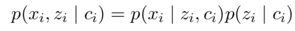

其中 **z_i** 在不同的上下文中有着不同的含义。作者分别从三项具体的任务出发详细阐述了对应的模型，分别为1）referenceto lists 2）referenceto databases 3）referenceto document context。

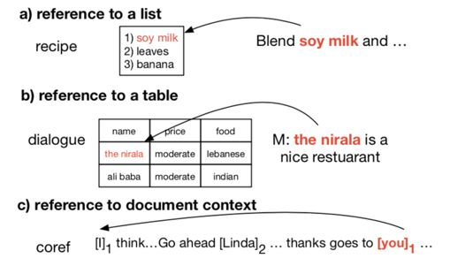

1）Reference to lists

该项任务主要考虑引用一个列表中的元素，这种任务有着很广泛的应用，比如根据文本生成对应文档，作者此处以根据食材生成食谱为例。

首先利用encoder对list中各个元素（食材）编码，将最后的输出作为decoder的初始输入，然后将decoder的每个输出与list中所有项目做attention得到，再利用decoder输出和attention值生成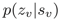 以及传统sequence to sequence 模型的输出。可以看作一个开关，用于控制下一个单词是从list中复制还是根据softmax生成，而和分别对应最终生成的单词。具体的计算过程如下：

<mpchecktext>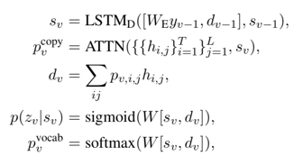</mpchecktext>

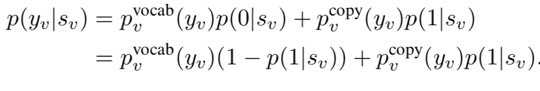

2）Reference to databases

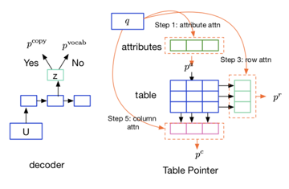

此类任务基础框架和前一项任务相同，但是外部数据源从列表变为了表格（数据库），则通过下列过程生成。

 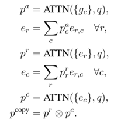

3）Reference document context

该项任务旨在生成文本时生成对前文出现的实体的引用，当** z_i**=0，下一个单词通过softmax生成，当**z_i**=1，下一个单词根据 **h_e** 生成，此处与前两项任务不同的是，前两项任务从外部数据源（列表或数据库）直接复制，而该任务是前文出现的实体变换之后得到对应的单词，概率形式如下：

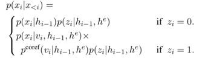

其中 **h_e** 是一个动态维护的前文出现的实体集合，当出现新的实体，则将其加入至集合之中，当实体已在集合中出现，则用其新的表示替换旧的表示，示意图如下：

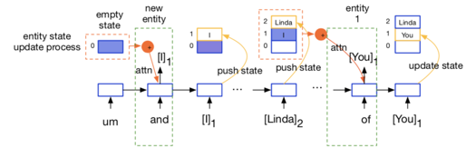

**实验******

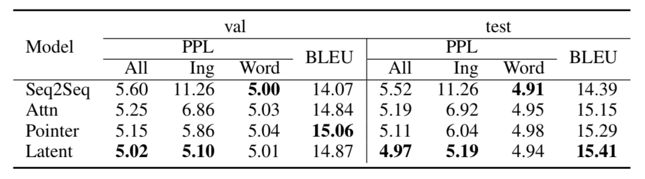

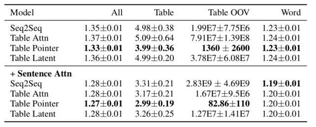

上述三个表格分别对应三项任务的实验结果，可以看出在语言模型中引入RE的确提升了文本生成的性能表现。

**OpenKG**

开放知识图谱（简称 OpenKG）旨在促进中文知识图谱数据的开放与互联，促进知识图谱和语义技术的普及和广泛应用。

点击**阅读原文**，进入 OpenKG 博客。
