## 时序与因果关系联合推理

> 论文笔记整理：李昊轩，南京大学硕士，研究方向为知识图谱、自然语言处理。

来源：ACL2018

链接：https://www.aclweb.org/anthology/P18-1212

## **动机**

理解事件之间的时间和因果关系是一项基本的自然语言理解任务。由于原因一定先于结果发生，因此时序关系与因果关系之间存在取值上的联系。在已有工作中较少联合关注这两种关系。本文提出了一种基于整数线性规划（ILP）模型的联合推理框架，通过约束限制了结果中时序和因果的一致性。

## **贡献点**

1. 提出了基于 ILP 模型的时序与因果关系的联合推理框架，包含了以下约束条件：（1）原因必须在时序上先于其结果；（2）时序对称性约束；（3）时序传递性约束

2.  开发了一个用于联合标注数据集。本文通过在 EventCausality 数据集的基础上增加标注时序关系的方法构建了该数据集。

## **时序和因果联合推理方法**

1.  时序关系部分

a)  时序关系部分的推理公式

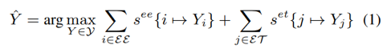

其中，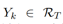 表示第 k 个事件-事件、事件-时间表达式对的时序关系标签；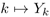 表示第 k 个事件-事件、事件-时间表达式对被预测为标签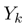。该式表示最大化所有事件-事件、事件-时间表达式对的打分之和。

b)  对称性与传递性约束

时序关系标签定义如下表所示：

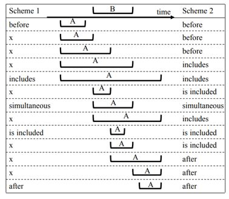

传递性关系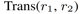 如下表所示：

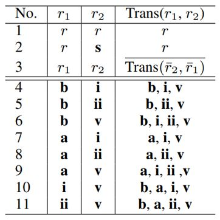

对称性与传递性约束定义如下：

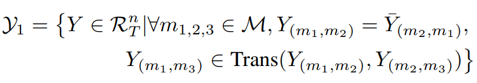

c)  增强语言学规则

本文使用了若干先验语言学知识用于限制Y的搜索空间，可以表达为如下形式：

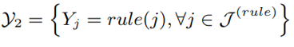

其中，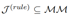是一组事件-事件、事件-时间表达式对，这些对可以被该语言学规则决定。

2.  包含因果关系的完整模型

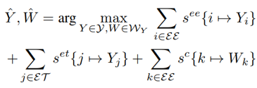

其中， 是 W 的搜索空间，依赖于时序关系标签**Y**，其定义如下：

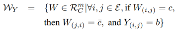

其中，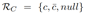是因果关系标签集合；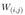 是事件对 (i,j) 的因果关系标签。该约束将因果关系和时序关系联系在一起。

3.  打分函数

时序关系和因果关系均使用 Softmax 打分函数，例如事件-事件对的时序关系打分如下：

对于因果关系，本文特别将词对顺序的先验概率分布加入特征。

4.  将联合推理转换为ILP形式

打分函数：

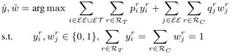

时序关系对称性和传递性约束：

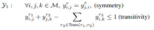

语言学规则约束：

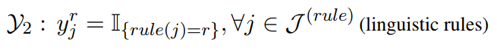

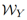 约束：

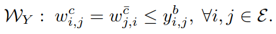

## **实验**

1. 在 TB-Dense 数据集上时序关系识别的性能对比实验与ablation实验

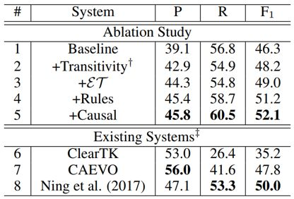

2. 在自建数据集上的时序与因果关系识别的性能

已有数据集不能满足要求，因此本文自建数据集用于同时测试时序与因果关系识别两个任务的性能。

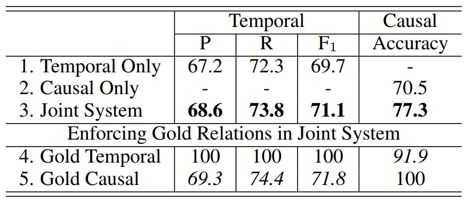

## **总结**

本文提出了一种新颖的基于ILP模型的时序与因果联合推理框架TCR ，并且开发了一个新的时序与因果联合标注数据集。实验表明，TCR能够同时显著改善两个任务上的性能。
