## 用对抗学习做知识表示（NAACL2018）

&gt; 笔记整理: 

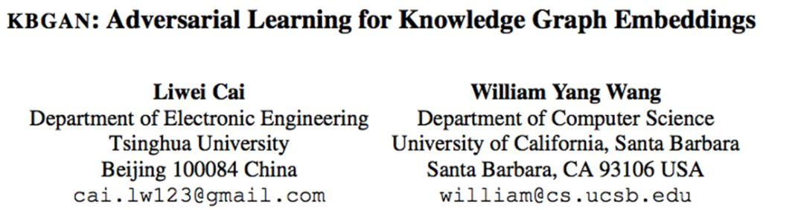

论文链接：https://arxiv.org/pdf/1711.04071.pdf

代码链接：https:// github.com/cai-lw/KBGAN 

 

本文针对在生成负样本时有大部分负样本可以很好地和正样本区分开，对训练的影响不大，提出了使用生成对抗网络（GANs）的方法，解决生成的负样本不够好的问题。它是第一个考虑用对抗学习生成负样本的工作。

设计模型时，本文把基于概率的log损失的表示学习模型作为生成器得到更好的负样本质量；使用基于距离的边缘损失的表示学习模型作为判别器得到表示学习的最终结果。由于生成器的步骤离散导致不能直接运用梯度反向传播，对此作者使用了一步强化学习设置，使用一个降低方差的强化方法实现这个目标。

方法上本文先列举了两种损失函数：

(1)Margin loss function:

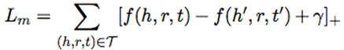

(2)Log-softmax loss function:

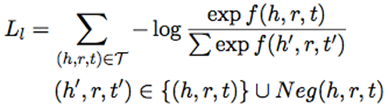

再通过分析均匀负采样的缺陷：等概率替换会使容易区分的负样本对学习的贡献较小，会让模型学到一些简单的特征，而不是尽可能去理解语义，对此作者认为使用log损失函数从替换实体得到的所有负样本中筛选出更有用的负样本很有必要。

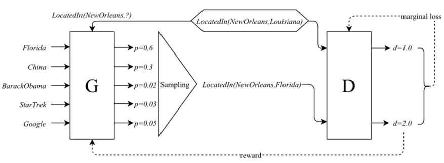

最后通过模型图我们发现论文使用softmax概率模型为生成器G，通过概率分布进行采样；判别器部分D接收生成的负样本和ground truth triple并计算分数；G通过梯度策略最小化生成的负三元组的分数，D通过梯度下降最小化正样本和负样本的边缘损失。

假设生成器得到的负样本概率分布为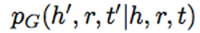

（1）那么判别器的score function为

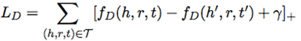

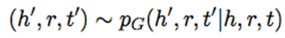

（2）生成器的目标是最大化负距离的期望为

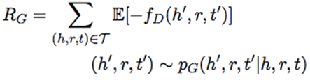

由于 R_G 是一个离散采样步骤得不到梯度，本文借鉴了其他论文提到的梯度策略理论获取梯度进行优化【这一部分论文把这个过程对标到强化学习，认为生成器是agent，判别器是environment， (h, r, t) 是 state，负样本概率分布 P_G 是policy，(h’, r, t’)是action，-f_D(h’, r, t’)是reward，认为是 one-step RL 是在每个 epoch，actions 不会影响 state，但每个 action 后会重新从一个不相关的state开始；为减小算法方差而不引入新参数，作者从 reward 减掉一个常量】

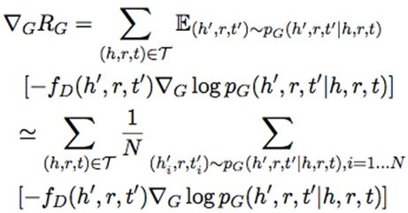

概率分布的计算使用以下公式，f_G(h, r, t)为生成器的scorefunction：

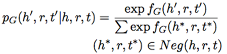

算法伪代码如下：

**实验部分**

论文选用的数据集有FB15K-237, WN18, WN18RR，结果发现使用 DISMULT 或 COMPLEX 作为生成器都不会对性能有较大影响，且 TransD, TransE 在 KBGAN 中很明显优于它们的 baseline。

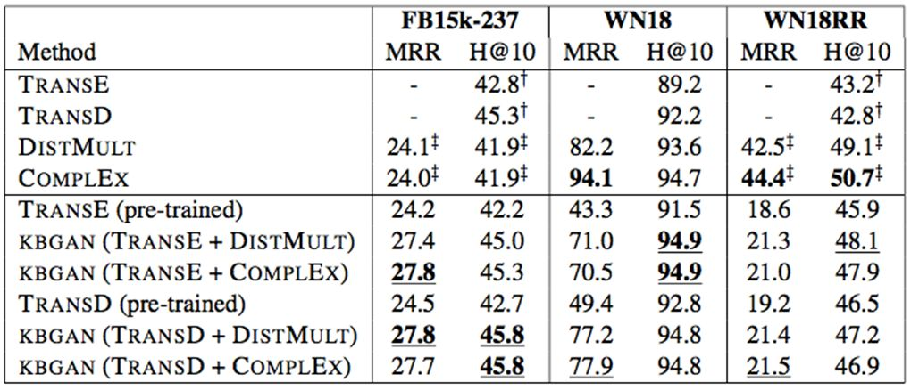

笔记整理：李娟，浙江大学直博生，研究方向为表示学习.

****

**OpenKG.CN**

中文开放知识图谱（简称OpenKG.CN）旨在促进中文知识图谱数据的开放与互联，促进知识图谱和语义技术的普及和广泛应用。

点击**阅读原文**，进入 OpenKG 博客。
