## 知识图谱三元组置信度的度量

&gt; 笔记整理: 

论文笔记整理：叶橄强，浙江大学计算机学院，知识图谱和知识推理方向。****

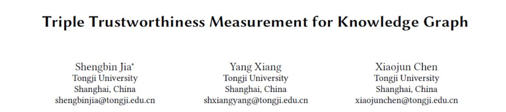

## **https://arxiv.org/pdf/1809.09414.pdf**********

## 

## **动机**

      在构建知识图谱的过程中，不可避免地会产生噪声和冲突。基于知识图谱的任务或应用一般默认假定知识图谱中的知识是完全正确的，这样会不可避免地会带来潜在的偏差。而本文则建立了一个知识图谱三元组置信度的度量模型（Knowledge GraphTriple trustworthiness measurement model, KGTtm），量化其语义正确性和所表达事实的真实程度。本文的主要贡献在于：
1. 提出了一种综合利用三元组语义信息和全局推断信息的知识图谱三元组置信度的度量方法，可以度量和整合实体层面、关系层面和知识图谱全局层面的置信值。1. 基于Freebase数据集构造的基准数据，验证了知识图谱三元组置信度的有效性。1. 知识图谱三元组置信度的度量模型计算出的置信度可用于知识图谱的构建或改进。
基于Freebase数据集构造的基准数据，验证了知识图谱三元组置信度的有效性。

## 

## **概念**

知识图谱三元组置信度（KG triple trustworthiness），用来衡量三元组所表达知识的真实程度或者说可信程度。

知识图谱三元组置信度的值所在范围为[0，1]，值越接近0表明该三元组是错误的概率越大，反之，值越接近1则表明该三元组是真实的概率越大。基于这个概念，可以发现并衡量现有知识库中可能存在的错误，提高知识库中知识的质量。

## 

## **方法**

本文提出了一个基于交叉神经网络结构的新模型：知识图谱三元组置信度的度量模型（Knowledge GraphTriple trustworthiness measurement model, KGTtm）。这个模型可以从三个层面衡量三元组可信赖的概率，包括实体层面、关系层面和整个知识图谱层面等，然后针对这三个不同的层次，分别提出了问题并通过设计三种算法和三种对应的评估器来解决，最后通过融合器整合三个评估器的结果，输出一个最终的三元组置信值。模型如图所示：

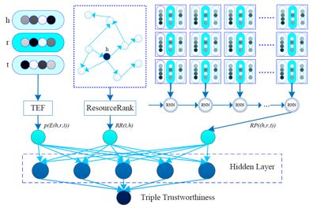

该模型的图示在纵向上可分为上下两个层次。上面部分是多个置信评估单元（评估器）的集合，这些评估器的输出构成下面部分的融合器的输入，而下面部分的融合器是一个多层感知器，为每个三元组生成最终的置信值。

**1.     ****评估器******

**(1) ResourceRank算法**

本文提出了ResourceRank算法，用于刻画两个实体之间的关联强度。该算法的思路是，如果实体对(h, t)之间的关联性很强，那么会有非常多的资源从头部实体h通过所有关联路径传递到知识图谱中的尾部实体t。例如在下图中，从节点（实体）A到节点E的边（关系）非常密集，也就是说(A, E)这两个实体之间存在较高的关联强度，因此可以很容易地猜测到(A, E)之间存在关系；但是从节点G到节点F之间没有直接关联的边，类似地可以认为(G, F)之间不存在关系。

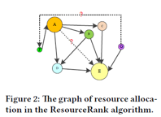

ResourceRank算法主要包括三个步骤：

（1）构建一个以头实体h为中心的有向图；

（2）迭代运算图中的资源流直到其收敛，并计算尾实体t的资源保留值；

（3）综合其他特征并输出(h, ?, t)的可能性。

头节点h拥有的资源将通过所有相关路径流向整个有向图中的其他节点。本文参考PageRank算法，模拟了资源流到分布稳定的过程，将尾实体上资源的值表示为**R**(**t**|**h**)：

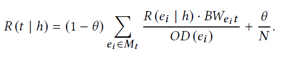

其中，M_t 是所有通向节点 t 的节点集合，OD(e_i) 是节点 e_i 的出度，BW(e_it)是从节点到节点 t 带宽。因此对于 M_t 中个每个节点 e_i，从节点 e_i 到节点 t 转移的资源量为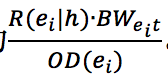。因为知识图谱中可能存在的错误和噪声，构造的有向图并不完美并且可能存在影响资源流动的闭合回路。因此为了提高模型的容错率，假设每个节点的资源流都有相同概率θ可以直接跳转到的随机节点，并且随机流向t的这部分资源是 1/N，其中 N 是节点总个数。

由于有向图中节点的不同状态可以反映实体所包含的信息，因此用以下六个特征去构造特征向量V，分别是①**R**(**t**|**h**)，②头节点的入度**ID(h)**，③头节点的出度O**D(h)****，**④尾节点的入度**ID(t)****，**⑤尾节点的出度**OD(t)****，**⑥首节点至尾节点深度**Dep**。经过激活函数的处理后，向量V转化成的概率值RR(h,t)，即表明头实体h和尾实体t之间可能存在一个或多个关系的可能性，其中具体的转化方法是：

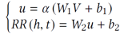

其中α是非线性激活函数，而Wi和bi是在模型训练时候可以调节的参数矩阵。RR(h,t)值的范围在[0, 1]之间，值越接近1表明h和t之间越有可能存在关系。

**(2) ****基于平移的能量函数算法：******

本文提出了基于平移的能量函数算法（Translation-basedenergy function, TEF），用于计算实体对(h, t)之间出现这种关系r的可能性。

一个可信的三元组需要满足：h+r≈t，因此可以定义能量函数**E**(**h, r, t**)** = |h + r – t|**，其值越小，实体对(h, t)之间建立关系r的概率越大，(**h, r, t**)的可信度越好，反之亦然。

基于平移的能量函数算法（TEF算法）的具体步骤为：首先计算每三个元素的能量函数**E**(**h, r, t**)，以实现实体或关系的低维分布式表示，然后利用一个改进的sigmoid函数将**E**(**h, r, t**)转化为实体对(h, t)构成关系r的概率，转化公式为：

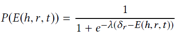

其中，**δr**是与关系**r**相关的阈值。当**E**(**h, r, t**)** =****δr**的时候，概率值P为0.5。**λ**是用于平滑处理的超参数，可以随模型训练进行动态调整。

**(3) ****可达路径推理算法：******

本文提出了可达路径推理算法（Reachable paths inference, RPI）。在有向图中，从头实体到尾实体有许多真实存在的、通过一步或者多步可达的路径，这表明了头尾实体之间存在语义相关性和三元组之间蕴含的复杂推理模式，而这些可达路径将是判断三元组置信度的重要依据。

要利用可到达的路径来推断三元组置信度，主要需要解决两个关键挑战：

①可达路径的选择：

可达路径的可靠性需要考虑到路径与目标三元组的语义相关性的因素，因此本文针对这部分提出了一种基于语义距离的路径选择算法：

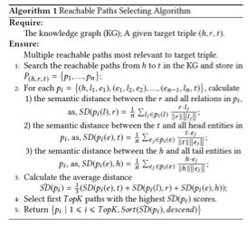

②可达路径表示：

通过第一个步骤选定路径，然后将每个选定路径映射到一个低维向量以便进行后续计算。传统的方法仅仅考虑了路径中的关系，而本文考虑整个知识图谱中的三元组路径，不仅包括关系，还包括头实体和尾实体，因为实体还可以提供重要的语义信息。

每个三元组的三个元素的嵌入作为一个单元s连接起来，因此路径就被转换成有序序列S ={s1,s2, …, sn}，然后利用递归神经网络（RNN）得到最后一次的输出向量ht，它可以表示每条路径的语义信息。将排名前K的路径的输出ht链接在一起向量，然后将向量进行非线性处理得到值**RP**((**h, r, t**))，用来表示知识图谱中相关的三元组判定目标的置信度。

**2.     ****融合器******

本文设计了一个基于多层感知器的融合器来输出最终三元组的置信值。用上述三个评估器得到的输出构建特征向量f(s)：

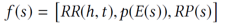

然后将其输入融合器并通过多个隐藏层进行转换。输出层是一个二进制分类器，将标签y=1指定给真三元组，将标签y=0指定给假三元组，最后使用非线性激活函数去计算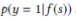：

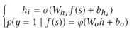

其中是第i层隐藏层，和是第i层隐藏层将被学习训练的参数矩阵，而和是输出层的参数矩阵。

## 

## **实验**

**(1) ****验证三元组置信度的有效性：******

本文基于从Freebase中提取的一个典型的基准知识图谱FB15K，验证KGTtm的三元组置信度输出是否有效。由于FB15K中没有明确的标记错误，同时考虑到现实世界中大多数知识图谱错误都是由相似实体之间的误解造成的，于是在该研究中自动生成假三元组作为负示例来引入错误和冲突，具体生成过程中保证负例数等于正例数，然后为每个真三元组构造三种假三元组，分别是替换头实体、替换关系和替换尾实体来生成。

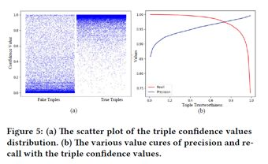

经过测试实验，将产生的三元组置信值显示在坐标系中，如图5（a）所示。左侧区域显示负示例的值分布，右侧区域显示正示例的值分布。可以看出，正例的置信值主要集中在上半部分区域，而负示例的值主要集中在较低的区域。这与判断三元组置信度的规律相一致，证明了模型输出的三元组置信值是有意义的。

此外，通过动态设置三元组置信值的阈值，可以测量输出的精度和召回率曲线，如图5（b）所示。只有当三元组置信值高于阈值时，才能认为它是可信的。随着阈值的增加，精度继续提高，召回率继续下降；当阈值在区间[0, 0.5]内调整时，召回率没有明显变化，仍处于较高水平；然而如果在区间[0.5, 1]内调整阈值，则召回率快速下降，特别是在阈值越接近1的时候召回率下降得越快。这些结果表明，正例的置信度普遍较高，并且即使将阈值设置为一个较小的值，精度仍能够保持在较高的水平，这表明该模型能够很好地识别负实例，并赋予它们一个较小的置信值。

** (2) ****与其他模型的比较知识图谱错误检测能力：******

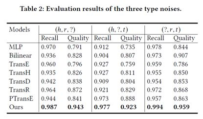

如上表所示，本文的模型在精确度和F1分数方面比其他模型有更好的结果。通过张量分解和非线性变换等运算计算出三元组有效性的分数，然后使用sigmoid函数将分数转换为置信值。与双线性模型和多层感知器模型相比，本文提出的模型在两个评价指标上的改进提升超过10%，而利用基于平移的能量函数算法（TEF）算法将基于嵌入的TransE、TransH、TransD、TransR和PTransE模型的输出转换为三元组置信值，能够使这些基于嵌入的模型优于传统的方法，虽然在一定程度上其结果受嵌入质量的影响，但是相比之下本文提出的模型能够不依赖于单词嵌入。由于本文提出的模型充分利用了三元组语义的内部语义信息和知识图谱的全局推理信息，因此实现三元组置信度的度量能够更为稳健并且表现得更为优异。

## 

## **总结**

为了消除知识驱动学习任务或应用中因知识库错误而产生的偏差，本文建立了知识图谱三元组置信度的度量模型（KGTtm），对知识库中的错误进行检测和消除。KGTtm模型是一个交叉的神经网络结构，可以综合利用知识图谱的三元组语义信息和全局推理信息从三个角度评价三元组的可信度。实验基于常用的知识图谱Freebase进行试验，而实验结果很好地证实了模型的有效性。

**OpenKG**

开放知识图谱（简称 OpenKG）旨在促进中文知识图谱数据的开放与互联，促进知识图谱和语义技术的普及和广泛应用。

点击**阅读原文**，进入 OpenKG 博客。
