## 知识图谱中的链接预测：一种基于层次约束的方法

&gt; 笔记整理: 

论文笔记整理：张良，东南大学博士生，研究方向为知识图谱，自然语言处理。

链接：https://ieeexplore.ieee.org/stamp/stamp.jsp?tp=&amp;arnumber=8450054

 

本文主要关注KG上的 Link prediction 问题，以往的方法在处理KG的时候只利用了 KG 里最一般的结构，例如将关系向量r作为头实体向量h和尾实体向量t之间的一个翻译，这种结构在KG中是最直接最普遍的。然而还有许多其它特殊的 KG Structure 可以被利用从而提升链接预测等任务的效果。一个典型的结构就是知识图谱中的层次结构（hierarchical structure），这种结构包含了丰富的推理模式，可进一步提高链接预测的效果。在文本中，作者提出了一种基于翻译模型的层次约束链接预测方法，称为hTransM。它可以通过检测单步或多步的层次结构来适应性地决定最优间隔。

# 

# **背景**

在一个知识图谱中，节点表示实体，边表示节点之间的关系。知识图谱上的链接预测目的是为了能够预测出一个三元组（h，r，t）缺失的头实体h，尾实体t或者关系r。为了处理这一问题，已经出现了许多相关方法，大致可以分为两类。第一类是基于规则和路径的方法，也就是关系通过比较明确的规则和关系路径的学习预测得来。第二类就是基于知识图谱嵌入的方法，实体之间的关系通过嵌入向量被隐式地预测出来。这些方法中比较有代表性的有基于翻译模型的TransE，TransA，还有利用图谱结构的PTransE等。

# 

# **动机**

虽然已经出现了一些利用图谱自身结构的模型，如PTransE，但仍有许多图谱自身的特殊结构没有被有效利用，一个典型的结构就是知识图谱中的层次结构（hierarchical structure）。在这种结构中，实体组织成树状结构，它们的关系也为层次关系。这种层次结构类似关系路径，能够提供丰富的模式，从而提高链接预测效果。这种层次结构其实在知识图谱中普遍存在，例如数据集WN18，有将近50%的层次关系。这种层次结构会导致实体的嵌入向量呈一个比较特殊的分布，相比于没有层次结构的方法多了一些限制，从而可以提升链接预测等任务的效果。基于以上动机，作者提出了hTransM，一种基于层次约束的链接预测方法。文中的主要贡献有如下四点：

（1）本文将层次结构分为两类，一类是单步层次结构（single-step hierarchical structures），另一类是多步层次结构（multi-step hierarchical structures）。另外，文中还提供了一种通过利用层次关系的属性来检测层次结构的方法。

（2）提出了一种基于层次约束的链接预测方法（hTransM），该方法在知识图谱嵌入的方法上实现。

（3）通过对提供模型的均匀稳定性以及误差的上界的证明，进一步证明了了hTransM方法的收敛性。

（4）通过实体预测以及关系预测等实验证明了该方法的有效性。

# **主要方法**

首先需要对一些概念进行定义，

层次结构（Hierarchical Structure）：一个层次结构是通过一个关系将若干实体组合成层级的形式。不同的层级在垂直方向上区分出来，对于某一个层级，相对于其它层级的位置有上位，下位以及相同层级等关系。例如通过关系“孩子”（child）组成的层级结构，不同的层次表示不同代的人。

一个层次结构（Ahierarchical structure）：通过关系 r* 构成，定义为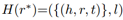，其子图是一个有向无环图。其中l是节点到层次索引的映射。

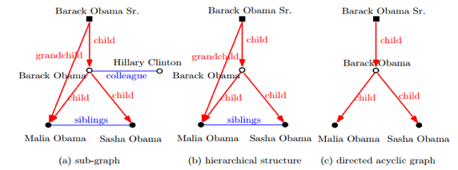

图1

在上图中，实体 Barack Obama Sr，Barack Obama 以及 Malia 和 Sasha 通过关系 child 组成了一个三级层次结构。

层次关系（hierarchical relation）：层次关系r用来使各层的实体属于同一层次。

关系路径（relation path）：一条关系路径是由某个头实体出发到达某个尾实体之间所经过的所有关系组合而成。

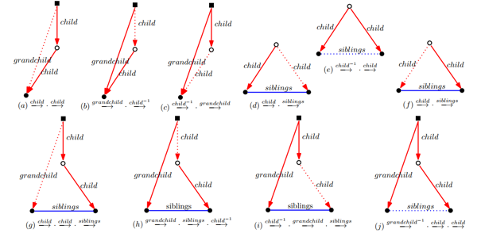

图2

上图为从图1中抽取出的多种关系路径。

层次关系路径（hierarchical relation path）：一个层次关系路径是一种多步关系路径，可以定义为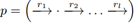，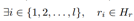。也就是说至少有一种关系出现在不同的层次中。

有两种推理类型的层次结构可以被用到链接预测任务中，分别是单步层次结构和多步层次结构。

单步层次结构（Single-stephierarchical structure）：一个单步层次结构是一个层次结构的子图，可以定义为 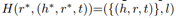，单步层次结构中的实体分布在两个不同的层次上，并通过单步关系（single-steprelation）进行链接，其尾实体有着共同的父节点。图3（a）表示一个单步层次结构。

多步层次结构（Multi-step hierarchicalstructure）：与单步层次结构对应，多步层次结构中的实体分布在不同的层次上，通过关系路径链接，这些路径有着相同的头实体和尾实体，可以定义为 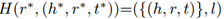，图3（b）表示一个单步层次结构。

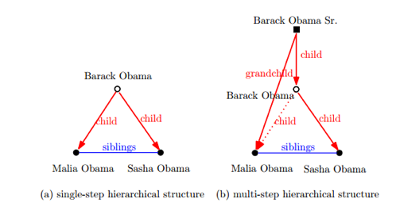

图3

 

和一般的关系相比较，通过层次关系组合在一起的实体在其嵌入空间中的分布会有着比较明显的区分，这种限制可以很好地被用到链接预测任务中。首先，在单步层次结构中，兄弟节点所对应的实体所对应的向量会在向量空间中比较相近，因为它们有共同的父节点，语义相似。在传统的学习方法中，大多只对头实体和尾实体进行约束，使它们尽可能靠近，而忽略了兄弟尾实体之间的语义相似。而这些相似性可以很好地作为推理信息被用到链接预测中。另外，这种层次结构已经大量地出现在知识图谱中，例如FB15K和WN18K，都有将近50%的层次关系。

虽然知识图谱中已有许多层次结构，但还需要将其抽取出来。

层次结构的发现（Hierarchical Structure Discovery）：以往的文献表明，DAG（有向无环图）有着独特的层次结构，从而可以利用许多算法进行发掘。由于许多DAG的子图并非具有层次结构，所以问题的关键在于检测其子图是否进一步具有层次结构，进而将问题聚焦到层次关系的发现（discoveryof hierarchical relations）。层次关系由于层次结构的原因是不能形成环状的，所以文中采用拓扑排序算法（topological sorting algorithm）来检测环状结构：

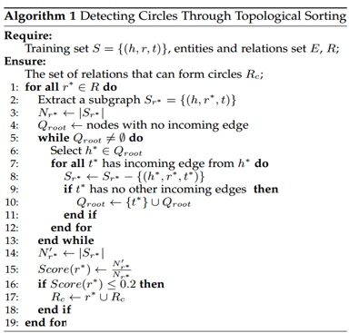

除了不能形成环状，层次关系也应该是不自反的（irreflexive），例如BarackObama 和Sasha 之间的关系child。另外，层次关系与不平衡映射性质密切相关（一对一，一对多等映射）。

 

预测方法hTransM的提出：有文献表明，适当值（appropriate value）对于链接预测的提升非常重要。所以hTransM通过检测知识图谱中的层次结构和一般结构定义了一个层次约束的margin ，其中 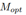被用来区分正确三元组和错误三元组。实体和关系的嵌入过程通过最小化带有的损失函数实现：

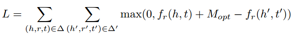

这里的评分函数采用TransE里的形式。

由于层次结构是通过单步层次结构和多步层次结构组成的，所以也会有两方面组成。这里很自然地用线性组合的方式将两部分进行组合：

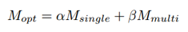

其中**α,β**都是参数，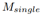用来发现单步结构所对应的最佳间隔， 则用来发现多步结构所对应的最佳间隔。

单步特定间隔（Single-step Specific Margin）：单步特定间隔是由对应的单步特定结构而产生的。对于一个给定的实体h和对应的关系r，正确实体的集合 Pr 由表示，集合中包含的实体都与h有关系r。错误实体的集合由 Nr 表示，集合中的实体与h有其它关系 r'。假如单步结构（single-step structure）具有层次性，那么正确实体就会分布地比较紧凑，即图4中的扇形区域。

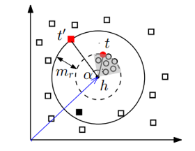

图4

在这种情况下，把一个正例和一个负例区分开来不仅需要考虑与实体h的虽短距离d，还需要考虑与扇形区域的相近程度。对于一个给定的三元组（h，r，t），可以表示为: 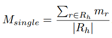。其中  为 Pr 和 Nr 之间的间隔, 通过来 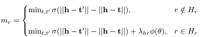给出。 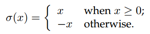。

多步特定间隔（Multi-step Specific Margin）：与单步特定间隔类似，多步特定间隔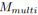可以表示为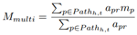。参数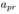由 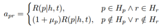给出。m_p 定义了 Pp 和 Np 之间的间隔。Pp 包含了正确的关系，Np 包含了错误的关系。其中 m_p 可以由图5进行表示。

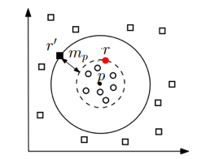

图5

图5中的环状代表正确关系，周围的长方体代表错误的关系。

 

论文还对hTransM方法的收敛性进行了证明。

 

# **实验结果**

实验在FB15K，WN18K以及FAMILY三个数据集上进行。FAMILY是一个人工构建的包含五个家庭总共六代人的层次知识图谱。三个数据集所包含的数据分布如下：

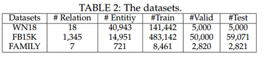

实体预测实验结果：

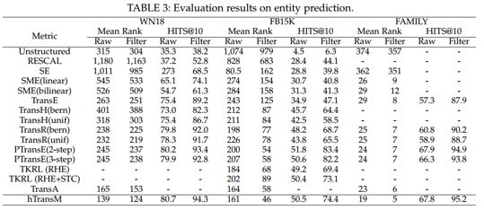

关系预测实验结果：

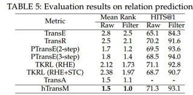

实验结果表明 hTransM 在链接预测任务上的效果相比其它传统方法有一定的提升。

# **总结与展望**

本文比较细致地从 KG embedding 模型损失函数中的间隔入手，充分考虑层次结构信息，对损失函数中的间隔项进行优化，并在此基础上提出了比较有效的链接预测方法。以往的 KG Embedding 方法在一定程度上忽视了知识图谱本身的结构化信息，最近一段时间相继出现了一些加入KG结构信息的论文，比如加路径，加节点的邻居信息，加三元组等等，但知识图谱中所包含的结构可能远不止于此，实现Link prediction的方法也不是必须要通过 KG embedding，在网络科学里（复杂网络）也有许多关于Link prediction的研究，大多都是从图论的角度，充分利用图谱自身结构（当然很少考虑语义），本文也是一种初步尝试，所以结合网络学科里的一些方法，可能会找到新的研究途径。

 

**OpenKG**

开放知识图谱（简称 OpenKG）旨在促进中文知识图谱数据的开放与互联，促进知识图谱和语义技术的普及和广泛应用。

点击**阅读原文**，进入 OpenKG 博客。
