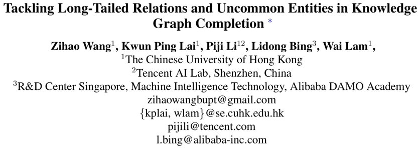
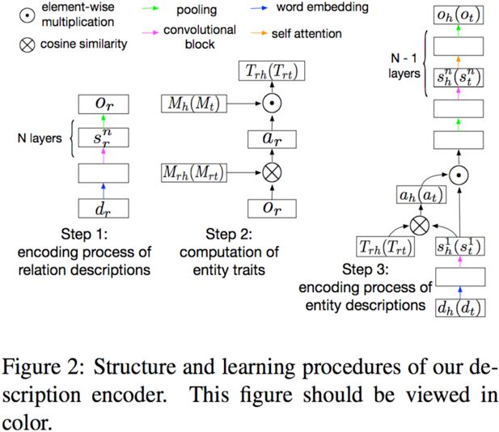
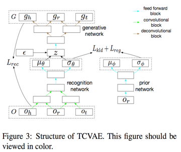
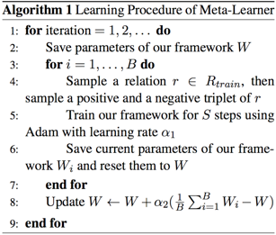
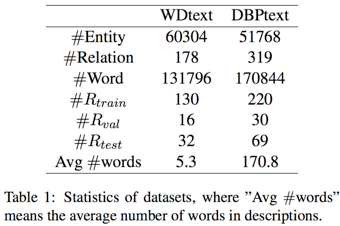
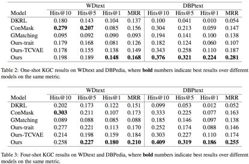
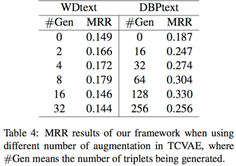

## 解决知识图谱补全中的长尾关系和不常见实体问题

> 论文笔记整理：汪寒，浙江大学硕士。

> 来源：ACL 2019

### 动机

KG的分布遵循长尾分布，大部分关系只有很少的三元组，且大体趋势是关系出现的频率和与之相关的不常见实体的比例呈反比关系。而之前的知识图谱补全工作都围绕在那些出现频率较高的实体和关系，忽略了剩下的那些infrequent relation和uncommon entities，所以作者就将针对 infrequent relations 和uncommon entities的KGC构造成一个few-shot learning的问题，并提出了一个meta-learning框架。

### 亮点

本文的亮点主要包括：

（1）提出了entity trait的概念，即实体的表示应该是relation-specific的，也就是不同的关系与实体的表述的不同部分相关，利用文本信息作为补充信息。

（2）提出了一个Triplet Generator，在meta-testing的训练阶段用一个VAE网络生成一些三元组进行数据增强。

### 概念及模型
- **Overview of Learning Method**
将每种关系的KGC看作是一个task，把所有task分为训练集Rtrain，验证集Rval，以及测试集Rtest。在meta-training的阶段每次都随机抽取B个task训练模型，得到模型参数W。在meta-testing的阶段对每个task都随机抽r个三元组继续训练模型，得到模型参数W’，再在剩下的三元组上测试模型性能。
- **Description Encoder**
从description生成三元组的embedding O=(oh,or, ot)

1. relation embedding生成

用一个CNN网络将relation的description映射成一个向量or

 

2. entity trait计算

entitytrait表示与某个关系相连所有的实体的共有特征，这个部分由两个memory matrix完成，其中Mrh形状为[m,u]，表示relation memory，Mh形状也为[m,u]，表示entity memory，这两个记忆矩阵可以记录实体和关系的全局信息。

 

3. relation-specific entity embedding生成

先将entity的description通过一个CNN网络生成hidden states，再用上一步生成的entity trait作为key计算隐状态权重，最后生成entity embedding。

- **Triplet Generator**
****

用一个复杂版的VAE来生成一些三元组补充训练数据。
- **Meta-Learner**
用Reptile算法优化。

### 理论分析

#### 实验

1. 数据集

作者通过Wikidata和DBPedia人工构造了两个数据集，只选择那些对应三元组出现次数多于5次少于1000次的关系。

 

2. One-shot和Four-shot KGC 实验结果

其中Ours-TCVAE是指去掉Triplet Generator。

3.     TripletGenerator study

表示用Triplet Generator生成不同个数三元组时模型在One-shot场景的表现。

### 总结

本文在few-shot问题上引入了文本信息作为补充信息，并提出了entity trait的概念，也就是实体的embedding应该是relation-specific。同时为了解决在meta-testing的训练阶段训练不足的问题，还提出了一个基于VAE的Triplet Generator来人工生成三元组补充训练数据。

