## 采用多层注意力机制的事件检测

> 笔记整理：杨帆，浙江大学计算机学院硕士，研究方向知识图谱。

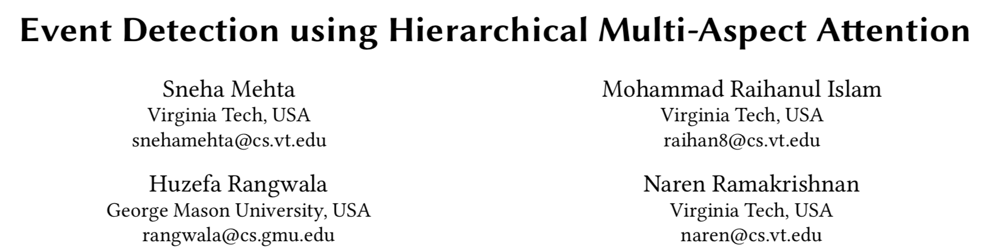

> 来源：WWW 2019

## **动机**

事件编码（event encoding）之前的工作集中在提取实体，检测触发单词以及匹配预定义的模板，这些方法存在以下缺点：首先它们依赖于细粒度的标记数据进行训练，但是这些数据很难获得；其次它们使用句子级别的嵌入来去除导致错误的上下文信息，但是一个事件的信息并不只是包含在一个单一的句子中。作者提出的模型引入多层的注意力机制来生成句子和文档的表示，旨在更好地捕获全局信息来进行事件分类及编码。

## **模型**

本文提出的模型包含以下三个模块：

1. **Sequence Encoder** 

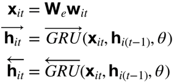

该模块使用双向GRU生成每个单词的表示。

2. **Word-Level Attention**

该模块包含以下三部分：

2.1 Bilinear Attention 

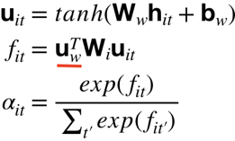

第一部分将 Sequence Encoder 生成的单词表示通过一层的MLP得到其对应的隐藏层表示，然后利用  和  计算得到attention ， 代表句子的全局信息。

2.2 Factorized Bilinear Multi-Aspect Attention (FBMA)

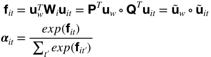

第二部分通过矩阵分解将之前单层的attention转换为多层的attention，用来抽取更丰富的全局信息。

 

2.3 Sentence Representation 

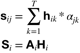

第三部分通过单词的表示以及对应的attention计算得到每个句子的表示。

 

3. **Attention-Level Attention**

3.1 Document representation 

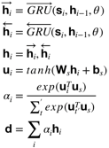

文档表示的计算方式与句子表示类似，此处不再赘述。

 

3.2 Loss 

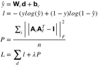

该模型采用交叉熵作为损失函数，并且引入惩罚项P防止生成的多层attention的各层权重相同。

## **实验**

1. Dataset 

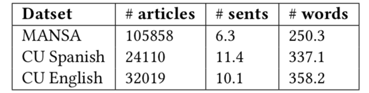

2. Baselines 

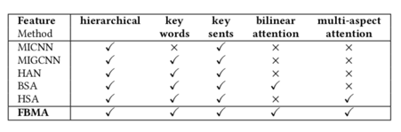

3. Results  

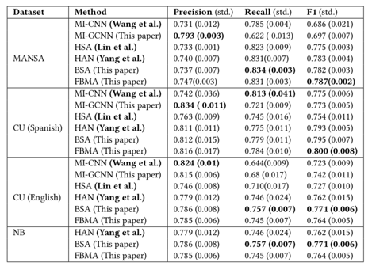

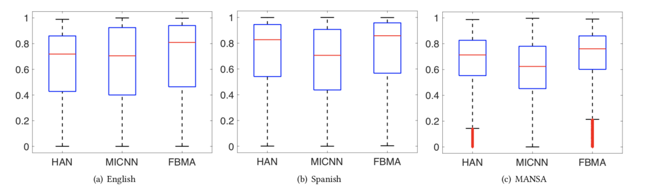

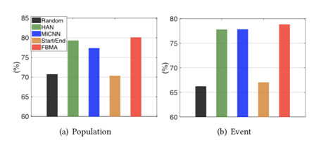

