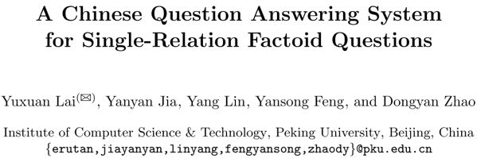
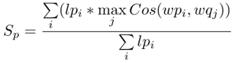
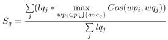
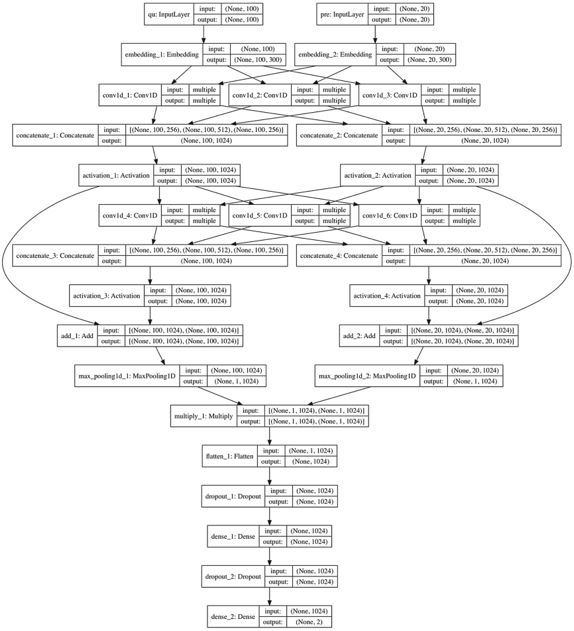
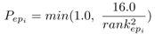
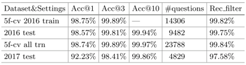
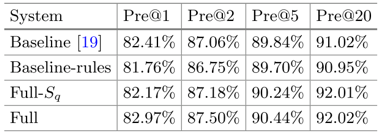
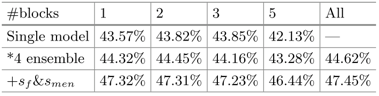
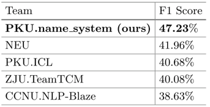

## 面向单关系事实问题的中文问答模型

> 论文笔记整理：花云程，东南大学博士，研究方向为知识图谱问答、自然语言处理。

来源：NLPCC 2017

论文下载地址：http://tcci.ccf.org.cn/conference/2017/papers/2003.pdf

## **动机**

开放领域的QA问题是一个被广泛研究的问题，而且目前这个问题并没有被很好地解决。在中文领域，相关的数据集并不多。而NLPCC开放了一个KBQA比赛，为中文KBQA提供了一个很好的数据集。本文使用了基于特征的方法来完成实体链接，并基于词向量对候选谓词进行初筛。之后，文章采用了深度CNN模型来重排实体-谓词对，从而找到最正确的实体-谓词。

## 

## **贡献**

文章的贡献有：

（1）提出了一种基于特征的实体链接方法；

（2）提出了一种基于词向量的候选谓词初筛方法；

（3）提出了一种基于深度CNN的谓词排序方法。

## 

## **方法**

⒈模型结构

首先人工构建特征，选取可能的实体指称。然后使用非监督的词向量，来选择候选的谓词。当得到实体-谓词对之后，采用deep-CNNs模型来重排它们。最后将所有的中间结果（打分）加权和，就得到最后的谓词，以及答案。另外，这里有个小trick，就是当一个问题经过解析，只有实体名，那么这个问题可能是关于这个实体的介绍，所以实体的谓词就为“introduce”，在知识图谱中得到这个实体的介绍信息并输出为答案。

 

⒉实体链接

NLPCC的KB中，实体是类似于“Li Na (Diving Athlete)”这样的，有实体名，也可能有扩展描述信息。实体指称是问题的一个子串，并且指称与实体名相同，或者与实体名的别名相同（NLPCC有文件提供了这个别名）。这里建立特征后，用GBDT去选择问题的所有子串中真正的实体指称子串。

这里首先使用正向最大匹配法（FMM，forwardmaximum matching）来进行切词后，再使用逆向最大匹配法（RMM，reverse maximum matching）来进行切词。RMM的基本原理与FMM基本相同，不同的是分词的方向与FMM相反。RMM是从待分词句子的末端开始，也就是从右向左开始匹配扫描，每次取末端m个字作为匹配字段，匹配失败，则去掉匹配字段前面的一个字，继续匹配。

当得到一个分词结果之后，句子中每一个分词视为一个候选实体指称，对每一个指称利用规则生成特征，在得到这些特征后，形成数值，并送到GBDT模型进行训练，从而分类出候选指称是黄金指称的概率Smen。

 

⒊候选谓词识别

经过特殊分词（找到问句和谓词中所有具有意义的词/词组），利用下式来判断谓词是否能够问句中谓词模式的语义：

其中wpi表示谓词中第i个词，wqi表示问题中第i个词，lpi表示wpi的长度。即对谓词中的每个词，找到问题中语义最相近的词，并乘上谓词的某个词的长度，最后求平均。

对于该公式，又做了改进：

这里是反过来，对问题中每个词，找到谓词中语义最相近的词（aveq表示所有问题中所有词的平均词向量，这里代表无意义的停用词的词向量），并乘上问题的某个词的长度，最后求平均。

 

⒋深度CNN结构

深度CNN用来重排序实体-谓词对与问题的相似程度，从而进行精确筛选。如下图1所示是deep-CNN的结构。该模型用来计算谓词和问句（去掉实体指称）的语义相似度。模型中采用了两个卷积层，并利用了残差网络进行连接。经过最大池化后，问题的向量和谓词的向量进行按位乘后，再通过一个使用了dropout的全连接层（MLP），来得到最终的相似度。处理问题和谓词的卷积层的参数是共享的。每一个卷积层，卷积宽度不同（256个宽度为1的核、512个宽度为2的核、256个宽度为3的核），并对不同核得到的结果进行拼接。另外，相邻的卷积层之间有残差网络连接。

最终得到基于deep-CNN的相似度SCNN。将所有的得分相加，即得到一个实体-谓词对于问题的相似度的最终得分：Sfinal =Smen + Sf + SCNN * 2。最大得分的实体-谓词对应的宾语就是最终答案。

## 

## **实验**

实验用的数据集是NLPCC 2017的比赛用数据集，有知识库和问题-答案对，用于训练。知识图谱中有43M的SPO三元组，有14609+9870个NLPCC 2016的问题-答案对来训练。在训练CNN时，由于正负例极度不平衡，所以采用动态负采样算法来筛选负例，选择一个样本的概率如下式所示：

其中，rankepi表示上一次迭代后（每次训练都会取出一个样本，那么排名会发生变化），一个实体-谓词对的排名，排名越大，说明这个实体-谓词对与问题的相似度越低。这就是一个简单的生成对抗模型（generative adversarialmechanism），因为rank越大，说明这个实体-谓词对越不靠谱，也就是对于模型的分类效果来说提升很小（太容易区分了），所以选中作为负样本的概率越小。这样就有了一个对抗模型的思想在里面。

如图3所示，为模型的实体链接结果，效果与之前的工作差不多（99.04%）。

图3 实体链接模型性能对比

如图4所示，是候选实体-谓词对的识别情况。由图可见，效果比baseline的系统要好。

图4 候选实体-谓词对的识别情况

如图5所示，是系统的问答效果，可见集合了所有特征的系统效果最好。

图5 系统的问答效果

如图6所示，是本文系统与其他基线系统的性能对比。可见本文系统效果最佳。

图6 各系统在NLPCC KBQA比赛结果对比

## **总结**

本文提出了一种复杂的中文KBQA模型，包含了基于特征的、GBDT分类的实体链接，基于词向量的候选谓词初筛，以及基于deep-CNN的实体-谓词重排序，最终得到了可以回答问题的实体-谓词对。对于CNN训练中的正负例不平衡问题，也提出了具有对抗生成思想的负采样算法。最终，文章提出的系统在NLPCC 2017比赛中获得第一名。文章中的许多方法都是在工程上易于实现的，可以借鉴到实际应用中。未来可以考虑将三元组的宾语的信息一并结合进来，用于实体-谓词的筛选。

