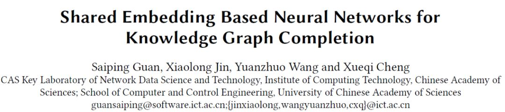
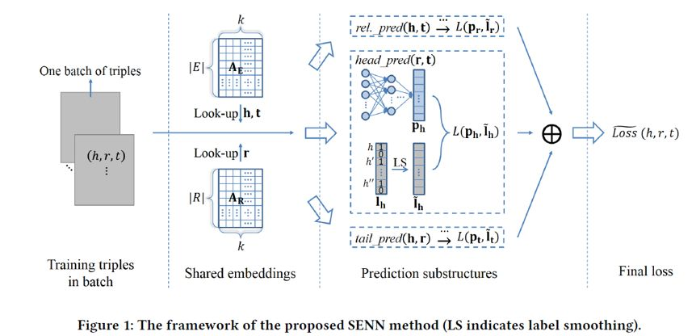
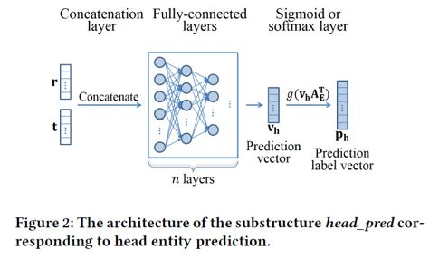
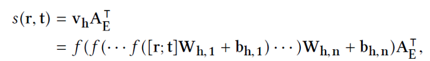
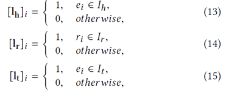
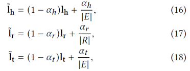
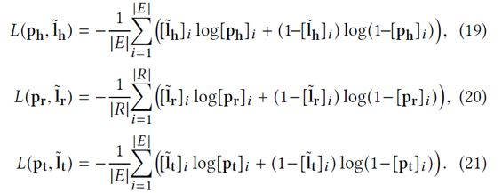
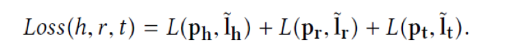
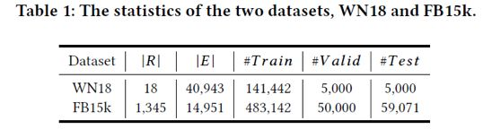
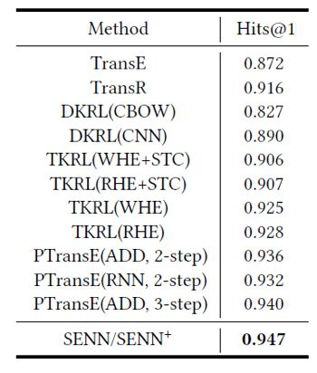

## 面向知识图谱补全的共享嵌入神经网络模型

&gt; 笔记整理: 

论文笔记整理：谭亦鸣，东南大学博士生，研究方向为跨语言知识图谱问答。

来源：CIKM’2018

链接：http://delivery.acm.org/10.1145/3280000/3271704/p247-guan.pdf?ip=121.249.15.96&amp;id=3271704&amp;acc=ACTIVE%20SERVICE&amp;key=BF85BBA5741FDC6E%2EEEBE655830483280%2E4D4702B0C3E38B35%2E4D4702B0C3E38B35&amp;__acm__=1553323826_2f92f0c5be62fc57d71a8cc02bf2335b

 

**Introduction**

知识图谱补全（KGC，knowledge graphcompletion）是一种自动建立图谱内部知识关联的工作，目标是补全图谱中缺失的三元组信息。对于这个问题，常见的方法分为基于矩阵以及基于翻译等两类。随着神经网络方法的普及，本文提出一种共享嵌入的神经网络模型用于处理KGC问题。

 

**Motivation**
1. 作者认为在补全任务中，头实体，关系和尾实体三者的训练数据存在一定差异性，而现有方法没有区分头尾实体及关系预测等三个问题做明确区分。1. 对于同一知识图谱的头实体，关系和尾实体补全，其对应的图谱知识空间可以通用，因此在图谱表示学习部分，使用shared策略是一个较好的方式1. 从技术角度，使用神经网络方法可以较好的模拟推理预测的过程。
对于同一知识图谱的头实体，关系和尾实体补全，其对应的图谱知识空间可以通用，因此在图谱表示学习部分，使用shared策略是一个较好的方式

**Model**

图 1 是本文所提出的KGC模型框架，作者将框架划分为以下四个部分：
1. 三元组的批量预处理1. 知识图谱的Shared embeddings表示学习1. 独立的头尾实体及关系预测子模型训练与融合1. 联合损失函数构成
知识图谱的Shared embeddings表示学习

联合损失函数构成

整个KGC的流程可以描述如下：
1. 将训练数据中的完整三元组（知识图谱）划分批量后作为模型的输入1. 对于输入的三元组，分别训练得到实体（包括头尾实体）嵌入矩阵与关系嵌入矩阵（embeddings）1. 将头尾实体及关系embeddings分别输入到三个预测模型中（头实体预测（?, r, t），关系预测(h, ?, t)，尾实体预测(h, r, ?)）
对于输入的三元组，分别训练得到实体（包括头尾实体）嵌入矩阵与关系嵌入矩阵（embeddings）

        预测子模型具有相似的结构如下图，模型输入关系向量与实体向量后，进入n层全连接层，得到预测向量，再经过一个sigmoid（或者softmax）层，输出预测标签向量。

打分函数（Score function）

以头实体预测子模型为例，其打分函数形式如下：

损失函数（Loss function）

            依据上述框架，对于给定的某个三元组(h, r, t)，可以得到三个对应的预测标签向量Ph, Pr, Pt

            目标标签向量则可以定义为：

            根据上述定义可以得到三者的平滑目标向量为：

            因此，各子模型损失函数形式可以描述如下：

            联合损失函数则是将三个子模型的打分函数进行相加融合得到：

**Experiment**

本工作实验使用的数据来源于WN18以及FB15K，具体统计信息如表1所示：

实体预测实验结果如下：

 

关系预测实验结果如下：

**Conclusion**

总的来说，本文工作在实验结果上确实表现出对以往方法性能的提升，但是对于头尾关系预测的子任务划分依据缺少较为详细的说明，故并不能明确任务划分做法的合理性，也没有不划分子模型的版本的对比测试。

 

**OpenKG**

开放知识图谱（简称 OpenKG）旨在促进中文知识图谱数据的开放与互联，促进知识图谱和语义技术的普及和广泛应用。

点击**阅读原文**，进入 OpenKG 博客。 
